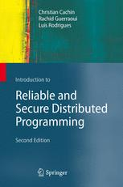
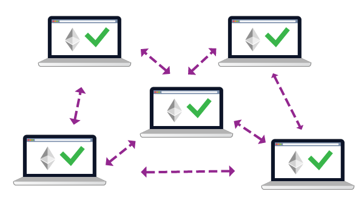

class: middle, center, title-slide

# Large-scale Data Systems

Fall 2021

  
Prof. Gilles Louppe 
[g.louppe@uliege.be](g.louppe@uliege.be)

---

# Us

This course is given by:
- Theory: Gilles Louppe ([g.louppe@uliege.be](mailto:g.louppe@uliege.be))
- Practicals and projects: Sami Ben Mariem ([Sami.BenMariem@uliege.be](mailto:Sami.BenMariem@uliege.be))

Feel free to contact any of us for help!

 
.center[
.circle.width-25[] &nbsp;
.circle.width-25[]
]

---

# Goals and philosophy

## Solid ground

- Understand the **foundational principles** of distributed systems, on top of
which distributed *databases* and *computing* systems are operating.
- Understand why data systems are designed the way they are designed.

## Practical

- Fun and challenging course project.
- Practice and improve **your system engineering skills**!

## Critical thinking

- Assess the benefits and disadvantages of data systems.
- No hype!

---

# Slides

Slides are available at [github.com/glouppe/info8002-large-scale-data-systems](https://github.com/glouppe/info8002-large-scale-data-systems).
- In HTML and in PDFs.
- Published/Updated the day before the lesson.
- Slight differences/improvements/fixes from previous years.

Slides are partially adapted from [CSE 486/585 Distributed systems](https://www.cse.buffalo.edu/~stevko/courses/cse486/spring16/schedule.html) (University at Buffalo) and
[CS425 Distributed systems](https://courses.engr.illinois.edu/cs425/fa2017/lectures.html) (University of Illinois UC).

.center.width-80[]

---

# Videos

Podcasts from Fall 2020 are available on MyULiège.

---

# Textbook

.center[]

The core content of this course (lectures 2 to 5) is based on the following textbook:

> .italic[Christian Cachin, Rachid Guerraoui, Luis Rodrigues, "Introduction to Reliable and Secure Distributed Programming", Springer.]

This textbook is *optional*.
---

# Projects

## Reading assignment

Read, summarize and criticize a major scientific paper in large-scale data systems.
(See GitHub for papers and instructions.)

.center.width-70[]

---

class: middle

## Programming project

Implement a distributed application. (Project to be announced later.)

.center.width-70[]

---

# Evaluation

- Oral exam (50%)
- Reading assignment (10%)
- Programming project (40%)

Projects are **mandatory** for presenting the exam.

???

Say some brief comment on the organization of the oral.

---

class: end-slide, center
count: false

Let's start!
