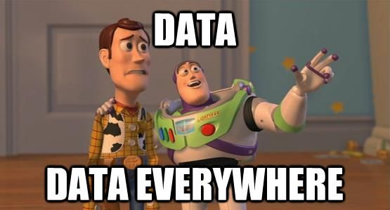
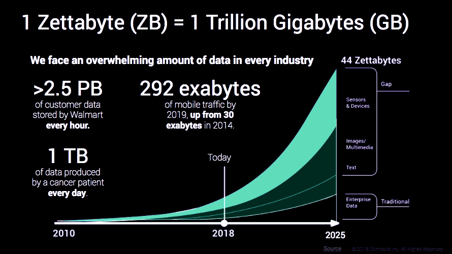
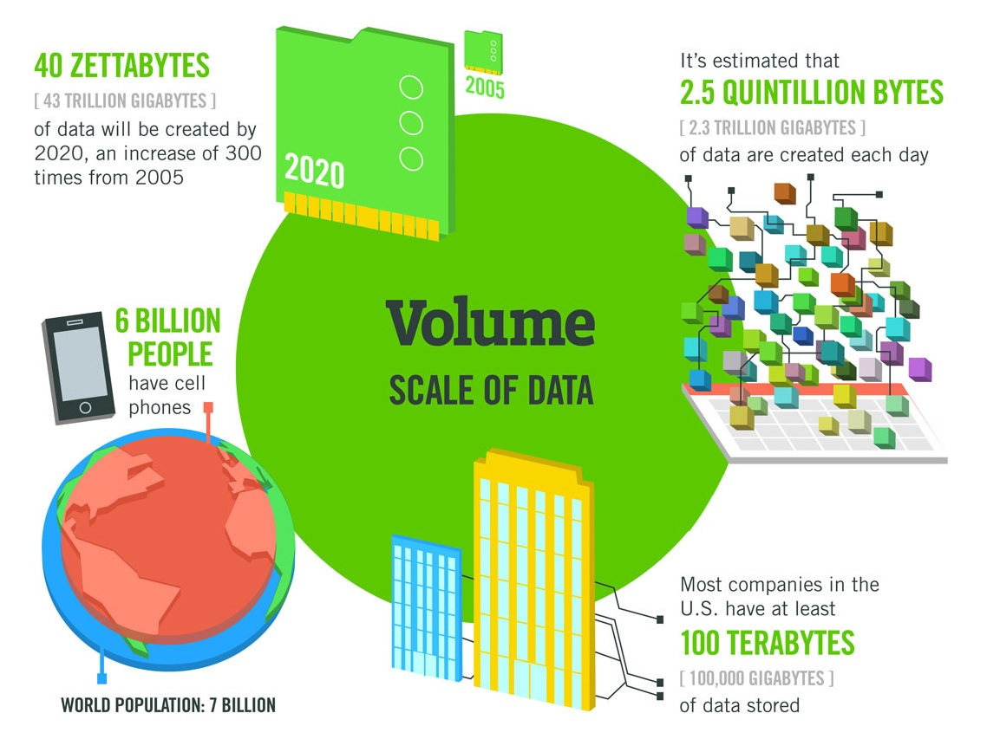
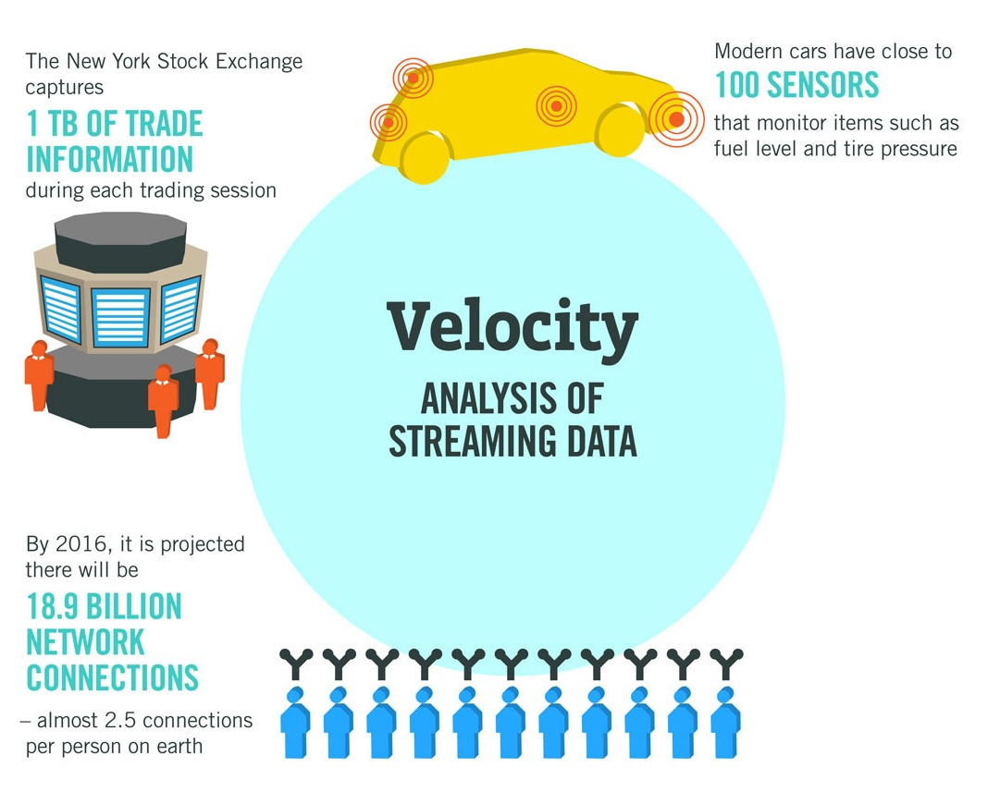
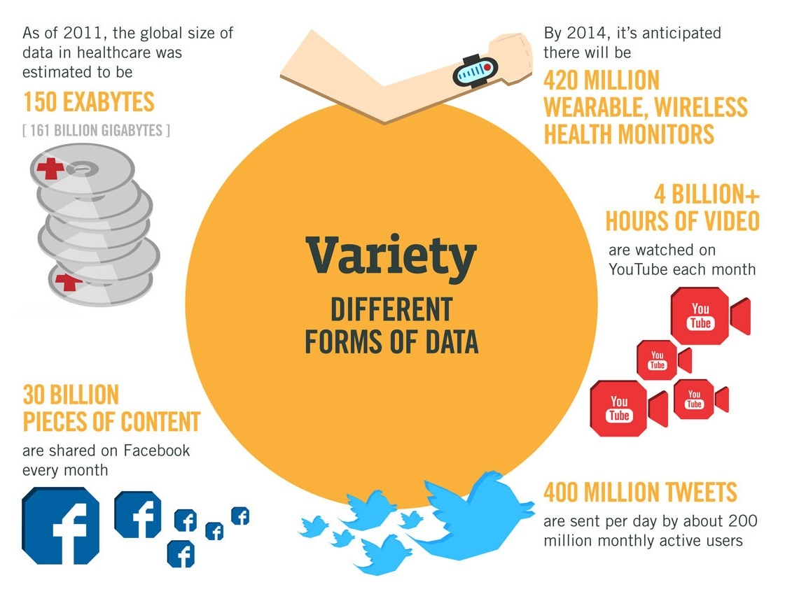
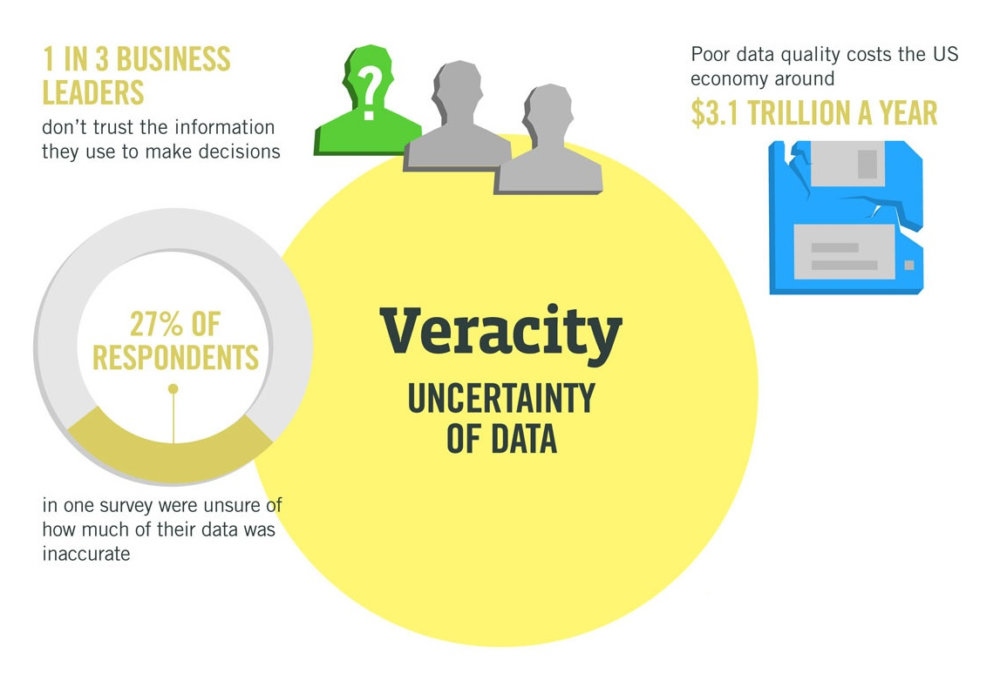
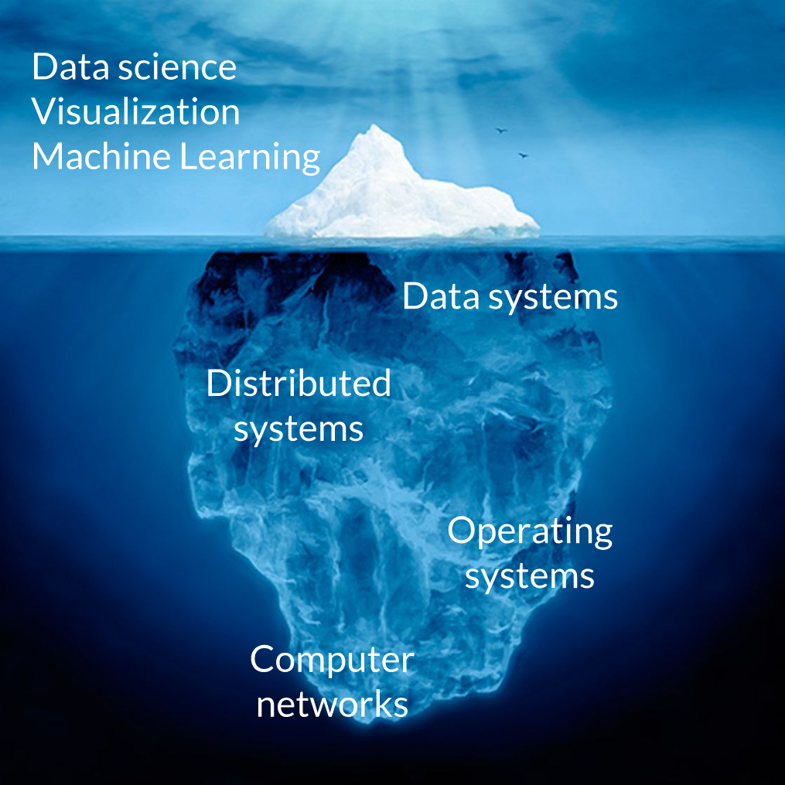
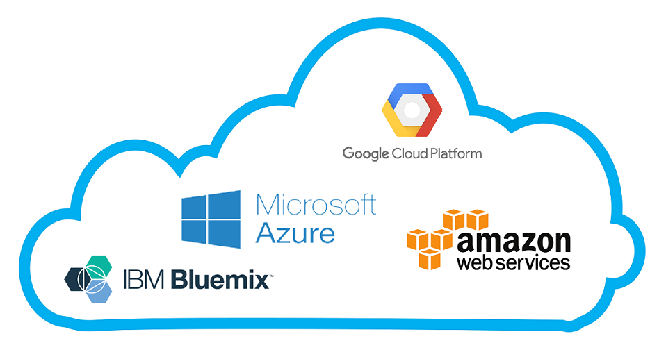
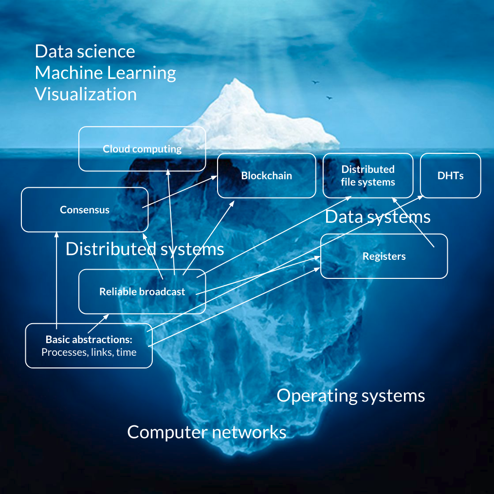

class: middle, center, title-slide

# Large-scale Data Systems

Lecture 1: Introduction

  
Prof. Gilles Louppe 
[g.louppe@uliege.be](g.louppe@uliege.be)

---

class: middle

# The zettabyte era

---

class: middle, center, black-slide

.width-90[]

---

class: middle

.circle.center.width-40[]

.italic["Every two days now we create as much information as we did from the dawn of civilization up until  2003, according to Schmidt. That’s something like five exabytes of data, he says.

Let me repeat that: .bold[we create as much information in two days now as we did from the dawn of man] through 2003.]

.pull-right[Eric Schmidt, 2010.]

---

class: middle, center, black-slide

.width-100[]

---

class: middle

.exercice[
- How many iPads would you need to store 1 ZB?
- What distance and volume does that represent?
]

???

1 ZB = 10^12 GB

iPad 10.2 => 128 GB, 250x175x7.5mm
https://www.apple.com/ipad-10.2/specs/

10^12 / 128 => 7 812 500 000 iPads to store 1ZB

Hence a stack of 58593km!
or 2343750 km for 40 ZB

that's 1.7 the diameter of the sun!

---

# The four V of big data

.center.width-100[]

---

class: middle

.center.width-100[]

---

class: middle

.center.width-100[]

---

class: middle

.center.width-100[]

---

class: middle

## Example: your own Facebook data

How much data do you generate through your interactions with Facebook?

Let's check!

???

To notice:
- search history
- advertisers
- location
- security

Also...
- https://myactivity.google.com/myactivity
- https://www.google.com/maps/timeline?pb

---

class: middle

## What's new?
- our ability to *store machine generated data*, at unprecedented scale and rate.
- the broad understanding that we **cannot just manually get value out of data**.

---

class: middle, black-slide

.grid[
.kol-1-2[.width-90[]]
.kol-1-2[
.italic[
 

“Increasingly, scientific breakthroughs will
be powered by advanced computing
capabilities that help researchers
manipulate and explore massive
datasets.

The speed at which any given scientific
discipline advances will depend on how
well its researchers *collaborate* with one
another, and with technologists, in areas
of eScience such as **databases**,
**workflow management**, visualization,
and **cloud computing technologies**.”
]
]
]

???

We came to the realization that...

---

class: middle

# Data systems

---

class: middle, center, black-slide

.width-80[]

???

In this course, we will focus on the technology of data systems that enable data science.

---

# Operating systems

Can you name examples of *operating systems*?

--

count: false

- Android
- Chrome OS
- FreeBSD
- iOS
- macOS
- OS/2
- RISC OS
- Solaris
- Windows
- ...

---

class: middle

## Definition

The low-level software which handles the interface to peripheral hardware,
schedules tasks, allocates storage, and presents a default interface to the user
when no application program is running.

---

# Distributed systems

Can you name examples of *distributed systems*?

--

count: false

- A client/server system
- The web
- Wireless networks
- Telephone networks
- DNS
- Massively multiplayer online games
- Distributed databases
- BitTorrent (peer-to-peer overlays)
- A cloud, e.g. Amazon EC2/S3, Microsoft Azure
- A data center, e.g. a Google data center, AWS
- The bitcoin network

---

class: middle

## Definition

A distributed system is a collection of entities with a common goal, each of
which is *autonomous*, *programmable*, *asynchronous* and *failure-prone*, and
which communicate through an **unreliable** communication medium.

- *Entity*: a process on a device.
- *Communication medium*: Wired or wireless network.

A distributed system appears to its users as a *single* **coherent** system.

---

class: middle, black-slide

.center.width-90[]

.center[.bold[Internet]: What are the entities? What is the communication medium?]

???

- Processes = the operating systems (at servers, desktop computers, mobile devices, etc)
- Communication = a collection of networks of different kinds (wired, wireless, phone, etc)
- Even if the laptop of your friend crashes, the Internet should not collapse!

---

class: middle, black-slide

.center.width-90[]

.center[.bold[Data center]: What are the entities? What is the communication medium?]

???

- Processes = the worker processes of a scientific program executing in a distributed or parallel fashion (e.g., with MPI)
- Communication = local network

---

class: middle

## Why study distributed systems?

- Distributed systems are **everywhere**:
    - Internet
    - WWW
    - Mobile devices
    - Internet of Things

- **Technical** importance:
    - Improve *scalability*
        - Adding computational resources to a system is an easy way to scale its performance to many users.
    - Improve *reliability*
        - We want high availability and durability of the system.

---

class: middle

- Distributed systems are **difficult** to build.
    - *Scale*: hundreds or thousands of machines.
        - Google: 4k-machine MapReduce cluster
        - Facebook: 60k machines providing the service
    - *Fault tolerance*: machines and networks do fail!
        - 50 machine failures out of 20k machine cluster per day (reported by Yahoo!)
        - 1 disk failure out of 16k disks every 6 hours (reported by Google)
    - *Concurrency*:
        - Nodes execute in parallel
        - Messages travel asynchronously
    - *Consistency*:
        - Distributed systems need to ensure user guarantees about the data they store.
        - E.g., all read operations return the same value, no matter where it is stored.
- But only a few **core problems** reoccur.

???

- Scale: Hard enough to program one machine!

---

class: middle

## Teaser: Two Generals' Problem

Two generals need to coordinate an attack.

- They must **agree** on time to attack.
- They will win only if they attack **simultaneously**.
- They communicate through **messengers**.
- Messengers may be **killed** on their way.

.exercice[What should they do?]

???

How do you reach agreement between multiple asynchronous entities?

---

class: middle, center, black-slide

.center[
<iframe width="640" height="480" src="https://www.youtube.com/embed/X7jzXlt6CgE?&loop=1&start=0" frameborder="0" volume="0" allowfullscreen></iframe>
]

???

Two Generals' Problem = Teaser example of a difficult but reoccuring problem in distributed systems.

---

class: middle

Let's try to solve the problem for generals $g_1$ and $g_2$.

- $g_1$ sends time of attack to $g_2$.
- Problem: how to ensure $g_2$ received the message?
- Solution: let $g_2$ acknowledge receipt of message.
- Problem: how to ensure $g_1$ received the acknowledgment?
- Solution: let $g_1$ acknowledge receipt of acknowledgment.
- ...

???

The generals must reach a consensus.

---

class: middle, center

This problem is provably **impossible** to solve!

(Unless we make additional assumptions)

---

class: middle

- Applicability to distributed systems:
    - Two nodes need to *agree* on a *value*.
    - They communicate by *messages* using an *unreliable channel*.

- **Agreement** is one of the core problems of distributed systems.

---

# Data systems

Can you name examples of *data systems*?

--

count: false

- A database
- A file system
- A ledger
- Search engines
- Data flow frameworks
- Social networks
- ...

---

class: middle

## Definition

In this course, data systems will broadly refer to any kind of computer systems, distributed or not, that can be used to store, retrieve, organize or process data.

Our main focus will be on data systems for data science purposes.

---

class: middle, center

.center.width-100[]

???

Many data systems exist for data science.

We will focus on some of them during this course, including...

---

class: middle

## Cloud services

.center.width-100[]

---

class: middle

## The Hadoop ecosystem (less and less)

.center.width-90[]

.footnote[Credits: Intelligent Business Strategies, [IBM Big Data Hub](http://www.ibmbigdatahub.com/blog/what-hadoop).]

???

- Processes = user application, computing framework servers (Spark), distributed file systems, and various other daemons managing the resources in the system.
- Communication = the Internet abstraction

---

class: middle

## A distributed ledger

.width-100[]

???

- Processes = wallets (storing bitcoins), miners (discovering new bitcoins), blockchain (== a distributed and secured database) for storing the transactions.
- Commmunication = a P2P network on top of the Internet.

---

class: middle

# Outline

---

class: middle, center, black-slide

.width-80[]

---

class: middle, center, black-slide

.width-80[]

---

# Fundamentals of distributed systems

Understand the **foundational principles** required for the *design*, *implementation* and *maintenance* of distributed systems.
- Communications
- Failures
- Consistency
- Concurrency
- Consensus

---

class: middle

## Communications

- How do you talk to another machine?
    - Reliable networking.
- How do you talk to multiple machines at once, with ordering guarantees?
    - Multicast, Gossiping.

## Failures and consistency

- How do you know if a machine has failed?
    - Failure detection.
- How you do program your system to operate continually even under failure?
    - Gossiping, replication.
- What if some machines do not cooperate?
    - Byzantine fault tolerance.

---

class: middle

## Concurrency

- How do you control access to shared resources?
    - Distributed mutual exclusion, distributed transactions, etc.

## Consensus

- How do multiple machines reach an agreement?
    - Time and synchronization, global states, leader election, Paxos, proof of work, blockchain.
- **Bad news**: it is impossible!
    - The impossibility of consensus for asynchronous systems.

---

# Case studies

From these building blocks, understand how to build and architecture data systems for large volumes or data or for data science purposes.

## Distributed storage

- How do you locate where things are and access them?
    - Distributed file systems
    - Key-value stores
- How do you record and share sensitive data?
    - Proof of work, blockchain

---

class: middle

## Distributed computing for data science

- What are the distributed computing systems for data science?
    - Map Reduce (Hadoop)
    - Computational graph systems (Spark, Dask)
- Is distributed computing always necessary?

---

class: end-slide, center
count: false

The end.
