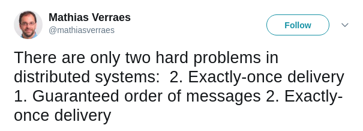
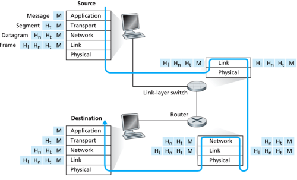

class: middle, center, title-slide

# Large-scale Distributed Systems

Lecture 1: Distributed systems

---

class: middle, center

# Introduction to distributed systems

---

# Operating systems

Can you name examples of *operating systems*?

--

- Android
- Chrome OS
- FreeBSD
- iOS
- macOS
- OS/2
- RISC OS
- Solaris
- Windows
- ...

---

# Operating systems

What is an *operating system*?

## Definition

The low-level software which handles the interface to peripheral hardware,
schedules tasks, allocates storage, and presents a default interface to the user
when no application program is running.

---

# Distributed systems

Can you name examples of *distributed systems*?

--

- A client/server system.
- The web
- Wireless networks
- Telephone networks
- DNS
- Massively multiplayer online games
- Distributed databases
- BitTorrent (peer-to-peer overlays)
- A cloud, e.g. Amazon EC2/S3, Microsoft Azure
- A data center, e.g. a Google data center, AWS
- The bitcoin network

---

# Distributed systems

What is a *distributed system*?

## Definition

A distributed system is a collection of entities with a common goal, each of
which is *autonomous*, *programmable*, *asynchronous* and *failure-prone*, and
which communicate through an **unreliable** communication medium.

- *Entity*: a process on a device.
- *Communication medium*: Wired or wireless network.

---

## Internet

.stretch[

.caption[What are the *entities*? What is the *communication medium*?]
]

---

## CERN data center

.stretch[

.caption[What are the *entities*? What is the *communication medium*?]
]

---

## Massively multiplayer online games

.stretch[

.caption[What are the *entities*? What is the *communication medium*?]
]

---

## A Hadoop system

.stretch[

.caption[What are the *entities*? What is the *communication medium*?]
]

.footnote[Credits: Intelligent Business Strategies, [IBM Big Data Hub](http://www.ibmbigdatahub.com/blog/what-hadoop).]

---

## Bitcoins

.stretch[

.caption[What are the *entities*? What is the *communication medium*?]
]

---

# Distributed systems are difficult to build

- **Scale**: hundreds or thousands of machine
    - Google: 4k-machine MapReduce cluster
    - Yahoo!: 4k-machine Hadoop cluster
    - Akamai: 70k machines, distributed over the world
    - Facebook: 60k machines providing the service
    - Hard enough to program one machine!
- **Dynamism**: machines do fail!
    - 50 machine failures out of 20k machine cluster per day (reported by Yahoo!)
    - 1 disk failure out of 16k disks every 6 hours (reported by Google)
- Additional constraints: *concurrent execution*, *consistency*, *security*, etc.

???

---

# What am I going to learn in this course?

- Understand the **foundational principles** required for the *design*, *implementation* and *maintenance* of distributed systems.
    - Communications
    - Consensus
    - Concurrency
    - Failures and consistency
- From these general building blocks, understand
    - distributed *computing paradigms* for data science
        - MapReduce, Computational Graph systems;
    - distributed *storage systems*
        - DFS, Key-value stores, Blockchain.
- Develop **critical thinking** about their strengths and weaknesses.
- Exposition to *industrial software* through course projects.

---

# Theme 1: Communications

- *How do you talk to another machine?*
    - Networking basics
- *How do you talk to multiple machines at once?*
    - Multicast, Gossiping.

---

# Theme 2: Consensus

- *How do multiple machines reach an agreement?*
    - Time and synchronization, global states, mutual exclusion, leader election, paxos.
- **Bad news**: it is impossible!
    - The impossibility of consensus.

---

# Theme 3: Concurrency

- *How do you control access to shared resources?*
    - Distributed mutual exclusion, distributed transactions, 2/3-phase commit, etc.

---

# Theme 4: Failures and consistency

- *How do you know if a machine has failed?*
    - Failure detection.
- *How you do program your system to operate continually even under failure?*
    - Gossiping, replication.
- *What if some machines malfunction?*
    - Byzantine fault tolerance.

---

# Theme 5: Distributed computing for data science

- *What are the distributed computing systems for data science?*
    - Map Reduce (Hadoop)
    - Computational graph systems (Spark, Tensorflow, (Py)Torch)
- *Is distributed computing always necessary?*

---

# Theme 6: Distributed storage systems

- *How do you locate where things are and access them?*
    - Distributed file systems
    - Key-value stores

- *How do you record and share sensitive data?*
    - Block chain

---

class: middle, center

# Networking basics

A quick refresher

---

# What is the Internet?

.stretch[
.caption[The Internet, 1969]]

.footnote[Credits: [ARPANET maps](http://som.csudh.edu/fac/lpress/history/arpamaps/)]

---

# What is the Internet?

.stretch[
.caption[The Internet, 1974]]

.footnote[Credits: [ARPANET maps](http://som.csudh.edu/fac/lpress/history/arpamaps/)]

---

# What is the Internet?

.stretch[
.caption[The Internet, 2007]]

.footnote[Credits: [AT&T Labs](http://www.research.att.com/export/sites/att_labs/groups/infovis/news/img/ATT_Labs_InternetMap_0730_10.pdf)]

---

# The Internet

- Underlies many *distributed systems*, while being a distributed system in itself.
- A vast interconnected collection of networks of *many types*.
- Goal of the original designers:
    - *interconnecting* different networks by designing **common protocols**.

## Designer's hat

- Why do we want to connect computers?
- What is the ideal outcome?
- How do we do that?

---

# Building the Internet

- Why: The whole can be greater than the sum of its parts.
- What:
    - Internet communication **must continue** despite loss of networks or gateways.
    - The Internet must support **multiple types of communication services**.
    - The Internet architecture must accommodate **a variety of networks**.
    - The architecture must permit distributed management of its resources.
    - The architecture must be cost effective.
    - The architecture must permit host attachment with a low level of effort.
    - The resources used in the architecture must be accountable.

---

# How to interconnect systems?

- There were *many types of networks* based on various physical media (coax,
  radio, satellite, etc).
- The original designers wanted to interconnect these networks somehow.

--

## A potential solution

Designing a "multi-media" network (e.g., via physical signal translator for
various physical media).

Issues:
- **Does not scale** with the variety of media:
    - adding $O(1)$ new types of medium requires $O(N)$ translator sub-systems;
- Adds **complexity** inside the network;
- Requires control over nodes;
- Increases the barrier to host attachment.

---

class: center, middle

.circle[]

All problems in computer science can be solved by another level of indirection. -- David Wheeler.

---

# Connecting by layering

- Sub-divide the problem by partitioning communication systems into **abstraction layers**.
    - A layer serves the layer above it and is served by the layer below it.
- *Interface* between layers defines interaction.
    - Hides implementation details;
    - Layers can change without disturbing other layers.

.center[]

---

# Challenges of layering

**Where** do we want to put the functionalities?

- Enabling a conversation between two hosts requires:
    - a mechanism for *addressing* (where do I send this message?)
    - a mechanism for *routing* (how do I reach this address?)
    - a mechanism for ensuring the *survivability* of the conversation, as long as there is a physical path between entities communicating.
- Addressing and routing?
    - Probably in the network.
- Survivability mechanisms?
    - The network or hosts?

---

# Two approaches to survivability

- stateful
- stateless
- IP layer
- sneak in end-to-end argument

---

# The Internet Protocol suite

---

# TCP

- Overview
- Handshake
- Retransmission
- Issues with TCP

---

# The application layer

---

# The HTTP standard

- Client-server model
- HTTP protocol, built on top of TCP
- Guided example
- telnet example
- Does the working definition work for the http web?

---

# Summary

---

# References
