class: middle, center, title-slide

# Large-scale Data Systems

Lecture 1: Distributed systems

<br><br>
Prof. Gilles Louppe<br>
[g.louppe@uliege.be](g.louppe@uliege.be)

???

R: revise to insist on why it is necessary for a data scientist
R: intro data deluge
R: big picture
https://datascience.berkeley.edu/academics/curriculum/fundamentals-of-data-engineering/
https://medium.freecodecamp.org/i-ranked-all-the-best-data-science-intro-courses-based-on-thousands-of-data-points-db5dc7e3eb8e

R: not sure it is worth keeping the tcp/network stuff

---

class: middle, center

# Introduction to Data Systems

---

# Operating systems

Can you name examples of *operating systems*?

--

- Android
- Chrome OS
- FreeBSD
- iOS
- macOS
- OS/2
- RISC OS
- Solaris
- Windows
- ...

---

# Operating systems

What is an *operating system*?

## Definition

The low-level software which handles the interface to peripheral hardware,
schedules tasks, allocates storage, and presents a default interface to the user
when no application program is running.

---

# Distributed systems

Can you name examples of *distributed systems*?

--

- A client/server system.
- The web
- Wireless networks
- Telephone networks
- DNS
- Massively multiplayer online games
- Distributed databases
- BitTorrent (peer-to-peer overlays)
- A cloud, e.g. Amazon EC2/S3, Microsoft Azure
- A data center, e.g. a Google data center, AWS
- The bitcoin network

---

# Distributed systems

What is a *distributed system*?

## Definition

A distributed system is a collection of entities with a common goal, each of
which is *autonomous*, *programmable*, *asynchronous* and *failure-prone*, and
which communicate through an **unreliable** communication medium.

- *Entity*: a process on a device.
- *Communication medium*: Wired or wireless network.

A distributed system appears to its users as a *single* **coherent** system.

---

## Internet

.width-100[

.caption[What are the *entities*? What is the *communication medium*?]
]

???

- Processes = the operating systems (at servers, desktop computers, mobile devices, etc)
- Communication = a collection of networks of different kinds (wired, wireless, phone, etc)
- Even if the laptop of your friend crashes, the Internet should not collapse!

---

## CERN data center

.width-100[

.caption[What are the *entities*? What is the *communication medium*?]
]

???

- Processes = the worker processes of a scientific program executing in a distributed or parallel fashion (e.g., with MPI)
- Communication = local network

---

## Massively multiplayer online games

.width-100[
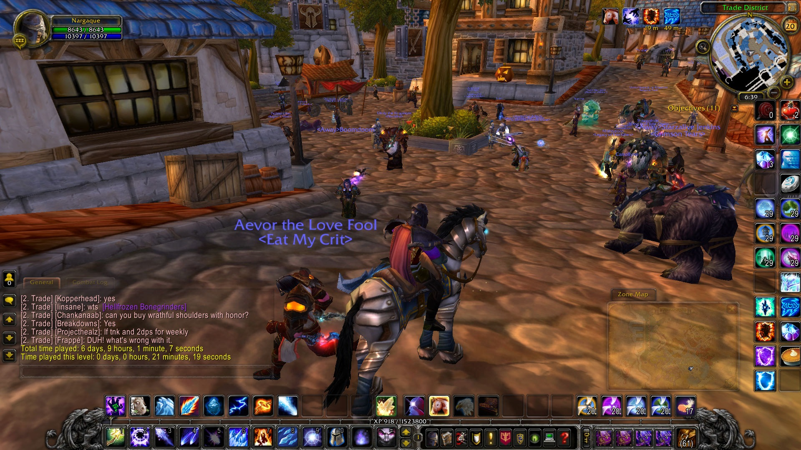
.caption[What are the *entities*? What is the *communication medium*?]
]

???

- Processes = game software running in player computers, game servers at Blizzard.
- Communication = the Internet abstraction
- Mention consensus issues

---

## A Hadoop system

.width-100[
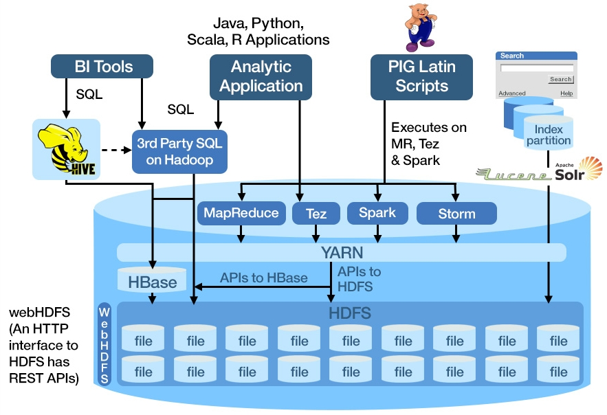
.caption[What are the *entities*? What is the *communication medium*?]
]

.footnote[Credits: Intelligent Business Strategies, [IBM Big Data Hub](http://www.ibmbigdatahub.com/blog/what-hadoop).]

???

- Processes = user application, computing framework servers (Spark), distributed file systems, and various other daemons managing the resources in the system.
- Communication = the Internet abstraction

---

## Bitcoins

.width-100[
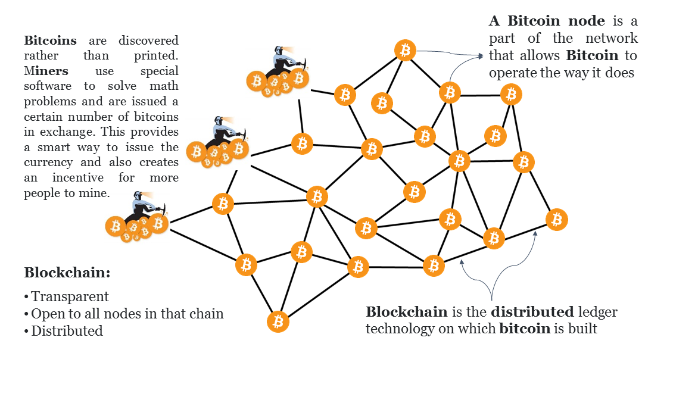
.caption[What are the *entities*? What is the *communication medium*?]
]

???

- Processes = wallets (storing bitcoins), miners (discovering new bitcoins), blockchain (== a distributed and secured database) for storing the transactions.
- Commmunication = a P2P network on top of the Internet.

---

# Why study distributed systems?

- Distributed systems are **everywhere**:
    - Internet
    - WWW
    - Mobile devices
    - Internet of Things

- **Technical** importance:
    - Improve *scalability*
        - Adding computational resources to a system is an easy way to scale its performance to many users.
    - Improve *reliability*
        - We want high availability and durability of the system.

---

#  Why study distributed systems?

- Distributed systems are **difficult** to build.
    - *Scale*: hundreds or thousands of machines.
        - Google: 4k-machine MapReduce cluster
        - Facebook: 60k machines providing the service
    - *Fault tolerance*: machines and networks do fail!
        - 50 machine failures out of 20k machine cluster per day (reported by Yahoo!)
        - 1 disk failure out of 16k disks every 6 hours (reported by Google)
    - *Concurrency*:
        - Nodes execute in parallel
        - Messages travel asynchronously
    - *Consistency*:
        - Distributed systems need to ensure user guarantees about the data they store.
        - E.g., all read operations return the same value, no matter where it is stored.
- But only a few **core problems** reoccur.

???

- Scale: Hard enough to program one machine!

---

# Teaser: Two Generals' Problem

.center[
<iframe width="640" height="480" src="https://www.youtube.com/embed/X7jzXlt6CgE?&loop=1&start=0" frameborder="0" volume="0" allowfullscreen></iframe>
]

???

Two Generals' Problem = Teaser example of a difficult but reoccuring problem in distributed systems.

---

# Teaser: Two Generals' Problem

Two generals need to coordinate an attack.

- They must **agree** on time to attack.
- They will win only if they attack **simultaneously**.
- They communicate through **messengers**.
- Messengers may be **killed** on their way.

---

# Teaser: Two Generals' Problem

Let's try to solve the problem for generals $g_1$ and $g_2$.

- $g_1$ sends time of attack to $g_2$.
- Problem: how to ensure $g_2$ received the message?
- Solution: let $g_2$ acknowledge receipt of message.
- Problem: how to ensure $g_1$ received the acknowledgment?
- Solution: let $g_1$ acknowledge receipt of acknowledgment.
- ...

--

This problem is **impossible** to solve!

(Unless we make additional assumptions)

???

R: explain why.

---

# Teaser: Two Generals' Problem

- Applicability to distributed systems:
    - Two nodes need to *agree* on a *value*.
    - They communicate by *messages* using an *unreliable channel*.

- **Agreement** is one of the core problems of distributed systems.

---

class: middle, center

# Outline

---

# What am I going to learn in this course?

- Understand the **foundational principles** required for the *design*, *implementation* and *maintenance* of distributed systems.
    - Communications
    - Failures
    - Consistency
    - Concurrency
    - Consensus
- From these general building blocks, understand
    - distributed *storage systems*
        - DFS, Key-value stores, Blockchain.
    - distributed *computing paradigms* for data science
        - MapReduce, Computational Graph systems;
- Develop **critical thinking** about their strengths and weaknesses.
- Exposition to *industrial software* through course projects.

---

# Theme 1: Communications

- *How do you talk to another machine?*
    - Networking basics
- *How do you talk to multiple machines at once, with ordering guarantees?*
    - Multicast, Gossiping.

---

# Theme 2: Failures and consistency

- *How do you know if a machine has failed?*
    - Failure detection.
- *How you do program your system to operate continually even under failure?*
    - Gossiping, replication.
- *What if some machines malfunction?*
    - Byzantine fault tolerance.

---

# Theme 3: Concurrency

- *How do you control access to shared resources?*
    - Distributed mutual exclusion, distributed transactions, etc.

---

# Theme 4: Consensus

- *How do multiple machines reach an agreement?*
    - Time and synchronization, global states, leader election, Paxos.
- **Bad news**: it is impossible!
    - The impossibility of consensus for asynchronous systems.

---

# Theme 5: Distributed storage

- *How do you locate where things are and access them?*
    - Distributed file systems
    - Key-value stores

- *How do you record and share sensitive data?*
    - Block chain

---

# Theme 6: Distributed computing for data science

- *What are the distributed computing systems for data science?*
    - Map Reduce (Hadoop)
    - Computational graph systems (Spark, Tensorflow, (Py)Torch)
- *Is distributed computing always necessary?*

---

class: middle, center

# Networking basics

How do you talk to another machine?

---

# What is the Internet?

.width-100[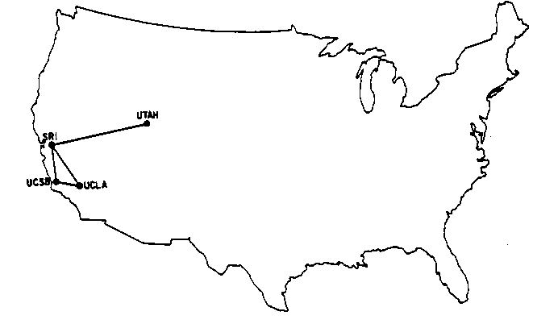
.caption[The Internet, 1969]]

.footnote[Credits: [ARPANET maps](http://som.csudh.edu/fac/lpress/history/arpamaps/)]

---

# What is the Internet?

.width-100[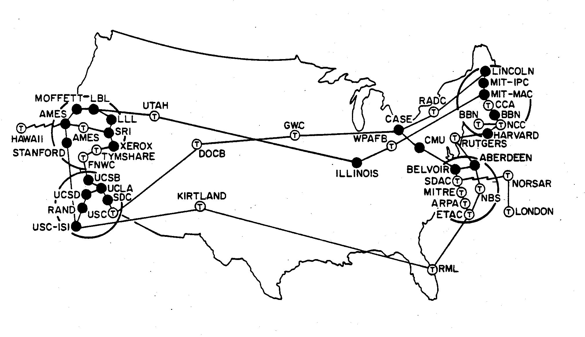
.caption[The Internet, 1974]]

.footnote[Credits: [ARPANET maps](http://som.csudh.edu/fac/lpress/history/arpamaps/)]

---

# What is the Internet?

.width-100[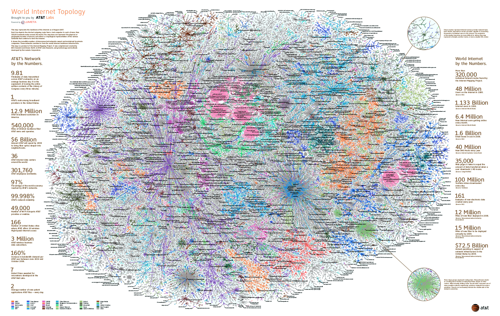
.caption[The Internet, 2007]]

.footnote[Credits: [AT&T Labs](http://www.research.att.com/export/sites/att_labs/groups/infovis/news/img/ATT_Labs_InternetMap_0730_10.pdf)]

---

# The Internet

- The Internet underlies many *distributed systems*, while being a distributed system in itself.
- A vast interconnected collection of networks of *many types*.
- Goal of the original designers:
    - *interconnecting* different networks by designing **common protocols**.

## Designer's hat

- Why do we want to connect computers?
- What is the ideal outcome?
- How do we do that?

---

# Building the Internet

- Why: The whole can be greater than the sum of its parts.
- What:
    - Internet communication **must continue** despite loss of networks or gateways.
    - The Internet must support **multiple types of communication services**.
    - The Internet architecture must accommodate **a variety of networks**.
    - The architecture must permit **distributed** *management* of its resources.
    - The architecture must be *cost effective*.
    - The architecture must permit host attachment with a *low level of effort*.
    - The resources used in the architecture must be *accountable*.

---

# How to interconnect systems?

- There were *many types of networks* based on various physical media (coax,
  radio, satellite, etc).
- The original designers wanted to interconnect these networks somehow.

???

Example: communicating with different spoken languages with a common super polyglot translator.

--

## A potential solution

Designing a "multi-media" network (e.g., via a physical signal translator for
various physical media).

Issues:
- **Does not scale** with the variety of media:
    - adding $O(1)$ new types of medium requires $O(N)$ translator sub-systems;
- Adds **complexity** inside the network;
- Increases the barrier to host attachment;
- Requires control over nodes one attaches to.

---

class: center, middle


.circle[]

*All problems in computer science can be solved by another level of indirection.* (David Wheeler)

???

Example: communicating with different spoken languages with intermediary that speak a common language.

---

# Connecting by layering

.grid[
.col-1-2[
- Sub-divide the problem by partitioning communication systems into **abstraction layers**.
    - Layers == levels of indirection.
    - A layer serves the layer above it and is served by the layer below it.
    - Complex services are built from simpler ones.
- *Interface* between layers defines interaction.
    - Hides implementation details;
    - Layers can change without disturbing other layers.
]
.col-1-2[
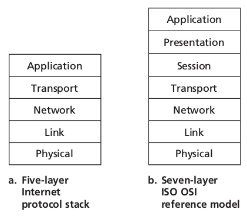
]
]

.footnote[Credits: [Computer Network: A Top-Down Approach](https://www.pearson.com/us/higher-education/program/Kurose-Computer-Networking-A-Top-Down-Approach-7th-Edition/PGM1101673.html)]

---

# Challenges of layering

- **Where** do we want to put the functionalities?
- What would be a good **division of labour** between end hosts and intermediate nodes in the network?
- Enabling a conversation between two remote hosts requires:
    - a mechanism for *addressing* (where do I send this message?)
    - a mechanism for *routing* (how do I reach this address?)
    - a mechanism for ensuring the *survivability* of the conversation, as long as there is a physical path between the entities communicating.
- Addressing and routing?
    - Probably in the network, at intermediate nodes.
- Survivability mechanisms?
    - The network or hosts?

---

# Two approaches to survivability

## Approach 1: stateful network.

- The **network** keeps the state information about conversations.

???

Draw picture 1: two end hosts communicating and the network recording the conversation.

---

# Two approaches to survivability

## Approach 2: stateless network.

- The **end hosts** keep the state information about conversations.
- Stateless networks' principle: *fate-sharing*.
    - The conversation shares the same fate with the ends.
    - It is acceptable to lose the state information associated with an entity if,
      at the same time, the entity itself is lost.
- Advantages:
    - Fate-sharing protects against any number of intermediate network failures.
    - Fate-sharing is much easier to engineer.
- This results in a **best-effort** network.
    - The intermediate nodes do not provide anything other than best-effort delivery (i.e., *addressing* and *routing*).
    - The end hosts provide *protection* mechanisms for the conservation.

???

Draw picture 2: two end hosts communicating and the end hosts recording the conversation.


---

# Encapsulation

.width-100[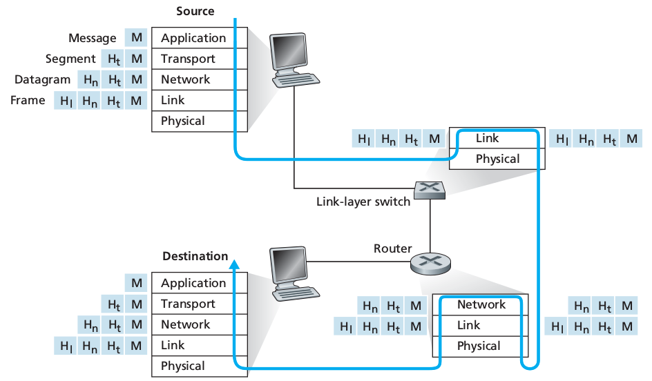]

Each node contains a different set of layers, reflecting their differences in functionality. Intermediate nodes remain simple while complexity is put at the network boundary in the end nodes.

---

# The end-to-end argument

.grid[
.col-2-3[
"When the function in question can completely and correctly be implemented
only with the knowledge and help of the application standing at the end
points of the communication system, providing that questioned
function as a feature of the communication system itself is not
possible." (Jerome Saltzer et al, 1984)
]
.col-1-3[
.circle[]
]
]

## In practice

- Resist the tendency to put complicated things in intermediate nodes.
- Good rule of thumbs in systems design, but not to follow blindly (e.g., in case of performance).

---

# TCP/IP

- *IP* (Internet protocol) as network layer
    - The network knows the source and the destination.
    - A conversation is divided into packets, which are delivered with **best-effort**.
    - Packet loss, corruption or out-of-order delivery could all happen.
- *TCP* (Transmission control protocol) as transport layer
    - Deals with the problems.
    - Implemented at the end hosts.

---

# TCP

- An *end-to-end* transmission protocol for the transport layer.
- **Protects** conversations:
    - Receiver *acknowledges* the reception of packets.
        - If a packet does not arrive, it is retransmitted.
    - Out-of-order delivery and duplicate packets are taken care of with *sequence numbers*.
    - Packet corruption is detected with checksums.
- **Controls congestion**:
    - The network might be over-utilized.
    - TCP prevents the network from collapsing (throttling).

---

# TCP: three-way handshake

.grid[
.col-1-2[
- Three-way handshake to **establish a connection**.
    - The client sends a *SYN* (open) to the server.
    - The server returns a *SYN ACK* acknowledgment.
    - The client sends an *ACK* to acknowledge the SYN ACK.
- <span class="Q">[Q]</span> Why three-way instead of two-way?
]
.col-1-2[
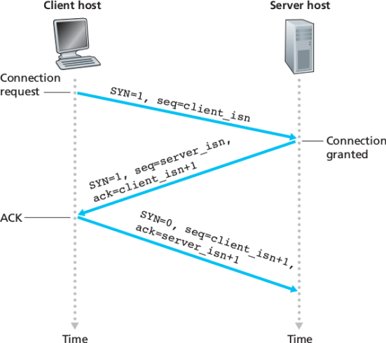
]
]

.center[]

.footnote[Credits: [Computer Network: A Top-Down Approach](https://www.pearson.com/us/higher-education/program/Kurose-Computer-Networking-A-Top-Down-Approach-7th-Edition/PGM1101673.html)]

???

Reason for three-way handshake:

TCP is bidirectional, i.e it is a pair of one way connections.

A two-way handshake ensure that the client can sends messages to the server.
However, the server does not know that it can sends messages back to the client.

For this reason, we need one two-way handshake for each connection, hence 4
events (SYN/ACK/SYN/ACK) in total. The middle events (ACK+SYN) can be sent
through a single packet.

---

# TCP: packet acknowledgment

.center[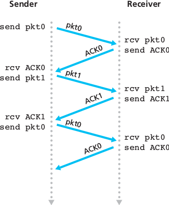]

.footnote[Credits: [Computer Network: A Top-Down Approach](https://www.pearson.com/us/higher-education/program/Kurose-Computer-Networking-A-Top-Down-Approach-7th-Edition/PGM1101673.html)]

---

# TCP: retransmission

.center[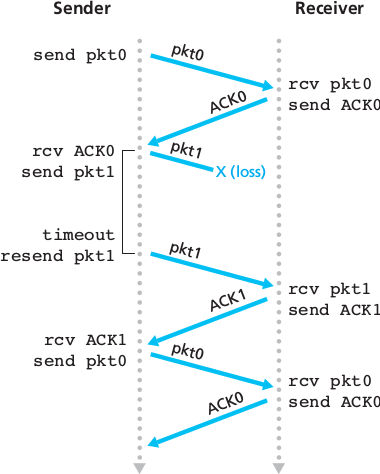]

.footnote[Credits: [Computer Network: A Top-Down Approach](https://www.pearson.com/us/higher-education/program/Kurose-Computer-Networking-A-Top-Down-Approach-7th-Edition/PGM1101673.html)]

???

TCP is an example of *synchronous system*, where we assume that processes have access to local physical clocks. This allows to build the timeout mechanism.

---

# UDP

- TCP comes with some **overhead**:
    - Connection establishment;
    - Packet loss: retransmission timeout;
    - Congestion control: does not utilize full bandwidth.
- There are applications that **do not** require these mechanisms.
    - Streaming applications.
        - Retransmitting lost or corrupted packets is not worth the effort.
- *UDP* provides a connectionless transport protocol which exposes IP almost exactly to the application layer, with minimal overhead.
    - This results in a **best-effort** transport layer, with no guarantee of delivery.
    - But with almost no overhead (in packet *size* or *delay*).
        - As the soon the application writes, packets are sent.

---

# The application layer

.width-100[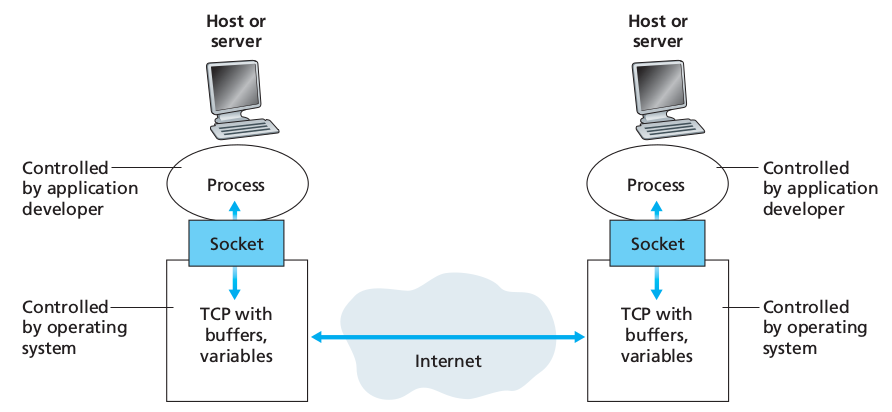]

- *Sockets* offer an **application programming interface** (API) of the transport layer (TCP or UDP).
- Applications are oblivious to underlying network operations.

.footnote[Credits: [Computer Network: A Top-Down Approach](https://www.pearson.com/us/higher-education/program/Kurose-Computer-Networking-A-Top-Down-Approach-7th-Edition/PGM1101673.html)]

---

# Socket programming

.center[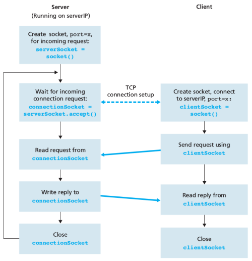]

.footnote[Credits: [Computer Network: A Top-Down Approach](https://www.pearson.com/us/higher-education/program/Kurose-Computer-Networking-A-Top-Down-Approach-7th-Edition/PGM1101673.html)]

---

# HTTP: our first distributed system

.grid[
.col-1-2[
- *HTTP*: hypertext transfer protocol.
- Application layer protocol powering the WWW.
- **Client / Server model**:
    - client: browser that requests, receives and displays web objects.
    - server: web server which stores the website and sends objects in response to requests.
- HTTP is stateless. *Why?*
]
.col-1-2[
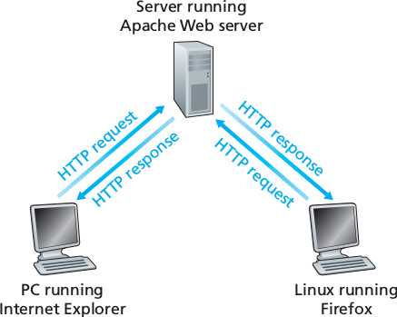
]
]

.footnote[Credits: [Computer Network: A Top-Down Approach](https://www.pearson.com/us/higher-education/program/Kurose-Computer-Networking-A-Top-Down-Approach-7th-Edition/PGM1101673.html)]

---

# An HTTP conversation

Suppose we want to visit `http://www.uliege.be`:

1a) The HTTP client initiates a TCP connection to the server `www.uliege.be` on port number 80.
```python
import socket
s = socket.socket(socket.AF_INET, socket.SOCK_STREAM)
s.connect(("www.uliege.be", 80))
```

1b) The HTTP server at `www.uliege.be` accepts and establishes the TCP connection from the client.

2) The HTTP client sends an HTTP message to the server via its TCP socket. The request includes the path name `/index.html`.
```python
request = b"GET /index.html HTTP/1.1\nHost: www.uliege.be\n\n"
s.send(request)
```

---

# An HTTP conversation

3) The HTTP server receives the request message via its socket, forms a response message containing the requested `/index.html` object, sends message into the socket.

4) The HTTP server closes the TCP connection if necessary. (But TCP doesn't actually terminate
until it knows for sure that the client has received the response message intact.)

5) The HTTP client receives a response message containing the HTML file and renders it.
```python
result = s.recv(10000)
while (len(result) > 0):
    print(result)
    result = s.recv(10000)
```

6) Steps 1-5 are then repeated for each sub-object in the page.

---

# Summary

- What to put on top of physical networks?
    - Layers providing *addressing*, *routing* and *survivability* of packets.
- Where to put functionalities?
    - **Fate-sharing** and **end-to-end arguments**.
    - IP provides a *best-effort delivery service*.
    - TCP *handles* most of the *survivability issues* to provide a **reliable** logical transport channel.
- HTTP: a client-server distributed system built on top of TCP.

---

# References

- Saltzer, Jerome H., David P. Reed, and David D. Clark. "End-to-end arguments in system design." ACM Transactions on Computer Systems (TOCS) 2.4 (1984): 277-288.
