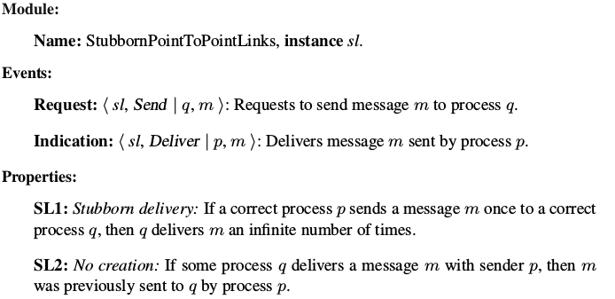
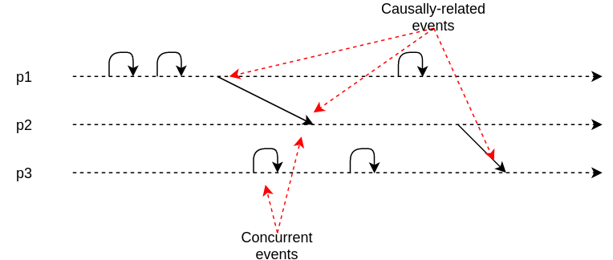

class: middle, center, title-slide

# Large-scale Data Systems

Lecture 2: Basic distributed abstractions

  
Prof. Gilles Louppe 
[g.louppe@uliege.be](g.louppe@uliege.be)

---

# Today

- Define **basic abstractions** that capture the
  fundamental characteristics of distributed systems:
    - *Process* abstractions
    - *Link* abstractions
    - *Timing* abstractions
- A **distributed system model** = a combination of the three categories of abstractions.

---

class: middle, center, black-slide

.width-80[]

---

# Why distributed abstractions?

*Reliable* distributed applications need underlying services **stronger** than transport protocols (e.g., TCP or UDP).

 

.circle.center[]
.caption["All problems in computer science can be solved  by another level of indirection" - David Wheeler.]

---

class: middle

## Distributed abstractions

- Core of any distributed system is a *set of distributed algorithms*.
- Implemented as a middleware between network (OS) and the application.

 
.center[]

---

class: middle

## Network protocols are not enough

.pull-right[]

- Communication
    - Reliability guarantees (e.g. with TCP) are only offered for **one-to-one** communication (client-server).
    - How to do *group communication*?
- High-level services
    - Sometimes one-to-many communication is not enough.
    - Need reliable *higher-level services*.
- Strategy: build complex distributed systems in a **bottom-up** fashion, from simpler ones.

---

class: middle

# Distributed computation

---

# Distributed algorithms

 

.center.width-70[]

 

- A *distributed algorithm* is a distributed collection $\Pi = \\{ p, q, r, ... \\}$ of $N$ processes implemented by *identical* automata.
- The automaton at a process regulates the way the process executes its computation steps.
- Processes jointly implement the application.
    - Need for **coordination**.
---

# Event-driven programming

- Every process consists of **modules** or **components**.
    - Modules may exist in multiple instances.
    - Every instance has a unique identifier and is characterized by a set of properties.
- Asynchronous **events** represent *communication* or *control flow* between components.
    - Each component is constructed as a state-machine whose transitions are triggered by the reception of events.
    - Events carry information (sender, message, etc)
- Reactive programming model:
  
.center[]
- Effectively, a distributed algorithm is described by a set of event handlers.

---

class: middle

## Layered modular architecture

.center[]

- Components can be composed locally to build software stacks.
    - The top of the stack is the *application layer*.
    - The bottom of the stack  the *transport* or *network* layer.
- Distributed programming abstraction layers are typically in the middle.
- We assume that every process executes the code triggered by events in a mutually exclusive way, without concurrently processing $\geq$ 2 events.

---

class: middle

## Execution

.center[]

- The **execution** of a distributed algorithm is a *sequence of steps* executed by its processes.
- A **process step** consists in
    - *receiving* a message from another process,
    - *executing* a local computation,
    - *sending* a message to some process.
- Local messages between components are treated as local computation.
- We assume *deterministic* process steps (with respect to the message received and the local state prior to executing a step).

---

class: middle

## Example: Job handler

.center.width-90[]

---

class: middle

.center.width-90[]

---

class: middle

.center.width-90[]

---

class: middle

.center.width-90[]

---

class: middle

.center.width-70[]

---

class: middle

.center.width-90[]

---

# Liveness and safety

- Implementing a distributed programming abstraction requires satisfying its *correctness*
  in all possible executions of the algorithm.
    - i.e., in all possible interleaving of steps.
- Correctness of an abstraction is expressed in terms of **liveness** and **safety** properties.
    - *Safety*: properties that state that nothing bad ever happens.
        - A safety property is a property such that, whenever it is violated in some execution $E$ of an algorithm,
        there is a prefix $E'$ of $E$ such that the property will be violated in any extension of $E'$.
    - *Liveness*: properties that state something good eventually happens.
        - A liveness property is a property such that for any prefix $E'$ of $E$, there exists an extension of $E'$ for which
        the property is satisfied.
- Any property can be expressed as the conjunction of safety property and a liveness property.

---

class: middle

.grid[
.kol-2-3[
## Example 1: Traffic lights at an intersection
- Safety: only one direction should have a green light.
- Liveness: every direction should eventually get a green light.
]
.kol-1-3[
.center.width-90[]
]
]

---

class: middle

## Example 2: TCP
- Safety: messages are not duplicated and received in the order they were sent.
- Liveness: messages are not lost.
    - i.e., messages are eventually delivered.

---

# Assumptions

- In our abstraction of a distributed system, we need to specify the *assumptions* needed for the algorithm to be **correct**.

- A distributed system model includes assumptions on:
    - **failure** behavior of processes and channels
    - **timing** behavior of processes and channels

---

class: middle

.center.width-100[]

 
.caption[Together, these assumptions define sets of solvable problems.]

---

class: middle

# Process abstractions

---

# Process failures

- Processes may **fail** in four different ways:
    - *Crash-stop*
    - *Omissions*
    - *Crash-recovery*
    - *Byzantine / arbitrary*

- Processes that do not fail in an execution are **correct**.

---

class: middle

## Crash-stop failures

- A process **stops taking steps**.
    - Not sending messages.
    - Not receiving messages.
- We assume the crash-stop process abstraction *by default*.
    - Hence, do not recover.
    - [Q] Does this mean that processes are not allowed to recover?

---

class: middle

## Omission failures

- Process **omits** sending or receiving messages.
    - *Send omission*: A process omits to send a message it has to send according to its algorithm.
    - *Receive omission*: A process fails to receive a message that was sent to it.
- Often, omission failures are due to *buffer overflows*.
- With omission failures, a process deviates from its algorithm by dropping messages that should have been exchanged with other processes.

---

class: middle

## Crash-recovery failures

- A process *might crash*.
    - It stops taking steps, not receiving and sending messages.
- It may **recover** after crashing.
    - The process emits a `<Recovery>` event upon recovery.
- Access to **stable storage**:
    - May read/write (*expensive*) to permanent storage device.
    - Storage survives crashes.
    - E.g., save state to storage, crash, recover, read saved state, ...
- A failure is different in the crash-recovery abstraction:
    - A process is *faulty* in an execution if
        - It crashes and never recovers, or
        - It crashes and recovers infinitely often.

    - Hence, a *correct* process may crash and recover.

---

class: middle

## Byzantine failures

- A process may **behave arbitrarily**.
    - Sending messages not specified by its algorithm.
    - Updating its state as not specified by its algorithm.

- Might behave **maliciously**, attacking the system.
    - Several malicious nodes might collude.

---

class: middle

.center.width-70[]
.caption[Fault-tolerance hierarchy]

???

Explain how failure modes are special cases of one another.

- Crash-stop special case of omission:
    - Omission restricted to omitting everything after a certain event.
- Crash-recovery and omission are the same:
    - Crashing, recovering and reading last state from storage
    - Just as same as omitting sending/receive while being crashed
    - But in crash-recovery, it might not be possible to restore all state
    - Therefore crash-recovery extends omission with amnesia
- Crash-recovery special case of Byzantine
    - Since Byzantine allows anything

---

class: middle

# Communication abstractions

---

# Links

- Every process may **logically** communicate with every other process (a).
- The physical implementation may *differ* (b-d).

.center.width-80[]

---

# Link failures

- *Fair-loss links*
    - Channel delivers any message sent, with non-zero probability.

- *Stubborn links*
    - Channel delivers any message sent infinitely many times.
    - Can be implemented using fair-loss links.

- *Perfect links* (reliable)
    - Channel delivers any message sent exactly once.
    - Can be implemented using stubborn links.
    - **By default**, we assume the perfect links abstraction.

.exercice[What abstraction do UDP and TCP implement?]

???

- TCP: perfect links
- UDP: fair-loss links

---

class: middle

## Stubborn links ($sl$)

.center[]

.exercice[Which property is safety/liveness/neither?]

???

- SL1. Stubborn delivery: liveness
- SL2. No creation: safety

---

class: middle

## Perfect links ($pl$)

.center[]

.exercice[Which property is safety/liveness/neither?]

???

- PL1. Reliable delivery: liveness
- PL2. No duplication: safety
- PL3. No creation: safety

---

class: middle

.center[]

.exercice[How does TCP efficiently maintain its `delivered` log?]

???

- With sequence numbers

---

class: middle

## Correctness of $pl$

- *PL1. Reliable delivery*
    - Guaranteed by the Stubborn link abstraction. (The Stubborn link will deliver the message an infinite number of times.)
- *PL2. No duplication*
    - Guaranteed by the log mechanism.
- *PL3. No creation*
    - Guaranteed by the Stubborn link abstraction.

---

class: middle

# Timing abstractions

---

# Timing assumptions

- Timing assumptions correspond to the **behavior** of processes and links **with respect to the passage of time**. They relate to
    - different processing speeds of processes;
    - different speeds of messages (channels).
- Three basic types of system:
    - *Asynchronous system*
    - *Synchronous system*
    - *Partially synchronous system*

---

# Asynchronous systems

- **No timing assumptions** on processes and links.
    - Processes do not have access to any sort of physical clock.
    - Processing time may vary arbitrarily.
    - No bound on transmission time.
- But *causality* between events can still be determined.
    - How?

---

class: middle

## Causal order

The **happened-before** relation $e_1 \to e_2$ denotes that $e_1$ may have caused $e_2$.
It is true in the following cases:
- *FIFO order*: $e_1$ and $e_2$ occurred at the same process $p$ and $e_1$ occurred $e_2$;
- *Network order*: $e_1$ corresponds to the transmission of $m$ at a process $p$ and $e_2$ corresponds to its reception at a process $q$;
- *Transitivity*: if $e_1 \to e'$ and $e' \to e_2$, then $e_1 \to e_2$.

---

class: middle

.center.width-100[]

---

class: middle

## Similarity of executions

- The **view** of $p$ in $E$, denoted $E|p$ is the subsequence of process steps in $E$ restricted to those of $p$
- Two executions $E$ and $F$ are *similar w.r.t. to $p$* if $E|p = F|p$.
- Two executions $E$ and $F$ are *similar* if $E|p = F|p$ for all processes $p$.

## Computation theorem

If two executions $E$ and $F$ have the same collection of events and their **causal order** is preserved, then $E$ and $F$ are similar executions.

???

Consequence: if causal order can be guaranteed then we dont need to make strong timing assumptions!

Can we check in a simple way if two events are causally related?

---

class: middle

## Logical clocks

In an asynchronous distributed system, the passage of time can be measured with **logical clocks**:
- Each process has a local logical clock $l_p$, initially set a $0$.
- Whenever an event occurs locally at $p$ or when a process sends a message, $p$ increments its logical clock.
    - $l_p := l_p + 1$
- When $p$ sends a message event $m$, it timestamps the message with its current logical time, $t(m) := l_p$.
- When $p$ receives a message event $m$ with timestamp $t(m)$, $p$ updates its logical clock.
    - $l_p := \\max(l_p, t(m))+1$

---

class: middle

.center.width-100[]

---

class: middle

## Clock consistency condition

Logical clocks capture **cause-effect relations**:
$$e_1 \to e_2 \Rightarrow t(e_1) < t(e_2)$$

- If $e_1$ is the cause of $e_2$, then $t(e_1) < t(e_2)$.
    - Can you prove it?
- But not necessarily the opposite:
    - $t(e_1) < t(e_2)$ does not imply $e_1 \to e_2$.
    - $e_1$ and $e_2$ may be logically **concurrent**.

---

class: middle

## Vector clocks

**Vector clocks** fix this issue by making it possible to tell when two events cannot be causally related, i.e. when they are concurrent.
- Each process $p$ maintains a vector $V_p$ of $N$ clocks, initially set at $V_p[i] = 0 \, \forall i$.
- Whenever an event occurs locally at $p$ or when a process sends a message, $p$ increments the $p$-th element of its vector clock.
    - $V_p[p] := V_p[p] + 1$
- When $p$ sends a message event $m$, it piggybacks its vector clock as $V_m := V_p$.
- When $p$ receives a message event $m$ with the vector clock $V_m$, $p$ updates its vector clock.
    - $V_p[p] := V_p[p] + 1$
    - $V_p[i] := \\max(V_p[i], V_m[i])$, for $i \neq p$.

---

class: middle

.center.width-100[]

---

class: middle

## Comparing vector clocks

- $V_p = V_q$
    - iff $\forall i \, V_p[i] = V_q[i]$.
- $V_p \leq V_q$
    - iff $\forall i \, V_p[i] \leq V_q[i]$.
- $V_p < V_q$
    - iff $V_p \leq V_q$ AND $\exists j \, V_p[j] < V_q[j]$
- $V_p$ and $V_q$ are logically concurrent.
    - iff NOT $V_p \leq V_q$ AND NOT $V_q \leq V_p$

---

# Synchronous systems

Assumption of three properties:
- *Synchronous computation*
    - Known upper bound on the process computation delay.
- *Synchronous communication*
    - Known upper bound on message transmission delay.
- *Synchronous physical clocks*
    - Processes have access to a local physical clock;
    - Known upper bound on clock drift and clock skew.

.exercice[Why studying synchronous systems? What services can be provided?]

???

Services:
- Timed failure detection, e.g. using a heartbeat mechanism.
- Measure of transit delays
- Coordination based on time (e.g., manipulating a specific file during a window of time)
- Worst-case response times.
- Synchronized clocks, which can then be used to timestamp events in the whole system.
    - This is feasible up to some bounded offset $\delta$

---

# Partially synchronous systems

A partially synchronous system is a system that is synchronous *most of the time*.
- There are periods where the timing assumptions of a synchronous system do not hold.
- But the distributed algorithm will have a long enough time window where everything behaves nicely, so that it can achieve its goal.

.exercice[Are there such systems?]

???

A system that is synchronous most of the time, but become asynchronous when messages are lost.
- E.g., buffer overflow (omission) -> retransmissions -> unpredictable delays

---

# Failure detection

- It is **tedious** to model (partial) synchrony.
- Timing assumptions are mostly needed to detect failures.
    - Heartbeats, timeouts, etc.
- We define **failure detector** abstractions to *encapsulate timing assumptions*:
    - Black box giving suspicions regarding node failures;
    - Accuracy of suspicions depends on model strength.

---

class: middle

## Implementation of failure detectors

A typical implementation is the following:
- Periodically exchange *hearbeat* messages;
- **Timeout** based on *worst case* message round trip;
- If timeout, then **suspect** node;
- If reception of a message from a suspected node, *revise suspicion* and increase timeout.

---

# Perfect detector (${\mathcal P}$)

Assuming a crash-stop process abstraction, the **perfect detector** encapsulates the timing assumptions of a *synchronous system*.

.center.width-90[]

.exercice[Which property is safety/liveness/neither?]

???

- PFD1. Strong completeness: liveness
- PFD2. Strong accuracy: safety

---

class: middle

.center[]

---

class: middle

## Correctness

We assume a synchronous system:
- The transmission delay is bounded by some known constant.
- Local processing is negligible.
- The timeout delay $\Delta$ is chosen to be large enough such that
    - every process has enough time to send a heartbeat message to all,
    - every heartbeat message has enough time to be delivered,
    - the correct destination processes have enough time to process the heartbeat and to send a reply,
    - the replies have enough time to reach the original sender and to be processed.

---

class: middle

- *PFD1. Strong completeness*
    - A crashed process $p$ stops replying to heartbeat messages, and no process will deliver its messages.
      Every correct process will thus eventually detect the crash of $p$.
- *PFD2. Strong accuracy*
    - The crash of $p$ is detected by some other process $q$ only if $q$ does
      not deliver a message from $p$ before the timeout period.
    - This happens only if $p$ has indeed crashed, because the algorithm makes sure $p$ must have
      sent a message otherwise and the synchrony assumptions imply that the message should
      have been delivered before the timeout period.

---

# Eventually perfect detector ($\diamond {\mathcal P}$)

The **eventually perfect detector** encapsulates the timing assumptions of a *partially synchronous system*.

.center.width-90[]

---

class: middle

.grid[
.kol-1-2.width-100[

]
.kol-1-2.width-100[

]
]

.exercice[Show that this implementation is correct.]

---

# Leader election ($le$)

- Failure detection captures failure behavior.
    - Detects **failed** processes.
- *Leader election* is an abstraction that also captures failure behavior.
    - Detects **correct** nodes.
    - But a single and same for all, called the *leader*.
- If the current leader crashes, a new leader should be elected.

---

class: middle

.center[]

---

class: middle

.center[]

.exercice[- Show that this implementation is correct.
- Is $le$ a failure detector?]

---

class: middle

# Distributed system models

---

# Distributed system models

We define a **distributed system model** as the combination of (i) a process abstraction,
(ii) a link abstraction,
and (iii) a failure detector abstraction.

- *Fail-stop* (synchronous)
    - Crash-stop process abstraction
    - Perfect links
    - Perfect failure detector
- *Fail-silent* (asynchronous)
    - Crash-stop process abstraction
    - Perfect links

---

class: middle

- *Fail-noisy* (partially synchronous)
    - Crash-stop process abstraction
    - Perfect links
    - Eventually perfect failure detector
- *Fail-recovery*
    - Crash-stop process abstraction
    - Stubborn links

The fail-stop distributed system model substantially simplifies the design of distributed algorithms.

---

class: end-slide, center
count: false

The end.

---

# References

- Alpern, Bowen, and Fred B. Schneider. "Recognizing safety and liveness." Distributed computing 2.3 (1987): 117-126.
- Lamport, Leslie. "Time, clocks, and the ordering of events in a distributed system." Communications of the ACM 21.7 (1978): 558-565.
- Fidge, Colin J. "Timestamps in message-passing systems that preserve the partial ordering." (1987): 56-66.
