class: middle, center, title-slide

# Large-scale Data Systems

Lecture 3: Reliable broadcast

  
Prof. Gilles Louppe 
[g.louppe@uliege.be](g.louppe@uliege.be)

---

# Today

- How do you talk to **multiple machines** at once?
- What if some of them *fail*?
- Can we guarantee that correct nodes all receive the same messages?
- What about **ordering**?
- What about *performance*?

---

class: middle, center, black-slide

.width-80[]

---

# Unreliable broadcast

.center.width-100[]

## Constraints
- The sender may fail.
- Recipients may fail.
- Packets might get lost.
- Packets may take long to travel.

How do we define a *reliable* broadcast service?

???

Correct nodes do not have the same view of the system:
- $p_2$ and $p_4$ delivered
- but $p_3$ did not.

---

class: middle

# Reliable broadcast abstractions

---

# Reliable broadcast abstractions

- *Best-effort broadcast*
    - Guarantees reliability only if sender is correct.
- *Reliable broadcast*
    - Guarantees reliability independent of whether sender is correct.
- *Uniform reliable broadcast*
    - Also considers the behavior of failed nodes.
- *Causal reliable broadcast*
    - Reliable broadcast with causal delivery order.

---

# Best-effort broadcast ($beb$)

.center[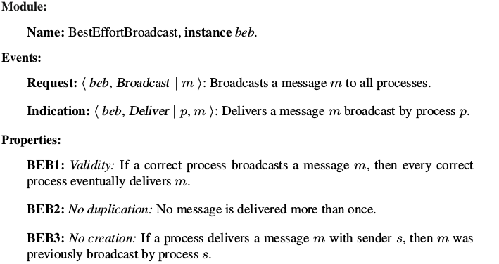]

---

class: middle

## $beb$ example (1)

.center.width-100[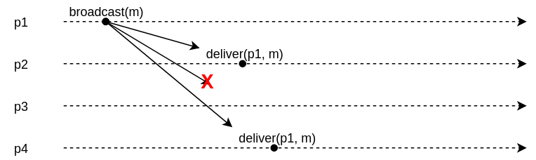]

[Q] Is this allowed?

???

Not allowed, because of validity.

---

class: middle

## $beb$ example (2)

.center.width-100[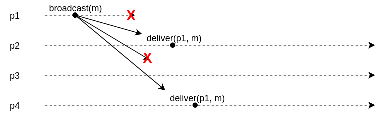]

[Q] Is this allowed?

???

Allowed.

---

# Reliable broadcast ($rb$)

- Best-effort broadcast gives no guarantees if *sender crashes*.
- **Reliable broadcast**:
    - Same as best-effort broadcast +
    - If sender crashes, ensure *all or none* of the correct node deliver the message.

---

class: middle

.center.width-90[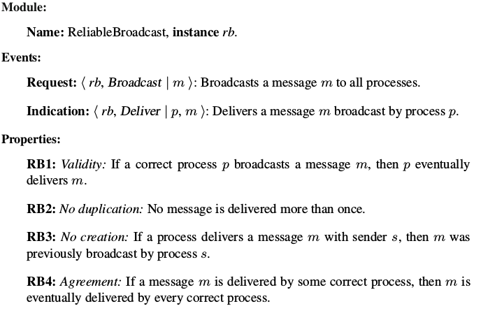]

---

class: middle

## $rb$ example (1)

.center.width-100[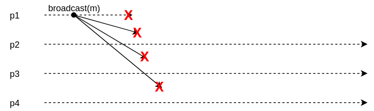]

[Q] Is this allowed?

???

Allowed, none of the messages are delivered.

---

class: middle

## $rb$ example (2)

.center.width-100[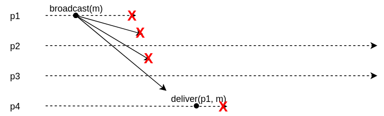]

[Q] Is this allowed?

???

Allowed, $p4$ crashes.

---

class: middle

## $rb$ example (3)

.center.width-100[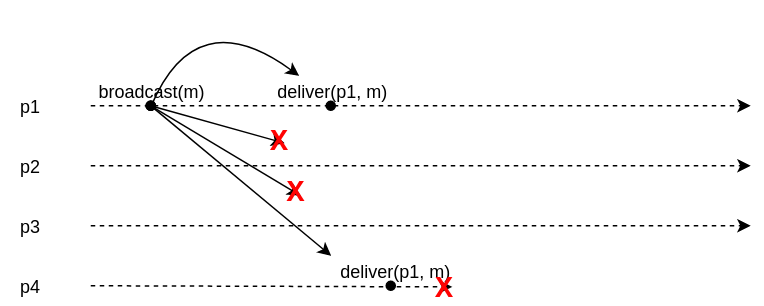]

[Q] Is this allowed?

???

Not allowed, $p2$ and $p3$ should also deliver since $p1$ delivers.

---

class: middle

## $rb$ example (4)

.center.width-100[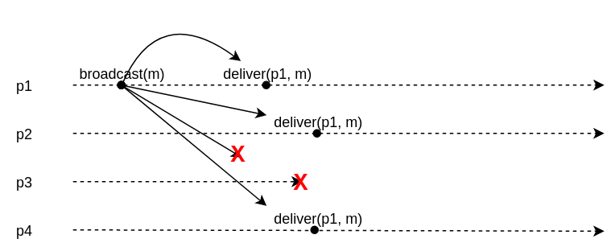]

[Q] Is this allowed?

???

Allowed.

---

# Uniform reliable broadcast ($urb$)

- Assume sender broadcasts a message
    - Sender fails
    - No correct node delivers the message
    - Failed nodes deliver the message
- Is this OK?
    - A process that delivers a message and later crashes may bring the application into a inconsistent state.
- **Uniform** reliable broadcast ensures that if a message is delivered, by a correct *or a faulty* process, then all correct processes deliver.

---

class: middle

.center.width-90[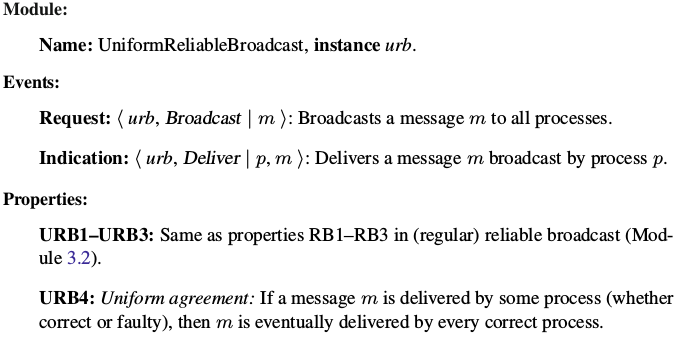]

???

Go back to rb-example 2. -> This one is not allowed anymore.

---

class: middle

# Implementations

---

# Basic broadcast

.center[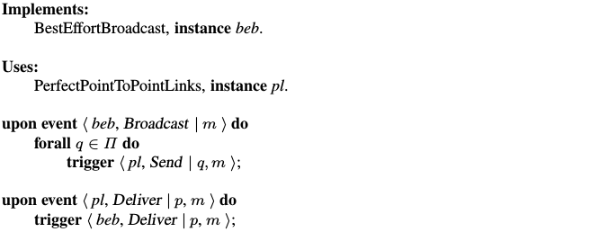]

Correctness:
- *BEB1. Validity*: If a correct process $p$ broadcasts $m$, then every correct process eventually delivers $m$.
    - If sender does not crash, every other correct node receives message by perfect channels.
- *BEB2+3. No duplication + no creation*
    - Guaranteed by perfect channels.

---

# Lazy reliable broadcast

- Assume a *fail-stop* distributed system model.
    - i.e., crash-stop processes, perfect links and a perfect failure detector.
- To broadcast $m$:
    - best-effort broadcast $m$
    - Upon `bebDeliver`:
        - Save message
        - `rbDeliver` the message
- If sender $s$ crashes, detect and relay messages from $s$ to all.
    - case 1: get $m$ from $s$, detect crash of $s$, redistribute $m$
    - case 2: detect crash of $s$, get $m$ from $s$, redistribute $m$.
- Filter duplicate messages.

---

class: middle

.center[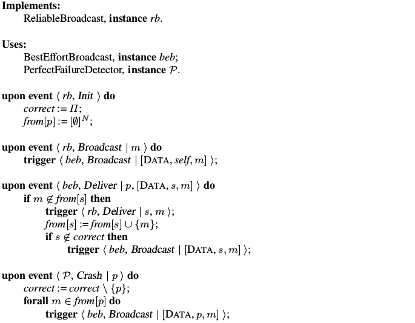]

---

class: middle

## Lazy reliable broadcast example (1)

.center.width-100[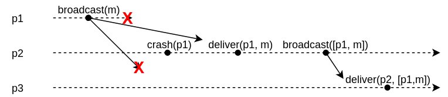]

[Q] Which case?

???

Case 2

---

class: middle

## Lazy reliable broadcast example (2)

.center.width-100[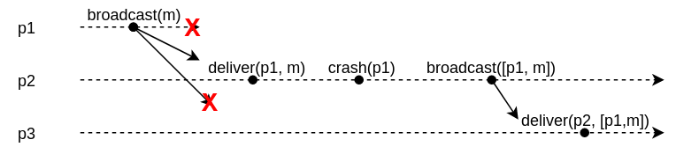]

[Q] Which case?

???

Case 1

---

class: middle

## Correctness of lazy reliable broadcast

- *RB1-RB3*
    - Satisfied with best-effort broadcast.
- *RB4. Agreement*: If a message $m$ is delivered by some correct process, then $m$ is eventually delivered by every correct process.
    - When correct $p_j$ delivers $m$ broadcast by $p_i$
        - if $p_i$ is correct, BEB ensures correct delivery
        - if $p_i$ crashes,
            - $p_j$ detects this (because of completeness of the PFD)
            - $p_j$ uses BEB to ensure (BEB1) every correct node gets $m$.

---

# Eager reliable broadcast

- What happens if we use instead an *eventually* perfect failure detector?
    - Only affects performance, not correctness.
- Can we modify Lazy RB to not use a perfect failure detector?
    - Assume all nodes have failed.
    - BEB broadcast all received messages.

---

class: middle

.center[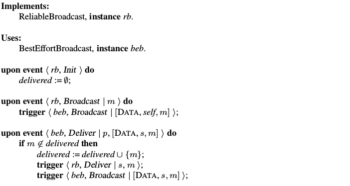]

[Q] Show that eager reliable broadcast is correct.

---

# Uniformity

Neither Lazy reliable broadcast nor Eager reliable broadcast ensure *uniform* agreement.

E.g., sender $p$ immediately RB delivers and crashes. Only $p$ delivered the message.

## Strategy for uniform agreement
- Before delivering a message, we need to ensure all correct nodes have received it.
- Messages are  **pending** until all correct nodes get it.
    - Collect acknowledgements from nodes that got the message.
- Deliver once all correct nodes acked.

---

# All-ack uniform reliable broadcast

.width-60[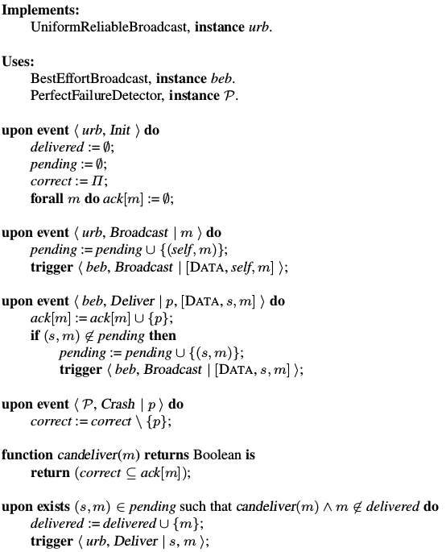]

---

class: middle

## Example

.center.width-100[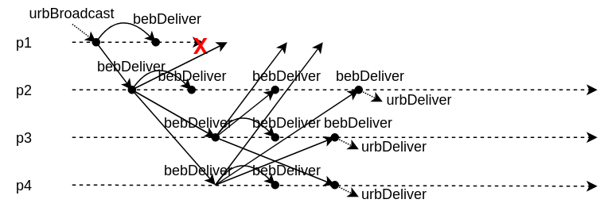]

---

class: middle

## Correctness of All-ack URB

.italic[Lemma.] If a correct node $p$ BEB delivers $m$, then $p$ eventually URB delivers $m$.

Proof:
- A correct node $p$ BEB broadcasts $m$ as soon as it gets $m$.
- By BEB1, every correct node gets $m$ and BEB broadcasts $m$.
- Therefore $p$ BEB delivers from every correct node by BEB1.
- By completeness of the perfect failure detector, $p$ will not wait for dead nodes forever.
    - `canDeliver` becomes true and $p$ URB delivers $m$.

---

class: middle

- *URB1. Validity*: If a correct process $p$ broadcasts $m$, then $p$ delivers $m$
    - If sender is correct, it will BEB delivers $m$ by validity (BEB1)
    - By the lemma, it will therefore eventually URB delivers $m$.
- *URB2. No duplication*
    - Guaranteed because of the `delivered` set.
- *URB3. No creation*
    - Ensured from best-effort broadcast.
- *URB4. Uniform agreement*: If a message $m$ is delivered by some process (correct or faulty), then $m$ is eventually delivered by every correct process
    - Assume some node (possibly failed) URB delivers $m$.
        - Then `canDeliver` was true, and by accuracy of the failure detector, every correct node has BEB delivered $m$.
    - By the lemma, each of the nodes that BEB delivered $m$ will URB deliver $m$.

---

# $urb$ for fail-silent

- All-ack URB requires a perfect failure detector (fail-stop).
- Can we implement URB in *fail-silent*,  without a perfect failure detector?
- **Yes**, provided a majority of nodes are correct.

.center[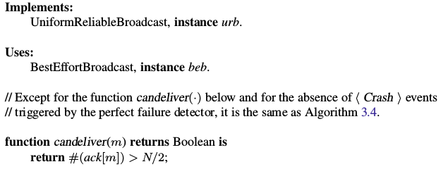]

[Q] Show that this variant is correct.

---

class: middle

# Causal reliable broadcast

---

class: middle

.center[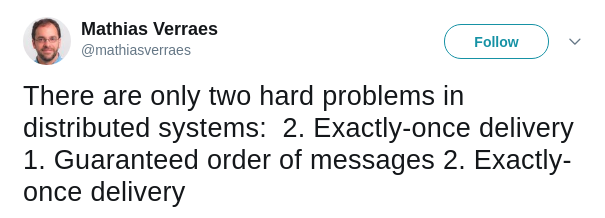]

Reliable broadcast:
- Exactly-once delivery: *guaranteed* by the properties of RB.
- Order of message? **Not guaranteed!**

[Q] Does uniform reliable broadcast remedy this?

???

No, uniform agreement only concerns individual messages.

---

# Causal order of messages

.center[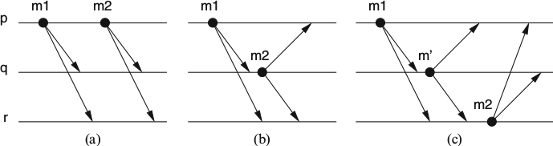]

A message $m_1$ may have caused another message $m_2$, denoted $m_1 \to m_2$ if any of the following relations apply:

- (a) some process $p$ broadcasts $m_1$ before it broadcasts $m_2$;
- (b) some process $p$ delivers $m_1$ and subsequently broadcasts $m_2$; or
- (c) there exists some message $m'$ such that $m_1 \to m'$ and $m' \to m_2$.

---

# Causal broadcast ($crb$)

.center[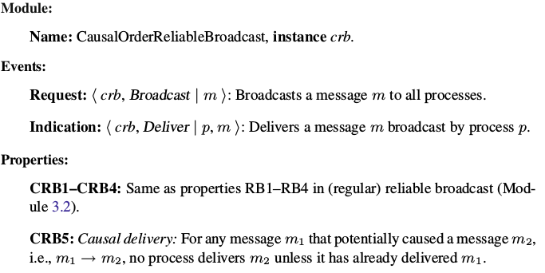]

---

# No-waiting causal broadcast

.center[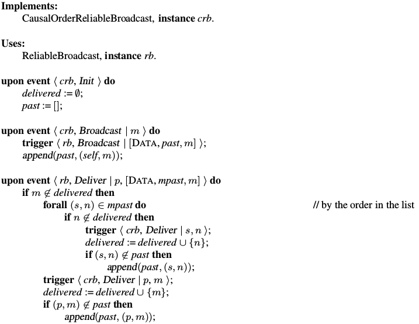]

point out issue of growing history size

---

class: middle

## No-waiting CB example

.center[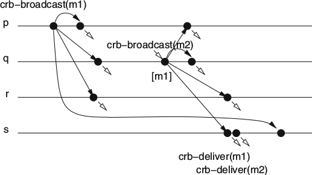]

- The size of the message **grows with time**, as messages include their list of
causally preceding messages `mpast`.
- Solution 1: *Garbage collect* old messages by sending acknowledgements of delivery to all nodes and purging messages that have been acknowledged from all.
- Solution 2: History is a *vector timestamp*!

---

# Waiting causal broadcast

.center[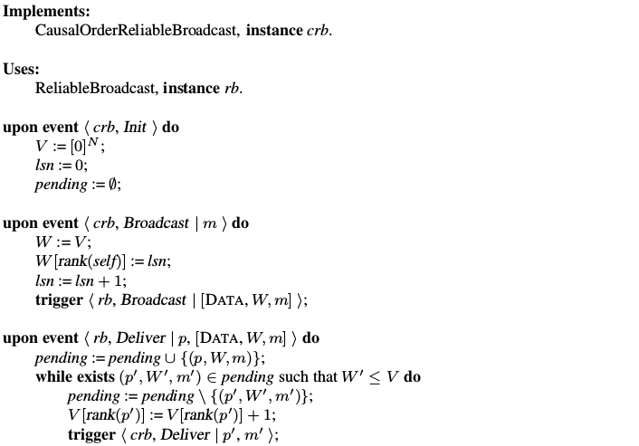]

[Q] Show the correctness of the algorithm.

---

class: middle

## Waiting CB example

.center[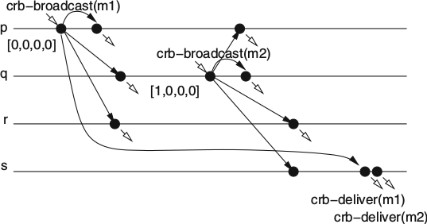]

---

class: middle

## Possible execution?

.center.width-100[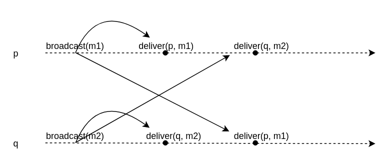]

[Q] Is this a valid execution? the order of delivery is not the same.

---

class: middle

# Probabilistic broadcast

(a.k.a. epidemic broadcast or gossiping.)

---

# Scalability of reliable broadcast

- In order to broadcast a message, the sender needs
    - to send messages to all other processes,
    - to collect some form of acknowledgement.
    - $O(N^2)$ are exchanged in total.
        - If $N$ is large, this can become overwhelming for the system.  
- Bandwidth, memory or processing resources may limit the number of messages/acknowledgements that may be sent/collected.
- Hierarchical schemes reduce the total number of messages.
    - This reduces the load of each process.
    - But increases the latency and fragility of the system.

.center.width-100[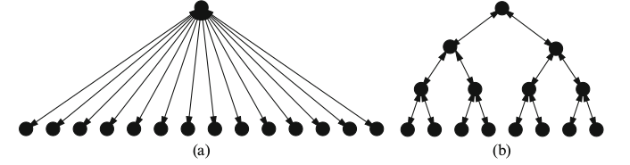]

---

# Epidemic dissemination

- Nodes infect each other through messages sent in **rounds**.
    - The *fanout* $k$ determines the number of messages sent by each node.
    - Recipients are drawn *at random* (e.g., uniformly).
    - The *number of rounds* is limited to $R$.
- Total number of messages is usually less than $O(N^2)$.
- No node is overloaded.

---

class: middle, center

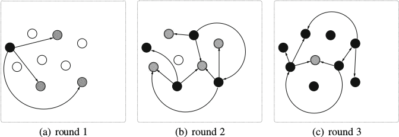

---

# Probabilistic broadcast ($pb$)

.center.width-90[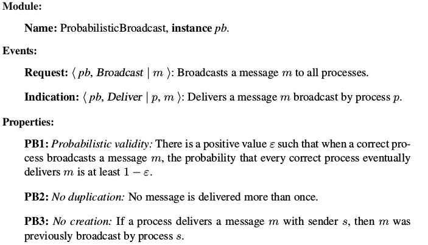]

---

# Eager probabilistic broadcast

.center[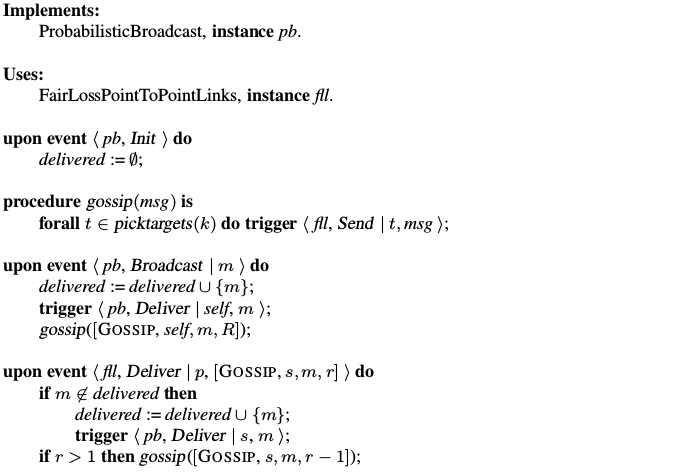]

---

# The mathematics of epidemics

Assume a virus using a distributed system to propagate, with human hosts as nodes.

## Setup
- Initial population of $N$ individuals.
- At any time $t$,
    - $S(t) =$ the number of *susceptible* individuals,
    - $I(t) =$ the number of *infected* individuals.
- $I(0) = 1$
- $S(0) = N-1$
- $S(t)+I(t)=N$ for all $t$.

---

class: middle

The expected dynamics of the SIS model is given as follows:
$$S(t+1) = S(t) - \frac{\alpha \Delta t}{N} S(t) I(t) + \gamma \Delta t I(t)$$
$$I(t+1) = I(t) + \frac{\alpha \Delta t}{N} S(t) I(t) - \gamma \Delta t I(t)$$
where
- $\alpha$ is the contact rate with whom infected individuals make contact per unit of time.
- $\frac{S(t)}{N}$ is the proportion of contacts with susceptible individuals for each infected individual.
- $\gamma$ is the probability for an infected individual to recover and switch to the pool of susceptibles.

---

class: center, middle

.width-70[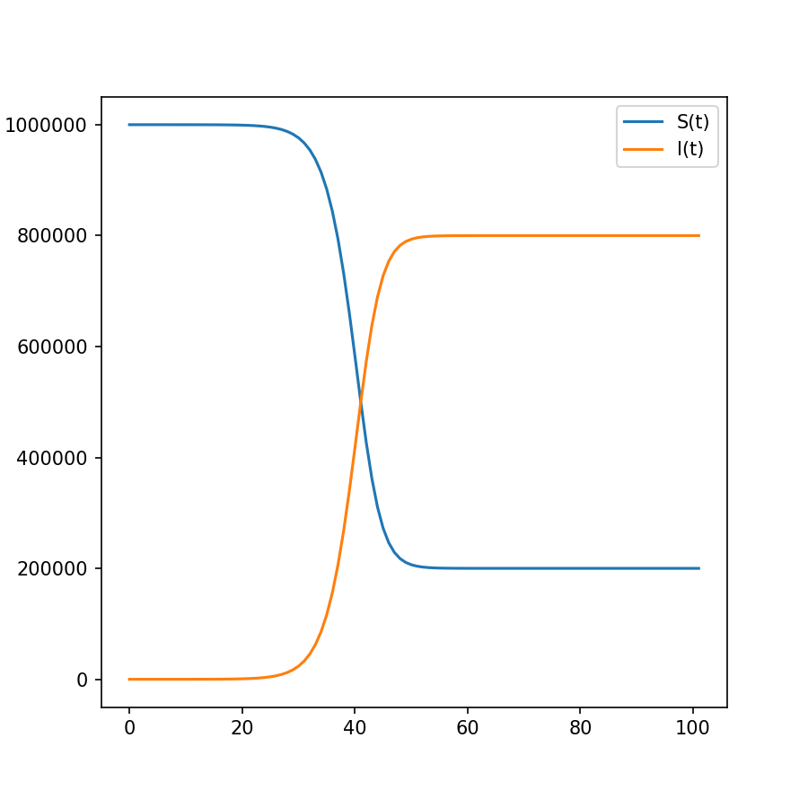]

$N=1000000$, $\alpha=5$, $\gamma=0.5$, $\Delta t = 0.1$

---

class: middle

In eager reliable broadcast,
- $\alpha = k$
    - An infected node selects $k$ nodes among $N$ to send its messages.
- $\gamma = 1$
    - An infected node immediately recovers.

---

# Probabilistic validity

At time $t$, the probability of not receiving a message is
$$(1 - \frac{k}{N})^{I(t)}$$
Therefore the probability of having received of one or more gossip messages up to time $t$, that is to have PB-delivered, is
$$p(\text{delivery}) = 1 - (1 - \frac{k}{N})^{\sum_{t_i=0}^t I(t_i)}$$

[Q] What if nodes fail? if packets are loss?

???

- Node failures: replace $N$ with $N/2$ and $k$ with $k/2$.
- Packet loss: replace $k$ with $k/2$.

---

class: center, middle

$p(\text{delivery}|k, t)$

.width-50[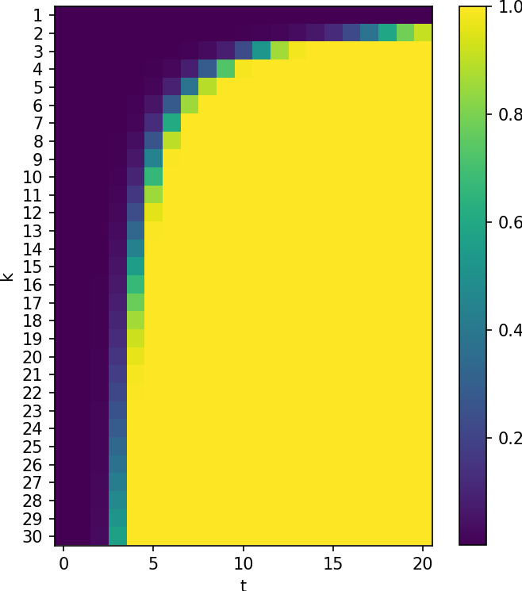]

$N=1000000$, $\gamma=1.0$

---

class: middle

From this plot, we observe that:
- Within only a few rounds (*low latency*), a large fraction of nodes receive the message (*reliability*)
- Each node has transmitted no more than $kR$ messages (*lightweight*).

---

# Lazy Probabilistic broadcast

- Eager probabilistic broadcast consumes **considerable resources** and causes many **redundant transmissions**.
    - in particular as $r$ gets larger and almost all nodes have received the message once.
- Assume *a stream of messages* to be broadcast.
- Broadcast messages in **two phases**:
    - *Phase 1 (data dissemination)*: run probabilistic broadcast with a large probability $\epsilon$ that reliable delivery fails. That is, assume a constant fraction of nodes obtain the message (e.g., $\frac{1}{2}$).
    - *Phase 2 (recovery)*: upon delivery, detect omissions through sequence numbers and initiate retransmissions with gossip.

---

class: middle

## Phase 1: data dissemination

.center.width-80[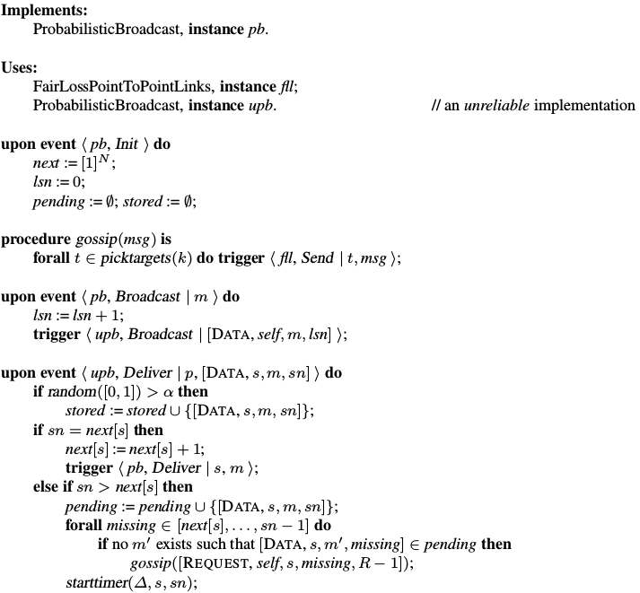]

---

class: middle

## Phase 2: recovery

.center.width-80[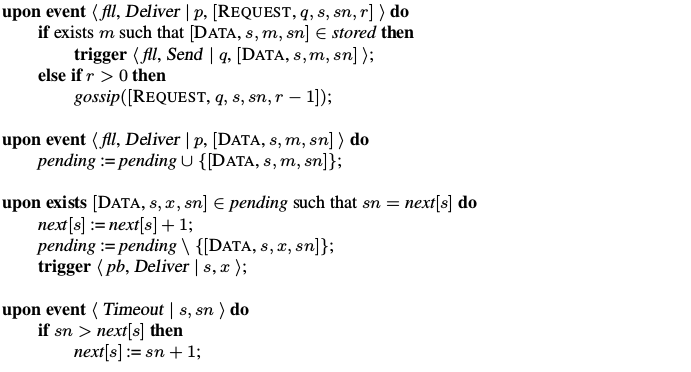]

---

# Summary

- Reliable multicast enable group communication, while ensuring **validity** and (uniform) **agreement**.
- Causal broadcast extends reliable broadcast with *causal ordering* guarantees.
- **Probabilistic broadcast** enable low-latency, reliable and lightweight group communication.

---

class: end-slide, center
count: false

The end.

---

# References

- Allen, Linda JS. "Some discrete-time SI, SIR, and SIS epidemic models." Mathematical biosciences 124.1 (1994): 83-105.
