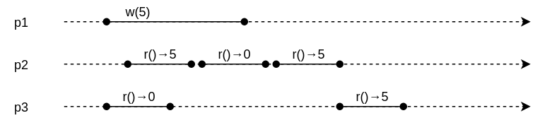
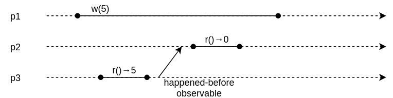

class: middle, center, title-slide

# Large-scale Data Systems

Lecture 4: Shared memory

  
Prof. Gilles Louppe 
[g.louppe@uliege.be](g.louppe@uliege.be)

---

# Today

.center.width-70[]
.caption[Towards a distributed file system.]
 

- How do you *share resources* between processes?
- Can we build the *illusion of single storage*?
    - While replicating data for **fault-tolerance** and **scalability**?
    - While maintaining **consistency**?

---

class: middle, center, black-slide

.width-80[]

---

# Shared memory

.center.width-60[]

In a multiprocessor machine, processors typically communicate through **shared memory** provided at the hardware level (e.g., shared blocks of RAM that can be accessed by distinct CPUs).
- Shared memory can be viewed as an *array of registers* to which processors can *read* or *write*.
- Shared memory systems are *easy to program* since all processors share a single view of the data.

---

class: middle

## Shared memory emulation

We want to **simulate** a *shared memory abstraction* in a distributed system, on top of message passing communication.
- Enable shared memory algorithms without being aware that processes are actually communicating by exchanging messages.
    - This is often much easier to program.
- Equivalent to **consistent data replication** across nodes.

---

class: middle

## Data replication

- Shared data allows to:
    - Reduce network traffic
    - Promote increased parallelism
    - Be robust against failures
    - Result in fewer page faults
- Applications:
    - distributed databases
    - distributed file systems
    - distributed cache
- Challenges:
    - Consistency in presence of *failures*.
    - Consistency in presence of *concurrency*.

---

class: middle

# Regular registers

---

# Read/Write registers

- A **register**  represents each memory location.
- A register contains only positive integers and is initialized to $0$.
- Registers have two *operations*:
    - $\text{read}()$: return the current value of the register.
    - $\text{write}(v)$: update the register to value $v$.
- An operation is **not instantaneous**:
    - It is first *invoked* by the calling process.
    - It computes for some time.
    - It returns a *response* upon completion.

.width-100[]

---

class: middle

## Definitions

- In an execution, an operation is
    - *completed* if both invocation and response occurred.
    - **failed** if invoked but not no response was received.
- Operation $o_1$ *precedes* $o_2$ if response of $o_1$ precedes the invocation of $o_2$.
- Operations  $o_1$ and  $o_2$ are **concurrent** if neither precedes the other.
- $(1,N)$-register: 1 designated writer, $N$ readers.
- $(M,N)$-register: $M$ writers, $N$ readers.

---

# Regular registers ($onrr$)

.center[]

???

Draw the schema of the component with requests and indications?

---

class: middle

## Regular register example (1)

.width-100[]

.exercice[Regular or non-regular?]

???

Non-regular.

---

class: middle

## Regular register example (2)

.width-100[]

.exercice[Regular or non-regular?]

???

Regular.

---

class: middle

## Regular register example (3)

.width-100[]

.exercice[Regular or non-regular?]

???

Regular.

This could not happen if we had a true single storage illusion!

---

class: middle

## Centralized algorithm

- Designates one process as the **leader**.
    - E.g., using the leader election abstraction (see Lecture 2).
- To $\text{read}()$:
    - Ask the leader for latest value.
- To $\text{write}(v)$:
    - Update leader's value to $v$.

.exercice[What is the issue with this algorithm?]

???

Problem? **Does not work if leader crashes!**

---

class: middle

## Decentralized algorithm (bogus)

- Intuitively, make an algorithm in which
    - A $\text{read}()$ reads the local value.
    - A $\text{write}(v)$ writes to all nodes.
- To $\text{read}()$:
    - Return local value.
- To $\text{write}(v)$:
    - Update local value to $v$.
    - Broadcast $v$ to all (each node then locally updates).
    - Return.

.exercice[What is the issue with this algorithm?]

---

class: middle

.width-100[]

.center[**Validity is violated!**]

---

# Read-one Write-all algorithm

- Bogus algorithm modified.
- To $\text{read}()$:
    - Return local value.
- To $\text{write}(v)$:
    - Update local value to $v$.
    - Broadcast $v$ to all (each node locally updates).
    - **Wait for acknowledgement from all correct nodes.**
        - Require a perfect failure detector (fail-stop).
    - Return.

---

class: middle

.width-70[]

---

class: middle

##  Read-one Write-all example

.width-100[]

.center[Validity is no longer violated because the write response has been postponed.]

---

# Fail-silent algorithm

    

.center[
.width-80[]

What if the failure detector is not perfect? 
]

???

Then Read-One Write-all may violate validity.

---

class: middle

Can we implement a regular register in **fail-silent**? (without a failure detector)

- When writing, timestamp the value to be written.
- Always write to a strict majority of nodes.
- Always read from a strict majority of nodes, and pick the most recent value.

Then, provided that a strict majority of nodes are correct, validity is ensured.

---

class: middle 

## Quorum principle

.center.width-80[]

???

In general, a quorum is the minimum number of votes that a distributed transaction has to obtain in order to be allowed to perform an operation in a distributed system.

Here, the minimum number = N/2+1.

When writing, wait for a strict majority of acks before returning.

When reading, if we wait for a strict majority of acks before returning, then choosing the largest timestamp ensures that the value written last is returned, even if the majority is not composed of the same nodes.

---

# Majority voting algorithm

.width-70[]

---

class: middle

.width-70[]

.exercise[Why do we reset `acks` and `readlist` right after having received back just more than $N/2$ messages?]

???

Validity:
1. consider a read without any concurrent write. This will return the latest value written since we have majority.
2. consider a read concurrent with a write. Two valid values: the previous one or the one currently being written.

---

class: middle

# Atomic registers
Towards single storage illusion.

???

Jump back to regular register example (3), slide 13.

---

# Sequential consistency

An operation $o_1$ *locally precedes* $o_2$ in $E$ if $o_1$ and $o_2$ occur at the same node and $o_1$ precedes $o_2$ in $E$.

An execution $E$ is **sequentially consistent** if an execution $F$ exists such that:
- $E$ and $F$ contain the same events;
- $F$ is sequential;
- Read responses have value of the preceding write invocation in $F$;
- If $o_1$ locally precedes $o_2$ in $E$, then $o_1$ locally precedes $o_2$ in $F$.

???

"... the result of any execution is the same as if the operations of all the processors were executed in some sequential order, and the operations of each individual processor appear in this sequence in the order specified by its own program."

---

class: middle

## Example (1)

.width-100[]

Sequential consistency **disallows** such execution.

---

class: middle

## Example (2)

.width-100[]

Sequential consistency *allows* such execution.

???

F: read at p2, write at p1, read at p3

This is ok because the two reads do not locally precede each other.

---

# Linearization

   

.width-100[]

---

class: middle

.width-100[]

This execution is sequentially consistent but is not linearizable!

---

class: middle

- *Linearizability*:
    - Read operations appear as if **immediately** happened at all nodes at time between invocation and response.
    - Write operations appear is if **immediately** happened at all anode at time between invocation and response.
    - Failed operations appear as
        - completed at every node, XOR
        - never occurred at any node.
    - The hypothetical serial execution is called a *linearization* of the actual execution.
- *Termination*:
    - If node is correct, each read and write operation eventually completes.

---

class: middle

## Example (1)

.width-100[]

Linearizability **disallows** such execution.

---

class: middle

## Example (2)

.width-100[]

Linearizability **disallows** such execution.

---

# $(1, N)$ atomic registers

.center.width-80[]

.exercice[Show that linearizability is equivalent to validity + ordering.]

---

class: middle

## Atomic register example (1)

.width-100[]

[Q] Atomic?

???

**No**, not possible to find linearization points.

---

class: middle

## Atomic register example (2)

.width-100[]

[Q] Atomic?

???

*Yes*

---

class: middle

## Atomic register example (3)

.width-100[]

[Q] Atomic?

???

*Yes*

---

class: middle

## Regular but not atomic

.width-100[]

[Q] Atomic? Regular?

???

[Q] Atomic? **No**. Regular? *Yes*, using majority voting.

---

# Implementation of $(1,N)$ atomic registers

- When reading, write back the value that is about to be returned.
- Maintain a local timestamp $ts$ and its associated value $val$.
- Overwrite the local pair only upon a write operation of a more recent value.

.center.width-70[]

---

# Read-Impose Write-all algorithm

---

class: middle

.exercice[How to adapt to fail-silent?]

???

**Read-Impose Write-Majority**

---

class: middle

## Correctness

- *Ordering*: if a read returns $v$ and a subsequent read returns $w$, then the write of $w$ does not precede the write of $v$.
    - $p$ writes $v$ with timestamp $ts_v$.
    - $p$ writes $w$ with timestamp $ts_w > ts_v$.
    - $q$ reads the value $w$.
    - some time later, $r$ invokes a read operation.
    - when $q$ completes its read, all correct processes (including $r$) have a timestamp $ts \geq ts_w$.
    - there is no way for $r$ to changes its value back to $v$ after this because $ts_v < ts_w$.

.exercice[Show that the termination and validity properties are satisfied.]

???

Make the plot.

Termination and validity are ensured in the same way as for Read-One Write-All.

---

# $(N, N)$ atomic registers

.center[]

---

class: middle

- How do we handle **multiple writers**?
- Read-Impose Write-all does not support multiple writers:
    - Assume $p$ and $q$ both store the same timestamp $ts$ (e.g., because of a preceding completed operation).
    - When $p$ and $q$ proceed to write, different values would become associated with the same timestamp.
- Fix:
    - Together with the timestamp, pass and store the identity $pid$ of the process that writes a value $v$.
    - Determine which message is the latest
        - by comparing timestamps,
        - by breaking ties using the process IDs.

???

[Q] How many messages are exchanged per read and write operations?

[Q] Can we similarly fix Read-Impose Write-Majority?

---

# Simulating message passing?

- As we saw, we can simulate shared memory with message passing.
    - A majority of correct nodes is all that is needed.
- Can we *simulate message passing* in shared memory?
    - Yes: use one register $pq$ for every channel.
        - Modeling a directed channel from $p$ to $q$.
    - Send messages by appending to the right channel.
    - Receive messages by busy-polling incoming "channels".
- Shared memory and message passing are **equivalent**.

---

# Summary

- Shared memory registers form a **shared memory abstraction** with read and write operations.
    - Consistency of the data is guaranteed, even in the presence of failures and concurrency.
- Regular registers:
    - Bogus algorithm (does not work)
    - Centralized algorithm (if no failures)
    - Read-One Write-All algorithm (fail-stop)
    - Majority voting (fail-silent)
- Atomic registers:
    - Single writers
    - Multiple writers

---

class: end-slide, center
count: false

The end.
