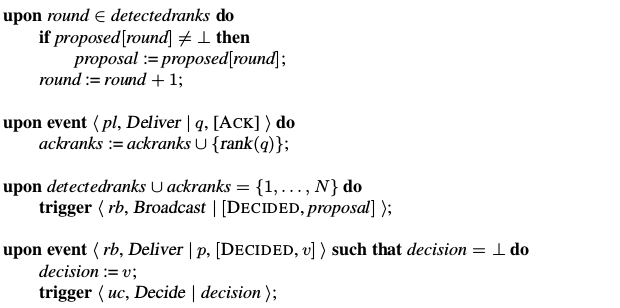

class: middle, center, title-slide

# Large-scale Distributed Systems

Lecture 5: Consensus

---

# Today

---

# Consensus

- **Consensus** is the problem of making processes all *agree* on one of the values they propose.
- Solving consensus is **key** to solving many problems in distributed computing:
    - synchronizing replicated state machines;
    - electing a leader;
    - managing group membership;
    - deciding to commit or abort distributed transactions.
- Any algorithm that helps multiple processes maintain common state or to decide on a future action, in a model where processes may fail, involves solving a consensus problem.

---

# Consensus

.center.width-100[]

[Q] Which is safety, which is liveness?

???

- Termination: liveness
- Validity: safety
- Integrity: safety
- Agreement: safety

---

# Sample execution

.center.width-100[]

[Q] Does this satisfy consensus?

???

Yes

---

# Uniform consensus

.center[]

---

# Sample execution

.center.width-100[]

[Q] Does this satisfy uniform consensus?

???

No

---

class: center, middle

.width-100[]

---

# Impossibility of consensus

So, are we done? **No!**
- The FLP impossibility result holds for *asynchronous systems* only.
- Consensus can be implemented in **synchronous** and **partially synchronous** systems.
- *Paxos*: consensus algorithm in asynchronous systems for which termination is not guaranteed, but where validity, integrity and agreement are guaranteed.

---

class: smaller

# Hierarchical consensus

- Assume a **perfect failure detector** (synchronous system).
- Assume processes $1, ..., N$ form an ordered **hierarchy** as given by a $\text{rank}(p)$ function.
    - $\text{rank}(p)$ is a *unique* number between $1$ and $N$ (e.g., the pid).
- Hierarchical consensus ensures that *the correct process with the lowest rank imposes its value* on all the other processes.
    - If $p$ is correct and rank $1$, it imposes its values on all other processes by broadcasting its proposal.
    - If $p$ crashes immediately and $q$ is correct and rank 2, then it ensures that $q$'s proposal is decided.
    - The core of the algorithm addresses the case where $p$ is faulty but crashes after sending some of its proposal messages and $q$ is correct.
- Hierarchical consensus works *in rounds*.
    - At round $i$, process $p$ with rank $i$ decides its proposal and broadcasts it to all processes.
    - All other processes that reach round $i$ wait before taking any actions, until they deliver this message or until they detect the crash of $p$.

---

# Hierarchical consensus

.center.width-60[]

---

# Execution without failure

.center.width-100[]

---

# Execution with failure (1)

.center.width-100[]

[Q] Uniform consensus?

[Q] How many failures can be tolerated?

???

- Not uniform consensus.
- $N-1$ failures at most.

---

# Execution with failure (2)

.center.width-100[]

---

# Correctness

- *Termination*: Every correct process eventually decides some value.
    - Every correct node makes it to the round it is leader in.
        - If some leader fails, completeness of the FD ensures progress.
        - If leader correct, validity of BEB ensures delivery.
- *Validity*: If a process decides $v$, then $v$ was proposed by some process.
    - Always decide own proposal or adopted value.
- *Integrity*: No process decides twice.
    - Rounds increase monotonically.
    - A node only decides once in the round it is leader.
- *Agreement*: No two correct processes decide differently.
    - Take correct leader with minimum rank $i$.
        - By termination, it will decide $v$.
        - It will BEB $v$:
            - Every correct node gets $v$ and adopts it.
            - No older proposals can override the adoption.
            - All future proposals ans decides will be $v$

---

# Hierarchical Uniform consensus

Idea:
- Same as *Hierarchical consensus*
- A round consists of two communication steps:
    - The leader BEB broadcasts its proposal
    - The leader collects acknowledgements
- Upon reception of all acknowledgements, **RB** broadcast the decision.
    - This ensures that if a decision is made (at a faulty or correct process), then this decision will be made at all correct processes.

---

# Hierarchical Uniform consensus

.center.width-60[]

---

.center.width-60[]

---

# Consensus in partially synchronous systems

???

mention tolerance

---

# Total Order Broadcast

???

== atomic broadcast

---

# Replicated state machines

---

# Paxos

---

# Summary

---

# References

- Fischer, Michael J., Nancy A. Lynch, and Michael S. Paterson. "Impossibility of distributed consensus with one faulty process." Journal of the ACM (JACM) 32.2 (1985): 374-382.
