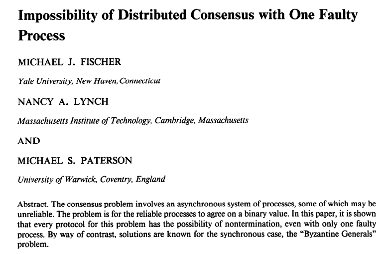

class: middle, center, title-slide

# Large-scale Distributed Systems

Lecture 5: Consensus

---

# Today

---

# Consensus

- **Consensus** is the problem of making processes all *agree* on one of the values they propose.
- Solving consensus is **key** to solving many problems in distributed computing:
    - synchronizing replicated state machines;
    - electing a leader;
    - managing group membership;
    - deciding to commit or abort distributed transactions.
- Any algorithm that helps multiple processes *maintain common state* or to *decide on a future action*, in a model where processes may fail, *involves solving a consensus problem*.

---

# Consensus

.center.width-100[]

[Q] Which is safety, which is liveness?

???

- Termination: liveness
- Validity: safety
- Integrity: safety
- Agreement: safety

---

# Sample execution

.center.width-100[]

[Q] Does this satisfy consensus?

???

Yes

---

# Uniform consensus

.center[]

---

# Sample execution

.center.width-100[]

[Q] Does this satisfy uniform consensus?

???

No

---

class: center, middle

.width-100[]

---

# Impossibility of consensus

So, are we done? **No!**
- The FLP impossibility result holds for *asynchronous systems* only.
- Consensus can be implemented in **synchronous** and **partially synchronous** systems.

---

class: center, middle

# Consensus in fail-stop

---

class: smaller

# Hierarchical consensus

- Assume a **perfect failure detector** (synchronous system).
- Assume processes $1, ..., N$ form an ordered **hierarchy** as given by a $\text{rank}(p)$ function.
    - $\text{rank}(p)$ is a *unique* number between $1$ and $N$ (e.g., the pid).
- Hierarchical consensus ensures that *the correct process with the lowest rank imposes its value* on all the other processes.
    - If $p$ is correct and rank $1$, it imposes its values on all other processes by broadcasting its proposal.
    - If $p$ crashes immediately and $q$ is correct and rank 2, then it ensures that $q$'s proposal is decided.
    - The core of the algorithm addresses the case where $p$ is faulty but crashes after sending some of its proposal messages and $q$ is correct.
- Hierarchical consensus works *in rounds*, with a rotating *leader*.
    - At round $i$, process $p$ with rank $i$ is the leader. It decides its proposal and broadcasts it to all processes.
    - All other processes that reach round $i$ wait before taking any actions, until they deliver this message or until they detect the crash of $p$.

---

# Hierarchical consensus

.center.width-60[]

---

# Execution without failure

.center.width-100[]

---

# Execution with failure (1)

.center.width-100[]

[Q] Uniform consensus?

[Q] How many failures can be tolerated?

???

- Not uniform consensus.
- $N-1$ failures at most.

---

# Execution with failure (2)

.center.width-100[]

---

# Correctness

- *Termination*: Every correct process eventually decides some value.
    - Every correct node makes it to the round it is leader in.
        - If some leader fails, completeness of the FD ensures progress.
        - If leader correct, validity of BEB ensures delivery.
- *Validity*: If a process decides $v$, then $v$ was proposed by some process.
    - Always decide own proposal or adopted value.
- *Integrity*: No process decides twice.
    - Rounds increase monotonically.
    - A node only decides once in the round it is leader.
- *Agreement*: No two correct processes decide differently.
    - Take correct leader with minimum rank $i$.
        - By termination, it will decide $v$.
        - It will BEB $v$:
            - Every correct node gets $v$ and adopts it.
            - No older proposals can override the adoption.
            - All future proposals ans decides will be $v$

---

# Hierarchical uniform consensus

- Same as *Hierarchical consensus*
- A round consists of *two communication steps*:
    - The leader BEB broadcasts its proposal
    - The leader collects acknowledgements
- Upon reception of all acknowledgements, **RB** broadcast the decision.
    - This ensures that if a decision is made (at a faulty or correct process), then this decision will be made at all correct processes.

---

# Hierarchical uniform consensus

.center.width-60[]

---

.center.width-60[]

---

class: middle, center

# Consensus in fail-noisy

---

# Consensus in partially synchronous systems

- Hierarchical consensus requires a *perfect failure detector*. Can we switch to an *eventually perfect failure detector* (i.e.,  **fail-noisy**)?
- A *false suspicion* (i.e., a violation of strong accuracy) might lead to the **violation of agreement**.
    - If a process is suspected while it is actually correct, then two processes might decide differently.
- *Not suspecting* a crashed process (i.e., a violation of strong completeness) might lead to the **violation of termination**.

.center.width-100[]

---

# Towards consensus...

We will build a consensus component in *fail-noisy* by combining three abstractions:

- an eventual leader detector
- an epoch-change abstraction
- an epoch consensus

---

# Eventual leader detector

.center[]

[Q] This abstraction can be implemented from an *eventually perfect failure detector*. How?

---

# Epoch-Change

- When a leader is chosen, the **Epoch-Change** abstraction signals the start of a new epoch by triggering a `StartEpoch` event.
    - The event contains:
        - an epoch timestamp $ts$
        - a leader process $l$.
- We require *monotonicity* of the timestamps for the epochs started at the same correct process.
- We require the *same leader* for every correct process at a given timestamp.
- **Eventually**, the component ceases to start new epochs. The last epoch started at every correct process must the same and the leader must be correct.

---

# Epoch-Change

.center[]

---

# Leader-based Epoch-Change

- Every process $p$ maintains two timestamps:
    - a timestamp $lastts$ of the last epoch that is has started;
    - a timestamp $ts$ of the last epoch it attempted to start as a leader.
- When the leader detector makes $p$ trust itself, $p$ adds $N$ to $ts$ and broadcasts a `NewEpoch` message with $ts$.
- When $p$ receives a `NewEpoch` message with parameter $newts > lastts$ from $l$ and $p$ most recently trusted $l$, then $p$ triggers a `StartEpoch` message.
- Otherwise, $p$ informs the aspiring leader $l$ with a `NACK` that a new epoch could not be started.
- When $l$ receives a `NACK` and still trusts itself, it increments $ts$ by $N$ and tries again to start a new epoch.

---

# Leader-based Epoch-Change

.center.width-50[]

[Q] How many failures can be tolerated? $N-1$

---

# Sample execution (1)

.center.width-100[]

---

# Sample execution (2)

.center.width-100[]

[Q] What if $p_1$ fails only later, some time after the second `bebDeliver` event?

---

# Epoch consensus

- The **epoch consensus** abstraction is similar to *consensus*, but with the following simplifications:
    - Epoch consensus represents an *attempt* to reach consensus.
        - The procedure can be aborted when it does not decide or when the next epoch should already be started by the higher-level algorithm.
    - Every epoch consensus instance is identified by an *epoch timestamp* $ts$ and a *designated leader* $l$.
    - **Only the leader** proposes a value.
        - Epoch consensus is required to decide *only when the leader is correct*.
- An instance **must terminate** when the application locally triggers an `Abort` event.
- The state of the component is initialized
    - with a higher timestamp than that of all instances it initialized previously;
    - with the state of the most recently aborted epoch consensus instance.

---

# Epoch consensus

.center[]

---

.center[]

---

# Read/Write Epoch consensus

- The epoch consensus is **initialized** with the state of the most recently aborted epoch consensus instance.
    - The state contains a timestamp and value.
    - Passing the state to the next epoch consensus serves the *validity* and *lock-in* properties.
- The algorithm involves *two rounds of messages* from the leader to all processes.
    - The leader **writes** its proposal value to all processes, who store the epoch timestamp and the value in their state, and acknowledge this to the leader.
    - When the leader receives enough acknowledgements, it decides this value.
    - However, if the leader of some previous epoch already decided some value, then no other value should be decided (to not violate *lock-in*).
    - To prevent this, the leader first **reads** the state of the processes which return `State` messages.
    - The leader receives a quorum of `State` messages and choses the value that comes with the highest timestamp, if one exists.
    - The leader *decides* and broadcasts its decision to all processes, which then decide too.
- We assume a majority of correct processes.

---

# Read/Write Epoch consensus

.center[]

---

.center[]

---

# Sample execution (1)

.center.width-100[]

---

# Sample execution (2)

.center.width-100[]

---

# Sample execution (3)

.center.width-100[]

[Q] What is wrong in this execution?

---

# Sample execution (4a)

.center.width-100[]

---

# Sample execution (4b)

.center.width-100[]

---

class: smaller

# Correctness

Assume $N > 2f$, where $f$ is the number of crash faults.

- *Lock-in*:
    - If some process ep-decided $v$ at $ts' < ts$, then it decided after receiving a `Decided` message with $v$ from leader $l'$ of epoch $ts'$.
    - Before sending this message, $l'$ had broadcast a `Write` containing $v$ and collected `Accept` messages.
    - These responding processes set their variables $val$ to $v$ and $valts$ to $ts'$.
    - At the next epoch, the leader sends a `Write` message and collect `Accept` messages with the previous $(ts', v)$ pair.
    - This pair has the highest timestamp with a non-null value.
    - This implies that $l'$ can only ep-decides $v$.
    - This argument can be continued until $ts$, establishing lock-in.

---

class: smaller

# Correctness

- *Validity*:
    - If some process ep-decides $v$, it is because this value was delivered from a `Decided` message.
    - Furthermore, every process stores in $val$ only the value received in a `Write` message from the leader.
    - In both cases, this value comes from `tmpval` of the leader.
    - In any epoch, the leader sets `tmpval` only to the value it ep-proposed or to some value it received in a `State` message from another process.
    - By backward induction, $v$ was ep-proposed by the leader in some epoch $ts' \leq ts$.
- *Uniform agreement* + *integrity*:
    - $l$ sends the same value to all processes in the `Decided` message.
- *Termination*:
    - When $l$ is correct and no process aborts the epoch, then every process eventually receives a `Decide` message and ep-decides.

---

# Leader-Driven consensus

- We now combine the epoch-change and the epoch consensus abstractions to
form the **leader-driven consensus** algorithm.
- The algorithm provides *uniform consensus* in *fail-noisy*.
- It runs through a sequence of epochs, triggered by `StartEpoch` events from
the epoch-change primitive.
    - These events determine the timestamp and leader of the next epoch consensus to start.
    - To switch from one epoch to the next, the algorithm aborts the running epoch consensus, obtains its state and initializes the next epoch consensus with it.
    - As soon as process has obtained a proposal value $v$ for consensus and is the leader of the current epoch, it ep-proposes this value for epoch consensus.
    - When the current epoch ep-decides a value, the process also decides value in consensus.
    - The process continue to participate in the consensus to help other processes decide.
- Leader-Driven consensus is modular formulation  of the **Paxos** consensus algorithm.

---

# Leader-Driven consensus

.center[]

---

.center[]

---

# Sample execution

.center.width-80[]

---

# Correctness

- *Validity*:
- *Uniform agreement*:
- *Integrity*:
- *Termination*:

XXX pg 227+

---

class: middle, center

# Total order broadcast

---

# Total order broadcast

- A **total-order (reliable) broadcast** (also known as *atomic broadcast*) abstraction
which ensures that all processes deliver the same messages in a *common global order*.
- Total-order broadcast is the key abstraction for maintaining consistency among multiple replicas
that implement one logical service.

---

# Total order broadcast

.center.width-80[]

---

# Consensus-based TOB

- Messages are first disseminated using a *reliable broadcast instance*.
    - No particular order is imposed on the messages.
    - At any point in time, it may be that no two processes have the same sets of unordered messages.
- The processes use **consensus to decide on one set of messages** to be delivered, order the messages in this set, and finally deliver them.

---

# Consensus-based TOB

.center.width-80[]

---

# Sample execution

.center.width-80[]

---

# Replicated state machines

- A **state machine** consists of variables and commands that transform its state and produce some output.
    - Commands are *deterministic* programs, such that the outputs are solely determined by the initial state and the sequence of commands.
- A state machine can be made *fault-tolerant* by replicating it on different processes.
- This can now be easily implemented simply by disseminating all commands to execute using a uniform total-order broadcast primitive.
- This gives a **generic recipe** to make any deterministic program distributed, consistent and fault-tolerant!

---

class: middle, center

---

# Replicated state machines

.center[]

---

# TOB-based Replicated state machines

.center[]

---

# Summary

---

# References

- Fischer, Michael J., Nancy A. Lynch, and Michael S. Paterson. "Impossibility of distributed consensus with one faulty process." Journal of the ACM (JACM) 32.2 (1985): 374-382.
