class: middle, center, title-slide

# Large-scale Data Systems

Lecture 6: Blockchain

  
Prof. Gilles Louppe 
[g.louppe@uliege.be](g.louppe@uliege.be)

---

# Today

.grid[
.kol-2-3[
Blockchain:
- Hash functions and data structures
- Digital signatures
- Simple (fictitious) cryptocurrencies
- Consensus in the blockchain
- Bitcoin and friends
]
.kol-1-3[
.width-100[]
]
]

Most of today's lecture is based on "Bitcoin and cryptocurrency technologies: A comprehensive introduction" by Narayanan et al.

---

class: middle, center, black-slide

.width-80[]

---

class: middle

# Hash functions and data structures

---

# Hash functions

A **hash function** is a mathematical function $H$ with the following properties:
- Its input can be any string of any size.
- It produces a fixed-size output (e.g. 256 bits).
- It is efficiently computable.
    - E.g., computing the hash of an $n$-bit string should be $O(n)$.

## Security properties
- Collision resistance
- Hiding
- Puzzle-friendliness

---

# Collision resistance

A hash function $H$ is said to be **collision resistant** if it is infeasible/difficult to find two values $x$ and $y$ such that $x \neq y$ yet $H(x)=H(y)$.

 
.center.width-80[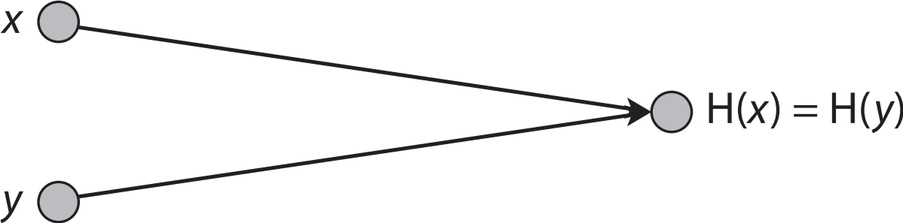]

---

class: middle

.center[Collisions do exist. But can anyone find them?]
 

.center.width-80[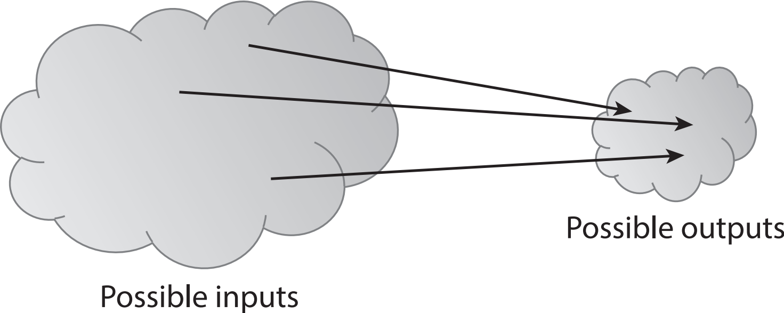]

---

class: middle

How to find a collision:
- Pick $2^{256}+1$ distinct values and compute the hashes of each of them.
- At least one pair of inputs must collide!

This works no matter the hash function $H$. But it takes too long to matter!

---

# Hiding

A hash function $H$ is said to be **hiding** if when a secret value $r$ is chosen from a probability distribution that has high entropy, then given $H(r || x)$, it is infeasible to find $x$.

---

class: middle

## Application: Commitments

A commitment is the digital analog of taking a value, sealing it in an envelope, and putting that envelope out on the table where everyone can see it.
- Commit to value (the content of the envelope).
- Reveal it later (open the envelope).

---

class: middle

## Commitment scheme
- $\text{commit}(\text{msg}, \text{key}) := (H(\text{msg} || \text{key}), H(\text{key}))$:  The commit function takes a message and a (secret) key as input and returns a commitment pair $\text{com}$.
- $\text{verify}(\text{com}, \text{key}, \text{msg})$: The verify function takes a commitment, a key and a message as inputs. It returns true iff $\text{com} = \text{commit}(\text{msg}, \text{key})$.

## Security properties
- Hiding: given $\text{com} := (H(\text{msg} || \text{key}), H(\text{key}))$, it is infeasible to find $\text{msg}$.
- Binding: Infeasible to find $\text{msg} \neq \text{msg}'$ such that $H(\text{msg} || \text{key}) = H(\text{msg}' || \text{key})$ is true, nor to change the key.

---

# Puzzle-friendliness

A hash function $H$ is said to be **puzzle friendly** if for every possible $n$-bit output value $y$, if $k$ is chosen from a distribution with high entropy and made public, then it remains infeasible to find $x$ such that $y=H(k || x)$ in time significantly less than $2^n$.

---

class: middle

## Application: Search puzzle

Given a puzzle ID $i$ and a target set $Y$, try to find a solution $x$ such that $H(i || x) \in Y$.

- Puzzle-friendliness implies that no solving strategy is much better than trying random values of $x$.
- Later, we will see that *mining* is a computational puzzle.

---

# SHA-256 hash function

  
.center.width-100[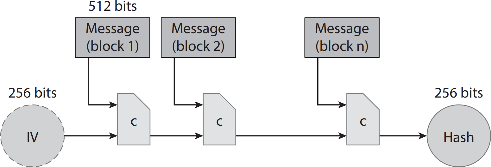]

SHA-256 uses the Merkle–Damgård construction to turn a fixed-length collision resistant compression function $c$ into a hash function that accepts arbitrary-length inputs.

---

# Hash pointers

A **hash pointer** is a pointer to where some information is stored, together with a cryptographic hash of this information. A hash pointer can be used for:
- retrieving the information associated to the pointer,
- verifying that the information has not changed.

 
.center.width-40[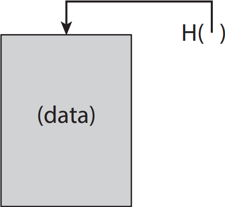]

---

class: middle, center, red-slide

.bold[Key idea]: build data structures with hash pointers

---

# Blockchain

A **blockchain** is a linked list that makes use of hash pointers.
- In a regular linked list, each block has data as well as a pointer to the previous block in the list.
- In a blockchain, the previous-block pointers are replaced by hash pointers.

.center.width-100[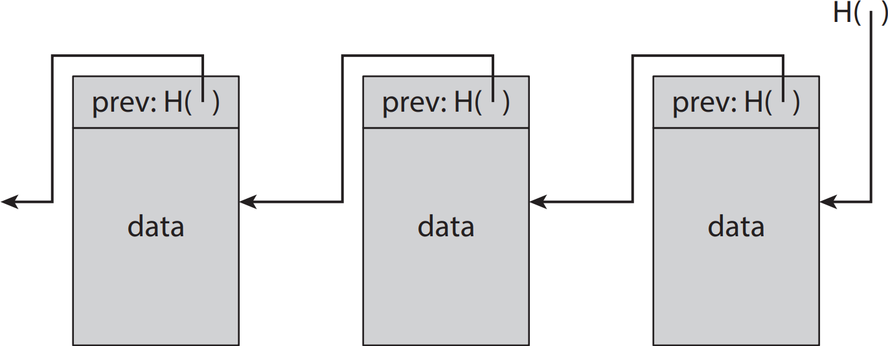]

---

class: middle

.center.width-100[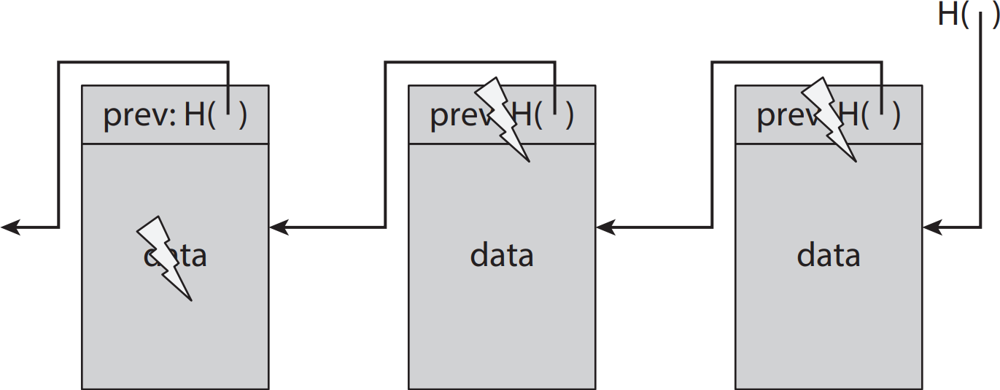]

## Tamper-evident log

- If an adversary modifies data anywhere in the blockchain, it will result in the hash pointer in the following block being incorrect.
- If we stored the head of the list, then even if an adversary modifies all pointers to be consistent with modified data, the head pointer will be incorrect and the change would be detected.

---

# Merkle tree

A **merkle tree** is a binary tree that makes use of hash pointers.

.center.width-100[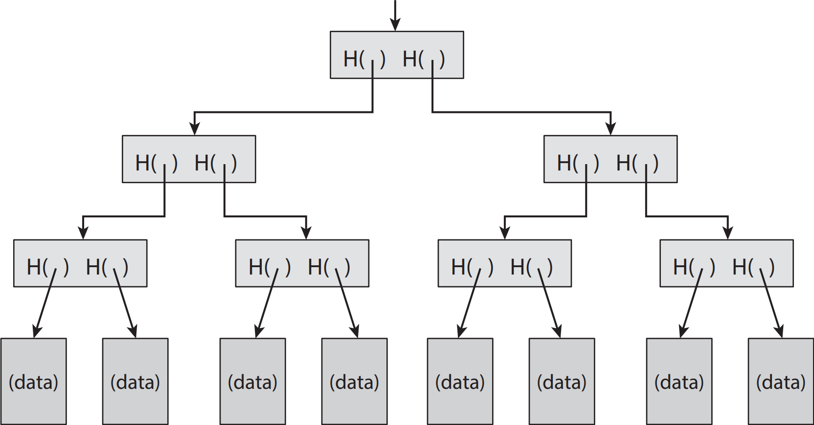]

---

class: middle

.center.width-40[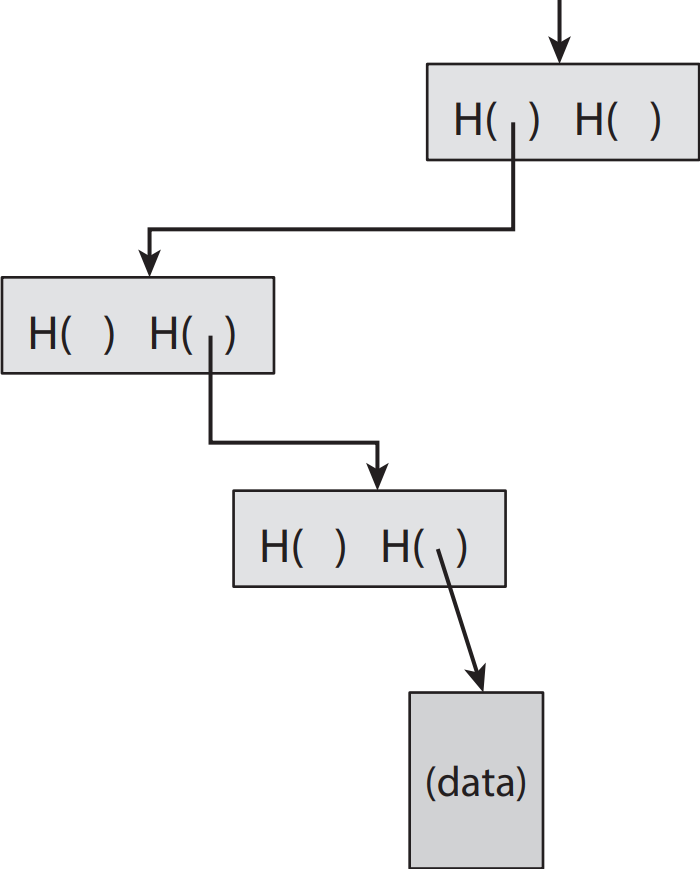]

## Proof of membership

Proving that a data block is included in the tree only requires showing the blocks in the path from that data block to the root. Hence $O(\log N)$.

---

class: middle

# Digital signatures

---

# Digital signatures

Digital signatures is the second cryptographic primitive we will need for implementing cryptocurrencies.

A **digital signature** is the digital analog to a handwritten signature on paper:
- Only you can make your signature, but anyone can verify that it is valid.
- Signatures are tied to a particular document. They cannot be cut-and-pasted to another document to indicate your agreement or endorsement.

Bitcoin makes use of the *Elliptic Curve Digital Signature Algorithm* (ECDSA) for digital signatures.

---

class: middle

## API for digital signatures

- $(\text{sk}, \text{pk}) := \text{generateKeys}(\text{keysize})$
    - $\text{sk}$: secret signing key
    - $\text{pk}$: public verification key
- $\text{sig} := \text{sign}(\text{sk}, \text{msg})$
- $\text{isValid} := \text{verify}(\text{pk}, \text{msg}, \text{sig})$

---

class: middle

## Requirements

- Valid signatures must verify.
- Signatures are existentially unforgeable.

 
.center.width-90[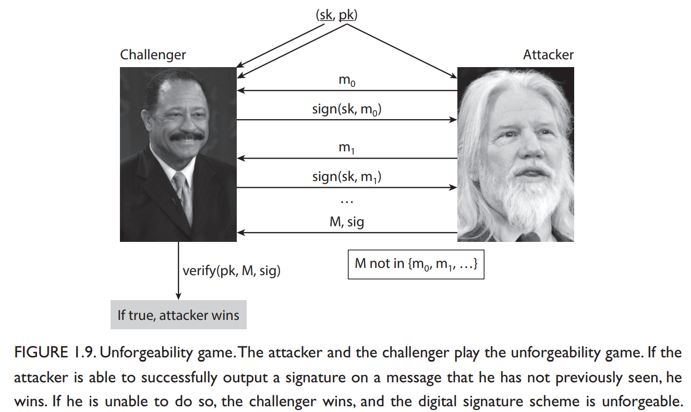]

---

class: middle

# Simple (fictitious) cryptocurrencies

---

# Goofycoin

## Rule 1: a designated entity (Goofy) can create new coins

To create a coin, Goofy generates *a unique coin ID* along with the *statement* `"CreateCoin [uniqueCoinID]"`.
- Goofy computes the **digital signature** of this string with his secret signing key.
- The string, together with Goofy's signature, is a coin.
- Anyone can verify that the coin contains Goofy's valid signature of the `CreateCoin` statement and is therefore a valid coin.

.grid[
.kol-3-4[  .center.width-50[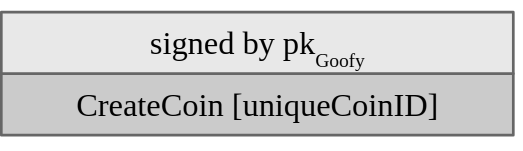]]
.kol-1-4.width-80[]
]

???

Same as for a bank or a government that decide to print money at will.

Verification of banknotes  can be done by anyone.

---

class: middle

.center.width-45[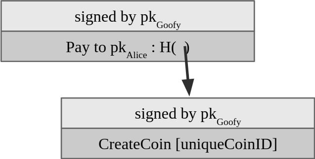]

## Rule 2: Whoever owns a coin can transfer it to someone.

- Let's say Goofy wants to transfer a coin he created to Alice.
- To do this, Goofy creates a new statement `"Pay this to Alice"`, where
    - `"this"` is a hash pointer that references the coin in question,
    - Alice's identity is defined by her public signing key.
- Alice can prove to anyone that she owns the coin because she can present the data structure with Goofy's valid signature.

---

class: middle, center

.center.width-50[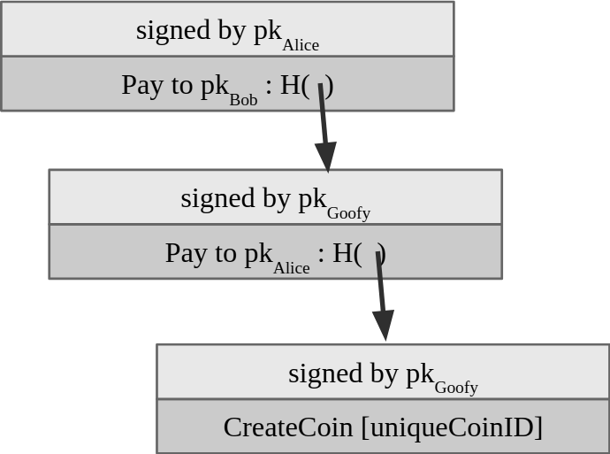]

The recipient can pass on the coin again.

---

class: middle

.center.width-80[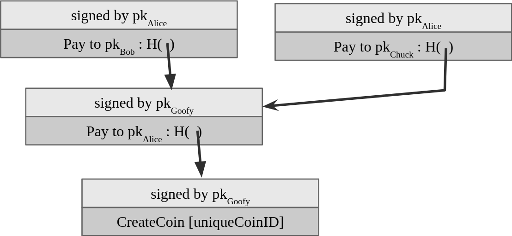]

## Double-spending attack

- Let's say Alice passed her coin on to Bob by sending her signed statement, but didn't tell anyone else.
- She could create another signed statement that pays the same coin to Chuck.
- Both Bob and Chuck would have valid-looking claims to be the owner of this coin.

Goofycoin does not solve the *double-spending attack* problem. For this reason, it is **not secure**.

---

# Scroogecoin

A *designated and trusted entity* (Scrooge McDuck) publishes an **append-only ledger** containing the history of all transactions.
- Append-only ensures that any data written to this ledger will remain forever in the ledger.
- Therefore, this can be used to prevent double spending by requiring that all transactions are written in the ledger before they are accepted.

.center.width-40[]

---

class: middle

.center.width-90[]

To implement the append-only ledger, Scrooge makes use of a **blockchain**, which he will digitally sign.
- The blockchain is a series of data blocks, each with one or more transaction(s) in it.
- Each block has the IDs of the transactions, the transaction's contents, and a hash pointer to the previous block.
- Scrooge digitally signs the final hash pointer, which binds all the data in this entire structure, and he publishes the signature along with the blockchain.

---

class: middle

.center.width-100[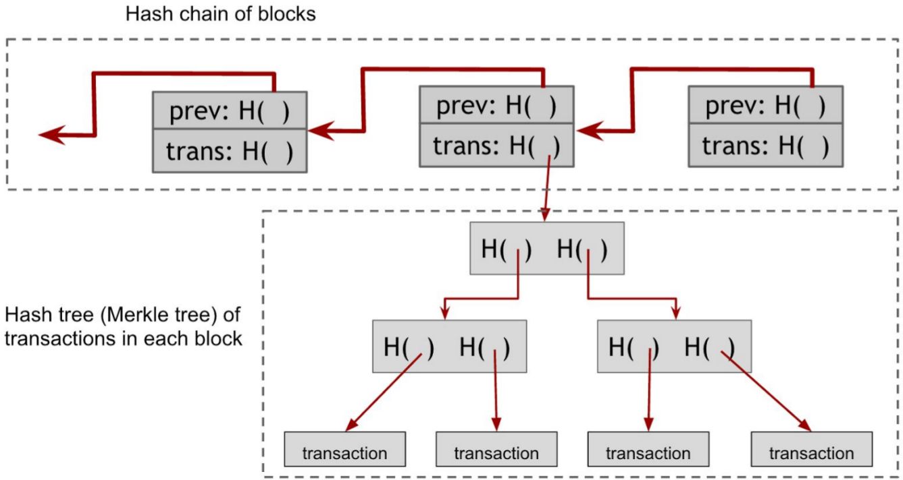]

In Bitcoin, the blockchain contains two different hash structures.
- The first is a *hash chain of blocks* that links the different blocks to one another.
- The second is internal to each block and is a *Merkle tree of transactions* within the blocks.

---

class: middle

A transaction only counts if it is in the block chain **signed by Scrooge**.
- Anybody can verify a transaction was endorsed by Scrooge by checking Scrooge's signature on the block that records the transaction.
- Scrooge makes sure that he does not endorse a transaction that attempts to double spend an already spent coin.
- If Scrooge tries to add or remove a transaction, or to change an existing transaction, it will affect all following blocks published by Scrooge.
    - As long as the latest hash pointer published by Scrooge is monitored, the change will be obvious and easy to catch.

---

class: middle

## Coin creation

- Same as for Goofycoin, but we extend the semantics to allow for multiple coins to be created per transaction.
- Coins are referred to by a transaction ID and a coin's serial number in that transaction.

 
.center.width-70[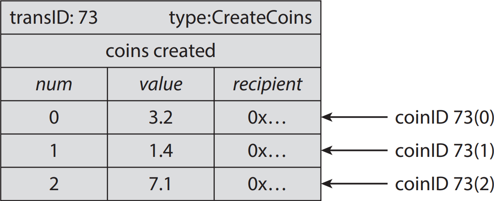]

---

class: middle

## Payments

A transaction consumes (and destroys) some coins and creates new coins of the same total value.

.grid[
.kol-1-2[
A transaction is *valid* if:
- The consumed coins are valid.
- The consumed coins have not already been consumed.
- The total value out in the transaction is to equal to the total value in.
- The transaction is validly signed by all the owners of the consumed coins in the transaction.
]
.kol-1-2[
.center.width-100[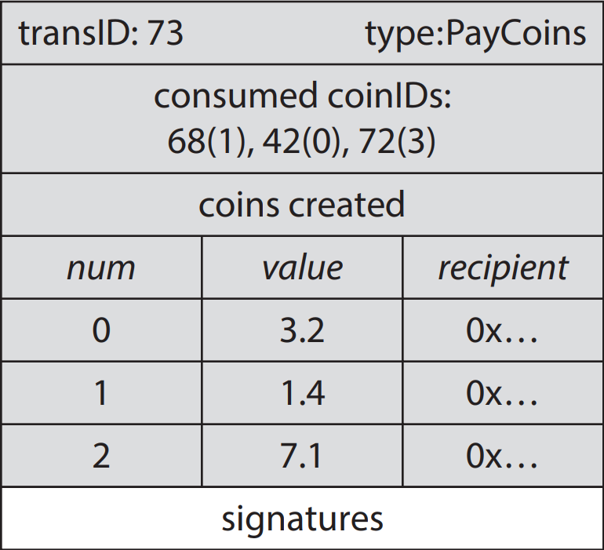]
]
]

---

class: middle

## Immutable coins

Coins cannot be transferred, subdivided or combined.

But we can obtain the same effect by using transactions. E.g., to subdivide:
- create a new transaction;
- consume your coins;
- pay out two new coins (of half the value of the original coin) to yourself.

---

class: middle

.grid[
.kol-2-3[
Scoorge cannot create fake transactions, because he cannot forge other people's signatures.

However,
- he could stop endorsing transactions from some users, denying them service and making their coins unspendable;
- he could refuse to publish transactions unless they transfer some mandated transaction fee to him.
- he can create as many coins for himself as he wants.

Can the system operate **without any central, trusted party**?
]
.kol-1-3[ .center.width-80[]
.caption[Do not worry.  I am honest.]]
]

---

class: middle

# Consensus in the blockchain

---

# Decentralization

We want a *decentralized* cryptocurrency system without any central (supposedly) trusted party.

## Solution
- Implement the currency protocol on top of a **peer-to-peer** network of nodes.
- Each node maintains its own copy of the ledger.

 
.center.width-70[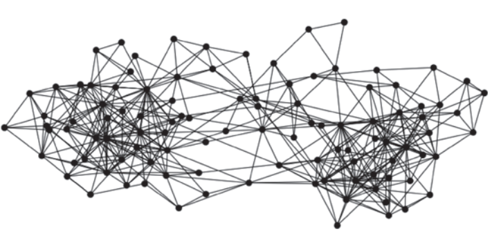]

---

class: middle

.center.width-100[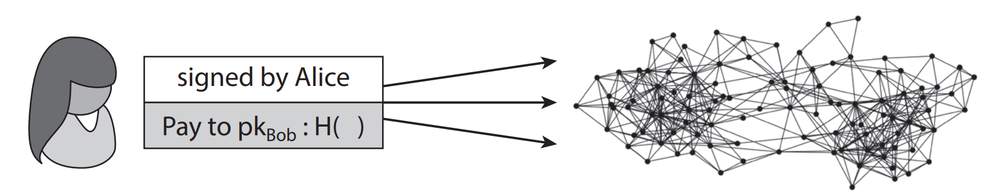]

When Alice wants to pay Bob, she *broadcasts* the transaction to all nodes in the network. Each node updates its ledger accordingly.

Note that Bob's computer is not (necessarily) in the picture.

---

class: middle

- Who maintains the ledger?
- Who has authority over which transactions are valid?
- Who creates new coins?
- Who determines how the rules of the system change?
- How do coins acquire exchange values?

---

# Consensus

For this peer-to-peer system to work:
- All nodes must have the exact same copy of the ledger.
- Therefore, they must agree on the transactions that are added in the ledger, and in which order.

$\Rightarrow$ They must reach **consensus**.

---

class: middle

## How consensus could work

At any given time:
- All nodes have a blockchain consisting of a sequence of blocks, each containing a list of transactions they have reached consensus on.
- Each node has a set of outstanding transactions it has heard about.

At regular intervals, every node in the system proposes its own outstanding transaction pool to be included in the next block, using some consensus protocol.

 
.center.width-80[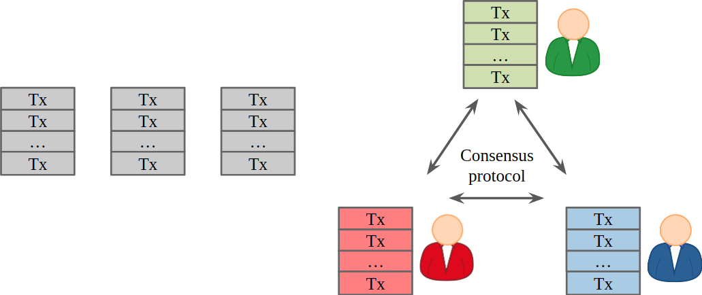]

---

class: middle

## Consensus is hard

- Nodes may crash
- Nodes may be malicious
- Network is highly imperfect
    - Not all pairs of nodes connected
    - Faults in the network
    - Latency (no notion of global time)

---

class: middle

Why not simply use a **Byzantine fault-tolerant** variant of *Paxos*?
- It would never produce inconsistent results.
- However
    - there are certain (rare) conditions in which the protocol may fail to make any progress,
    - no solution exists if less than $\tfrac{2}{3}$ of the nodes are honest.

---

class: middle

## Additional constraints
- *Pseudonymity*: we do not want nodes to have an identity.
- *Sybil attacks*: we do not want an adversary to be able to spawn many nodes (e.g., a majority) and take control of the system.

???

Draw diagram of a Sybil attack.

---

# Implicit consensus

Assume the ability to select a random node in manner that is not vulnerable to Sybil attacks, such that at least 50% of the time an honest node is picked.

## Consensus algorithm

1. New transactions are *broadcast* to all nodes.
2. Each node collects new transactions into a block.
3. In each round, a **random node** gets to broadcast its block.
4. Other nodes accept the block only if all transactions in it are valid (unspent, valid signatures).
5. Nodes express their acceptance of the block by including its hash in the next block they create.

   
[Q] To what basic abstraction does random selection is an implementation of?

???

Random selection is a leader detector.

---

class: middle

.center.width-80[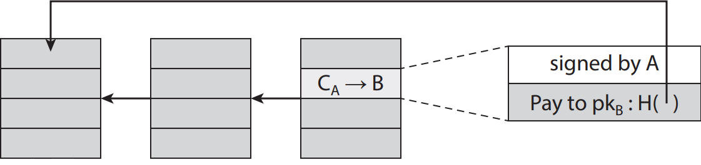]

Alice adds an item to her shopping cart on Bob's website. The server requests payment.
- Alice creates a transaction from her address to Bob's and broadcast it to the network.
- An honest node creates the next block and includes this transaction in that block.
- On seeing the transaction included in the blockchain, Bob concludes that Alice has paid him and send the purchased item to Alice.

---

class: middle

.center.width-80[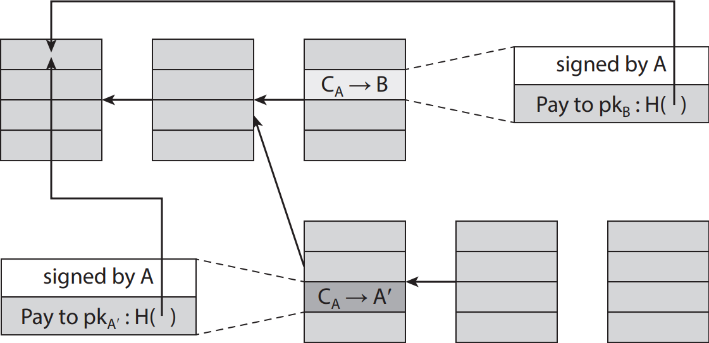]

## Double-spend attack

- Assume the next random node happens to be controlled by Alice.
- Since Alice gets to propose the block, she could propose one that ignores the block that contains the payment to Bob.
- Worse, she could make a transaction that transfers the same coin to an address she controls.
- Since the two transactions spend the same coins, only of them will be included in the blockchain.

---

class: middle

The double-spend attack success will depend on which block will ultimately end up on the long-term consensus chain.

## Policy upon forks

- Honest nodes follow the policy that **extends the longest valid branch**.
- In step 4 of implicit consensus, if an honest node discovers that the new block belongs to a longer branch than what it thought was part of the longest branch, then the node locally *reorganizes* its chain.

???

Alice's double-spend attempt:
- The node that chooses the next block may decide to build on either of two blocks.
- This choice will largely determine whether the double-spend attack succeeds.

---

class: middle

.center.width-80[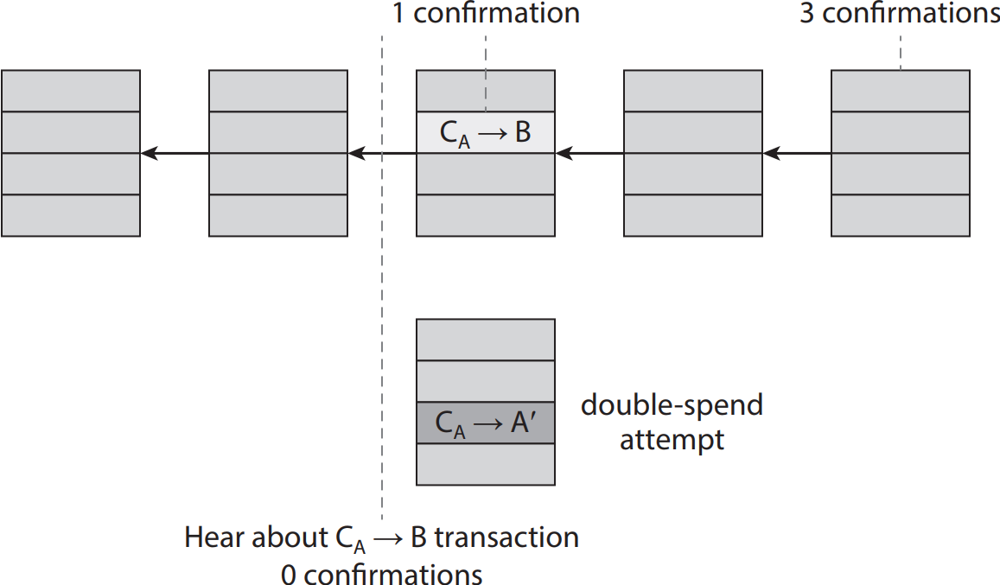]

Bob the merchant's point of view:
- Double-spend probability **decreases exponentially** with the number of confirmations.
- Common heuristic: wait for 6 confirmations before validating the transaction.

---

class: middle

## Recap

- Protection against invalid transactions is cryptographic, but enforced by consensus.
- Protection against double-spending is purely by consensus.
- We are never 100% certain that a transaction is part of the consensus branch. **The guarantee is probabilistic**.
    - Even with 1% of the total hashing power, Alice would have a hard time cheating on Bob.
    - The probability of mining six blocks in a row is $0.01^6 = 10^{-12}$.

---

# Incentives

- Assuming node honesty is problematic.
- Instead, can we build **incentives** for nodes to behave honestly?

    
.center.width-100[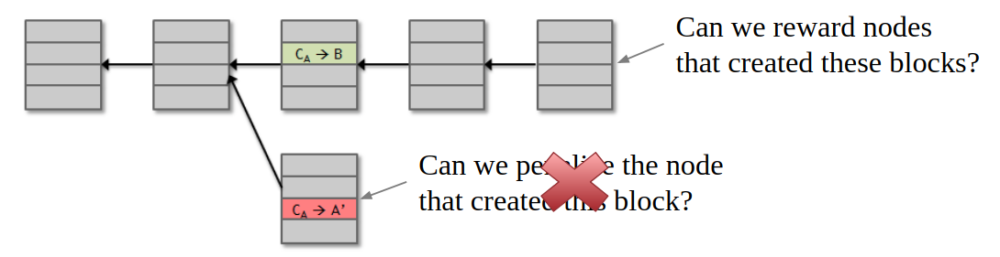]

---

class: middle

## Incentive 1: block reward

- The creator of a block gets to
    - include a special coin-creation transaction in the block
    - choose the recipient address of this transaction.
- The value is fixed: currently 12.5 coins, but halves every 210000 blocks (~ every 4 years).
- The block creator gets to collect the reward only if the blocks end up on the long-term consensus branch.

---

class: middle

.center.width-70[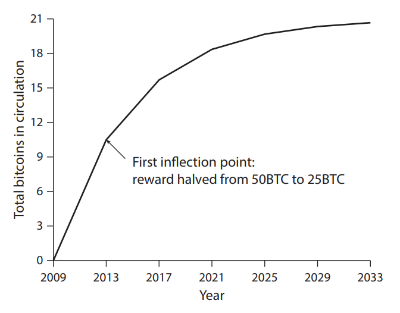]

Total supply of coins with time. The block reward is cut in half every 4 years, limiting the total supply to 21 millions.

???

Geometric series.
Analogy with the arrow story.

---

class: middle

## Incentive 2: transaction fees

- The creator of a transaction can choose to make the output value less than input value.
- The remainder is a transaction fee and goes to the block creator.
- Purely voluntary.

---

# Proof of work

How does one select a node at random without being vulnerable to Sybil attacks?
- Approximate the selection of a random node by instead selecting nodes in proportion to a resource that (we hope) nobody can monopolize.
    - in proportion to computer power: **proof of work** (PoW)
    - in proportion to currency ownership: *proof of stake* (PoS)

How does one select nodes in proportion to their computing power?
- Allow nodes to compete with one another by using their computing power.
- This results in nodes being picked in proportion to that capacity.

---

class: middle

## PoW with hash puzzles

.center.width-100[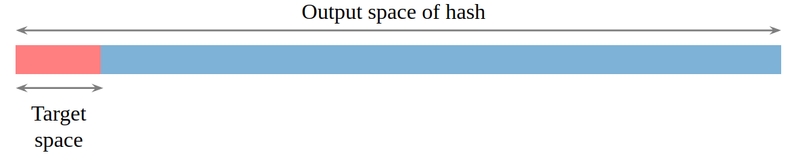]

To create a block, find a $\text{nonce}$ such that
$$H(\text{nonce} || \text{previous hash} || \text{tx}\_1 || \text{tx}\_2 || ...) < T$$
for some target $T \ll 2^{256} \approx 10^{77}$.
- If the hash function $H$ is secure, the only way to succeed is to try enough nonces until getting lucky.
- Node creators are called *miners*.

---

class: middle

## Property 1: difficult to compute

- As of 2018, the expected number of hashes to mine a block is $3 \times 10^{22}$.
- Only some nodes bother to compete.

---

class: middle

## Property 2: parameterizable cost

- The target $T$ is adjusted periodically as a function of how much hashing power has been deployed in the system by the miners.
- The goal is to maintain an average time of 10 minutes between blocks.

---

class: middle

## Property 3: trivial to verify

- The $\text{nonce}$ must be published as part of the block.
- Hence, anyone can verify that
$$H(\text{nonce} || \text{previous hash} || \text{tx}\_1 || \text{tx}\_2 || ...) < T$$

---

# 51% attack

- The whole system relies on the assumption that a majority of miners, weighted by hash power, follow the protocol.
- Therefore, the protocol is vulnerable to attackers that would detain 51% or more of the total hashing power.

---

class: middle

# Bitcoin and friends

---

# Bitcoin

- The cryptocurrency protocol presented so far corresponds to the general protocol used for **Bitcoin** (BTC).
- Bitcoin was invented by an unknown person (or group of people) using the name of Satoshi Nakamoto.
- It was released as an *open source software* in 2009.
- Its main goal is to establish a decentralized digital currency that is not tied to a bank or government.
- The estimated number of unique users is 3-6 million.

  
.center.width-20[]

---

class: middle

## Trading

- Bitcoin can be used to buy or sell goods.
- Bitcoin can be bought and sold like any other currency.
- Bitcoin ATMs even exist in some countries!

.center.width-50[]

---

class: middle

## Volatility

.center.width-100[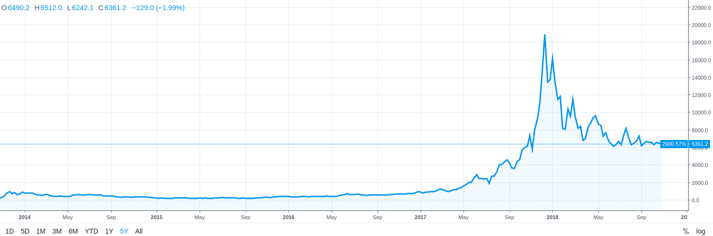]

As any currency, BTC can be exchanged for other currencies (e.g. USD or EUR).
- The current exchange rate (November 1, 2018) is 1 BTC = 6358 USD.
- The price is highly volatile and subject to speculation.

---

class: middle

## Mining as a business

.center.width-100[]
.italic.center[A mining farm.]

---

class: middle

## Extreme competition

.center.width-100[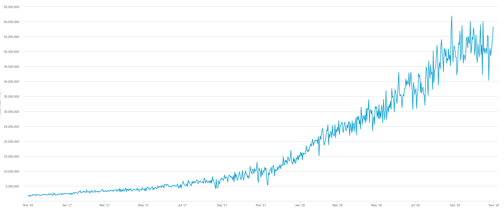]
.italic.center[Global hash rate over time.]

---

class: middle

## Energy sinkhole

.center.width-80[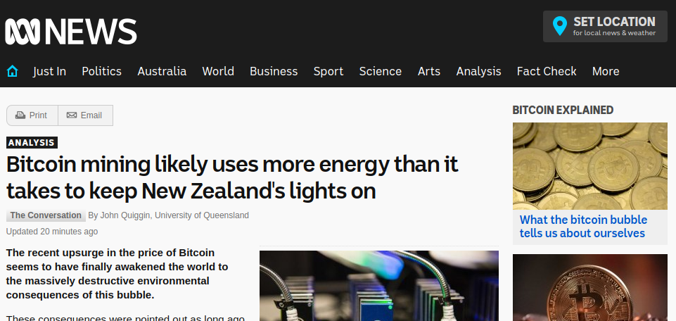]
.center.width-80[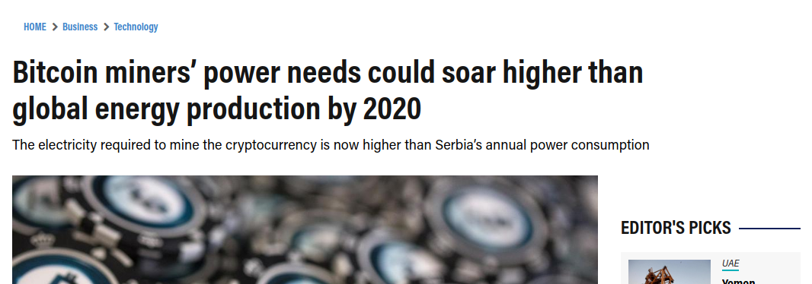]

---

class: middle

## Mining economics

.center.width-90[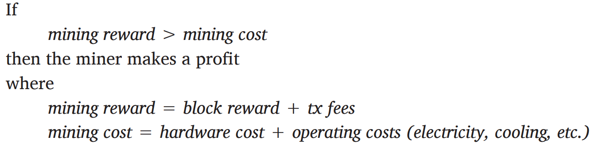]

See also the [Bitcoin Mining Profit Calculator](https://jblevins.org/btcmpc/).

---

class: center, black-slide, middle

<iframe width="640" height="400" src="https://www.youtube.com/embed/tt0idBrjpbk?cc_load_policy=1&hl=en&version=3" frameborder="0" allowfullscreen></iframe>

---

class: center, black-slide, middle

<iframe width="640" height="400" src="https://www.youtube.com/embed/fgrD0Bse70A?cc_load_policy=1&hl=en&version=3" frameborder="0" allowfullscreen></iframe>

---

# Other cryptocurrencies

BTC is only one of many cryptocurrencies. Popular cryptocurrencies include:
- ETH
- XRP
- LTC

.center.width-90[]

---

# Applications

A blockchain is nothing else than a continuously growing list of records.
- It is secure by design, with high Byzantine fault tolerance.
- Blockchains can therefore be used to store any kind sensitive information that should not be altered.

.center.width-80[]

---

# Summary

- The **blockchain** is a linked list with hash pointers.
- It can be used for implementing *a ledger* that stores sensitive information that should not be tampered with.
- Decentralization requires **consensus**.
- In Bitcoin, consensus is achieved by *proof-of-work*, which provides high Byzantine fault tolerance.

---

class: end-slide, center
count: false

The end.

---

# References

- Nakamoto, Satoshi. "Bitcoin: A peer-to-peer electronic cash system." (2008).
- Narayanan, Arvind, et al. Bitcoin and cryptocurrency technologies: a comprehensive introduction. Princeton University Press, 2016.
