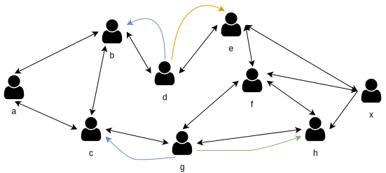
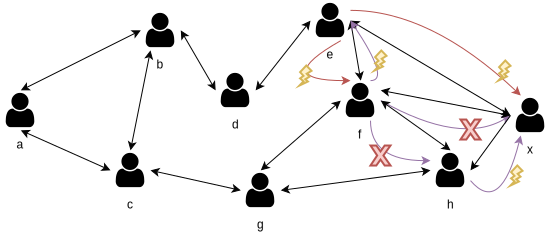
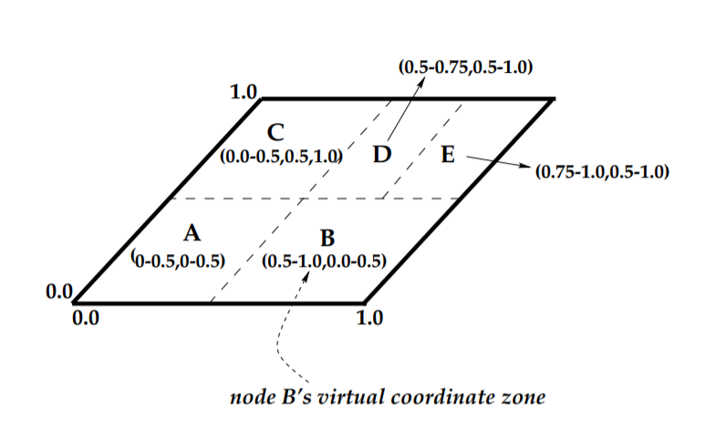
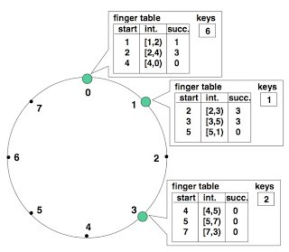
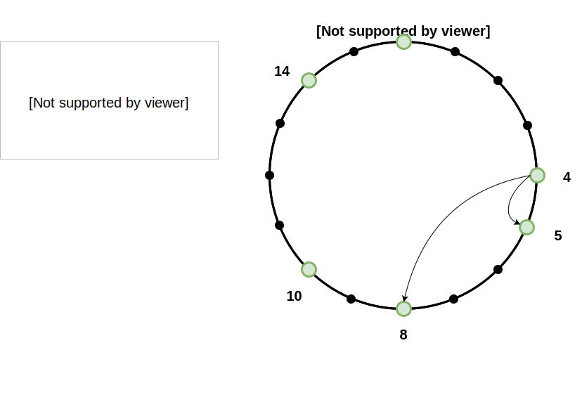
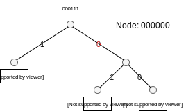
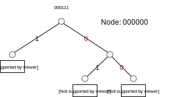
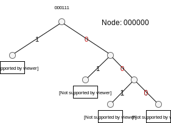
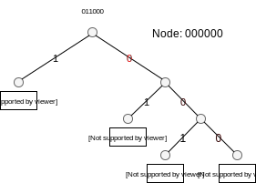
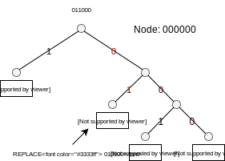

class: middle, center, title-slide

# Large-Scale Distributed Systems

Lecture 6: Distributed Hash Tables

---

# History: Napster

.grid[
.col-2-3[
- Developed by Shawn Fanning, Sean Parker, and released on 1st June 1998.
- Napster pioneered the concept of P2P (peer-to-peer) file-sharing.
- However, it wasn't truly P2P as we know it by today's standards.

]
.col-1-3[

]
]

---

## Napster Architecture (1)

- Napster relied on a *centralized* directory server with *flat* file system.
  - Files with the same name are possible.
- Storage of the data was done at node-level (*decentralized*).
  - Node informed the directory server that it is still available using *keep-alive* messages.
  - Node informed the directory server which files it serves.

.width-100[

]

---

## Napster Architecture (2)

- Flat file system:

.width-100[

]

---

## Data querying and retrieval in Napster

- Joe queries the centralized directory server for a result set which satisfies the pattern $A$.

.center.width-90[

]

---

## Data querying and retrieval in Napster

- Directory server selects a result set of $n$ (~ 100) filenames which satisfy pattern $A$.
- The result-set is sent to the requesting host, with the location of every entry in the result set.

.center.width-90[

]

---

## Data querying and retrieval in Napster

- The address of every item in the result set is pinged, and sorted with respect to transfer speed / distance.
- Joe selects the host to download the data from.
- A message is sent to Alice to initiate file transfer with Joe.
- No other instances besides the 2 nodes are involved with the transfer.

.center.width-90[

]

---

## Issues

- Centralized directory server
  - Flat file system
  - Bottleneck & security risk (e.g., DDoS) $\rightarrow$ complete network goes down.
  - Other external factors can shut down network (e.g., legal instances).
  - Query by name.
- Additional engineering required to handle load.
  - Hardware level (load balancers).
  - Software level (Partitioning of directory servers).
- No built-in replication of data.
  - Does not scale if everyone downloads from one particular peer because it is "close".
  - For example: if node $a$ is the only peer which holds a particular file $f$, and no other host copied $f$ during the time that $a$ was online, then file $f$ is "lost".

[Q] What mechanisms did we see that could solve the data replication issue?

---

# History: Gnutella

- Napster's ultimate demise, legally, but more interestingly, technically:
  - Sudden spike in interest from industry and academia in P2P systems.
- Development of Gnutella, released in early 2000 (pure P2P).
- First, *fully decentralized* network.
- Decentralized group membership, and search protocol.
  - With main application in file sharing.
- Maintains a *unstructured virtual (overlay) network* among peers.
- Gnutella nodes (*servants*), perform both *client* (C) and *server* (S) tasks.
  - (C) User-interfaces to facilitate querying.
  - (S) Accept queries from other servants.
  - (S) Check for matches against local dataset, and respond.
  - (S) Manage background traffic to ensure network integrity (e.g., routing).

---

## Bootstrapping (joining)

- A new servant connects to a list of known nodes.
  - Initial discovery of known peers in the network is *not* part of the protocol definition. Meaning, *no internally defined* ("tricks" are always possible) mechanisms to discover other servants.
  - Usually, initial list of peers was fetched from an external (centralized) service which kept track of a list of long-lived peers (e.g., gnutellahosts.com).
  - Or, list of possibly working peers was shipped with the software.

.width-100[

]

---

## Protocol

- Protocol messages are routed through the virtual overlay network.
  - A message could thus, for example, traverse the following path in the underlying IP infrastructure: Belgium $\rightarrow$ Australia $\rightarrow$ Belgium, while the peers might be "neighbors" in the virtual overlay network.
- Gnutella supports the following protocol messages:

Type     | Description                                                                                                                                                  | Payload
---------|--------------------------------------------------------------------------------------------------------------------------------------------------------------|-----------------------------------------------------
Ping     | Mainly used to send keep-alive messages, and to discover new peers in the network.                                                                           | None
Pong     | The response to a Ping. Includes the address of a connected Gnutella peer and information regarding the amount of data it is making available to the network. | IP address, port, total size of shared files
Query    | The primary mechanism for searching the distributed network. A peer receiving a Query descriptor will respond with a QueryHit if a match is found against its local data set. | Minimum network bandwidth of responding peer and search criteria
QueryHit | The response to a Query. This descriptor provides the recipient with enough information to acquire the data matching the corresponding Query. | IP address, port, network bandwidth of responding peer, number of results and result set
Push     | A mechanism that allows a firewalled peer to contribute file-based data to the network. | Peer identifier, index of requested file, IP address and port to send file to

---

## Example: Ping / Pong (1)

- $x$ prepares a ping descriptor to discover to local virtual overlay network:
    - Descriptor ID = `generate_random_descriptor()` (`0x359d...`)
    - Payload Descriptor = `0x00` (ping)
    - TTL = `0x02` (3 hops)
    - Hops = `0x00`
    - Payload length = `0x00000000`

.width-100[

]

---

## Example: Ping / Pong (2)

- $x$ transmits `Ping` to direct neighbors ($e$, $f$, and $h$):
  - Descriptor ID: `0x359d...`
  - TTL: `0x02` (assume 2 is default in this setting)
  - Hops: `0x00`

.width-100[

]

---

## Example: Ping / Pong (3)

- $e$, $f$, and $h$ send `Pong` response with new descriptor ID to $x$ *through origin peer* (Why?).
- Every receiving node validates Descriptor ID ("Have I seen this ID recently? If yes, drop message."), decrements TTL, increments Hops, and retransmits `Ping` to *other, non-origin* peers.

.width-100[

]

---

## Example: Ping / Pong (4)

- At this point `Ping` descriptor from $x$ expires (TTL = 0). Servants $b$ and $c$ will drop the messages and send the final `Pong` descriptors to the *origin peers*.

.width-100[

]

---

## Example: Ping / Pong (5)

.width-100[

]

---

## Example: Ping / Pong (6)

.width-100[

]

---

## Example: Ping / Pong (7)

- Final `Pong` messages are dropped due to TTL time-outs and descriptor ID collisions.
- Visible peers $V(x) = \\{b, c, d, f, g, h\\}$.

.width-100[

]

---

## Query / QueryHit

- A `Query` for a specific pattern, and the accompanying response, `QueryHit` employs the same routing scheme as `Ping` and `Pong` (*flooding*).
- The query pattern will only be matched against the hosts in $V(\lambda)$, where $\lambda$ is the requester.
  - This implies that data which does not reside in nodes in $V(\lambda)$, is *not* accessible by $\lambda$!

---

## Node Failure

- No action needs to be undertaken unless the failed node is a *direct peer*.
  - Cleanup of connection resources.
- Failure can be detected implicitly using `Ping` and `Pong` messages.
- Node does not reply to Query messages.
- After the disconnection of a node $n$, it does *not always* hold that $V(\lambda)\_{t + 1} = V(\lambda)\_t - \\{n\\}$.
- In this example: $V(x)\_{t+1} = V(x)\_t - \\{b, d\\} \rightarrow$ data of $b$ and $d$ is lost!

.width-100[

]

---

## Issues

- Communication in Gnutella happens through *flooding*.
  - Not scalable, increasing peers saturates connections and limits bandwidth.
  - Probability of finding data is dependent on structure of the network (e.g., number of direct peers) and TTL.
  - What happens when we increase TTL?
- No built-in replication.
  - Replication is dependent on user behavior.
- Security issues, due to pattern matching in queries.
  - How do we know that `metallica_enter_sandman.mp3` is not `justin_bieber_baby.mp3` or a virus?
- Not all nodes in the network are accessible! $\rightarrow V(\lambda)$

---

# Issues with these approaches

- Not reliable.
  - Data is lost if a particular node fails.
  - Node failure implicitly influence others nodes and network content (e.g., $V(\lambda)$).
- Not private and not secure.
  - How do ensure that the contents of file named $f$ really represents $f$?
- Not efficient and not scalable.
  - Querying network by flooding, $\mathcal{O}(n)$ worst-case, simply does not scale, hurts performance as well.
  - Querying network by using centralized service, bottlenecked, and single-point-of-failure directory server.
- Not self-organizing.
  - Centralized server was required in the case of Napster.
  - Web caches, or list of initial (bootstrapping) peers had to be shipped with the software.

$\rightarrow$ Data is arbitrarily stored over the network (*unstructured* P2P system).

---

class: middle
# Other approaches are required!

---

# Hash tables

A hash table would be able to address some of these concerns.
- *Efficient & scalable:* $\mathcal{O}(1)$ look-up and store operations (on a single machine).
- *Secure:* key $\equiv$ SHA-256 hash (or other hash function) of file $\rightarrow$ ensures file contents.

**Core idea:** A *scalable indexing* approach for distributed systems by hashing a key to a specific machine in the network.
- The data transfer system is scalable (direct, host-to-host) since the underlying IP (hierarchical) infrastructure supports it.
- But distributed systems need a scalable indexing system as well because of the virtual overlay network.

---

# Distributed Hash Tables

- In principle analogous to a regular Hash Table (using Hash Table abstraction).
- Extends upon replicated machines in the case when the data is so large we cannot store it on a single machine. However, we still need *fault-tolerance* (how do we prevent data-loss).

## Interface

- `put(k, v)`
- `get(k)`

## Properties

- When `put(k, v)` is completed, $k$ and $v$ are reliably stored on the DHT.
- If $k$ is stored on the DHT, a process will eventually find a node which stores $k$.

---

# Content Addressable Network

- Introduced by Sylvia Ratnasamy et al in 2001.
- Basically: take a hash map and apply it to the scale of the internet.
- Fully distributed.
- Scalable (nodes only contain small amount of information about adjacent nodes).
- Fault-tolerant (can route around network disruptions).
- Does not impose a hierarchical naming structure to achieve scalability.
  - "*Hierarchical*": ID's starting with 0 are on the left, ID's with 1 on the right (a la binary-search).

---

# CAN Architecture

- As the foundation of an internet-scale application.
- CAN operations:
  - Insertion
  - Look-up
  - Deletion
- Every CAN node stores:
  - A chunk (*zone*) of the entire hash table.
  - Holds information about a small number of adjacent nodes.
- Completely distributed, no intervention from centralized architecture.
- Scalable (nodes maintain a small amount of information about peers).
- Fault-tolerant, in the sense that messages can be routed around failures.
  - Data loss is still possible.
---

# CAN Architecture

- Virtual overlay network is a $d$-dimensional Cartesian space $C$.
  - E.g., 2-dimensional $[0,1] \times [0,1]$ Cartesian space.
- At any point in time, the *entire* coordinate space is *dynamically* partitioned among all nodes in the system, such that every node is responsible for a distinct zone.
- Using a $K, V$ pair, $K$ is hashed to a point $P \in C$ using a *uniform deterministic hash function $h$*.
  - Why uniform and deterministic?
- If the point $P$ is not owned by the requesting node or its immediate neighbors, the request must be routed through the CAN infrastructure until it reaches the desired zone.
  - **Efficient routing is critical to ensure scalability!**
  - Was this the case in the Gnutella network?

---

# CAN Routing

- Every node maintains a set of neighboring hosts, each entry:
  - IP address and port
  - Zone range

.width-100[

]

---

# CAN Routing

**Main concept**: follow a straight line through the Cartesian space from source to destination coordinates.

- Routing happens by selecting the neighboring zone which strictly minimizes the distance to the destination coordinate.
  - *Greedy message forwarding*.
  - Every CAN message includes a destination coordinate.
- A neighbor in a $d$-dimensional space is defined as: if two zones in a $d$-dimensional space overlap among $d - 1$ dimensions and abut along one.
- For a $d$-dimensional space partitioned into $n$ *equal* zones, the average routing path length is thus $(\frac{d}{4}n^{\frac{1}{d}})$.
  - Why?
  - Worst case?
  - Best case?

---

# CAN Routing Failure

- Failure in CAN routing can occur!
  - If a node loses all neighbors in a certain direction in the strictly shortest direction, and the routing table has not been rebuilt yet, then routing fails.
  - Message is send in a flooding manner to all remaining peers (*expanding ring search*).
  - Receive peers resume employing *greedy forwarding*.
  - **Problem**: Same message **COULD** be received multiple times by the destination node.

---

# CAN Construction

- Splitting the allocated zone of an existing node, and retaining a certain half of the splitted zone to the joining node along with all points which are located in the relevant half.
- This process can be divided into several steps:
  1. New node must assign itself a random coordinate.
  2. Then, the new node must have a node currently associated with the CAN (can be done differently).
  3. Using CAN routing, find the zone associated with the chosen coordinate.
  4. The current occupant node of the zone splits its zone in half and assigns one half to the new done. The split assumes a certain *ordering of dimensions* so a split can be undone at a later time.
  5. Key-Value pairs of the reassigned half-zone are transferred to the new node.
  6. Sets of neighbors in all adjacent zones are updated. Thus, insertion: $\mathcal{O}(d)$.

---

# CAN Maintenance

## Node departure and recovery

When nodes leave a CAN, we need to ensure that the zones they occupied are taken over by the remaining nodes.

*Clean exit*:
- Node explicitly hands over the zone (including the key-value) pairs to the (newly) responsible and remaining nodes.
- Zone will be handed over to the smallest adjacent zone (check correctness).

---

## Detecting failures

- Periodically, nodes send update messages to neighbors specifying:
  - A list of neighbors, and their zone coordinates
- A *time-out* of a neighbor response, triggers a failure.

---

## Recovering from a failure

Every neighboring node initiates a `TAKEOVER` procedure:

1. Every neighbor zone starts a timer proportionally to the volume of the zone.
2. When the timer expires, the neighbor sends a `TAKEOVER` message to all other neighbors with new zone information (including failed zones).

Upon the reception of a `TAKEOVER` message, a node cancels its timer if and only if the volume of the receiving zone is smaller then its own.

In this manner, a neighbor is chosen *who is still alive* and has the *smallest zone* (why smallest zone?).

**Still prone to failure (simultaneous failure of multiple nodes, how?)!**

---

# CAN Summary

- Interesting idea of applying *hash-functions* to distributed systems!
- *Replication* by applying multiple (different) hash-functions (or one could hash a hash).
- Several failure cases still possible. Possible routing failure handled by flooding!
  - Inefficient consumption of bandwidth in large networks.
  - Same message can arrive more than once (use Gnutella random-id safeguard).
- Rather inefficient messaging:
  - *Shortest* path length: 0
  - *Average* path length: $\mathcal{O}(\frac{d}{4}n^\frac{1}{d})$ (assuming equally divided zones)
  - *Longest* path length: $\mathcal{O}(n) \rightarrow$ Unacceptable for large systems
- Routing through overlay network makes all nodes reachable in a finite about of steps, practical considerations:
  - Neighboring nodes can be in Belgium and Australia ~370 ms (gov.au)
  - Imagine: message is routed through 10 machines with said latency: *3.7s respond time*!
  - Therefore, path length needs to be small! Even in worst-case!

---

class: middle, center

# Mid-lecture Recap!

---

# Mid-lecture Recap (1)

- Major challenge in P2P is how to achieve **efficient** *resource search*.
  - *Virtual overlay networks* achieve this by introducing *hierarchy* (order $\rightarrow$ no chaos :-)).
  - Hierarchy helps in this situation since it *eliminates* routes, by *reducing* the number of search-steps.
  - *Example*: binary search is efficient ($\mathcal{O}(\text{log}(n))$) because of the hierarchical, i.e., structured nature of sorted lists $\rightarrow$ the element on the left is always equal or smaller than me.
- Due to the introduction of (virtual) *overlay networks*, we are able to categorize P2P systems:
  - Unstructured P2P system.
  - Structured P2P system.

---

# Mid-lecture Recap (2)

## Unstructured P2P systems

Do not impose any type of structure on the overlay network, or are just loosely connected.

- Low search efficiency, especially for unpopular content.
- Search based on content meta-data (e.g., name).

---

# Mid-lecture Recap (3)

## Structured P2P systems

Impose hierarchy (structure) on virtual overlay networks.

- Topology of the network is tightly controlled,
- Any content can be reached in a relatively small number of steps due to deterministic look-up through *routing*.
- Higher search efficiency due to imposed hierarchy.
* Performance (search efficiency) is directly related to how nodes are arranged and how the overlay network is maintained.

---

class: middle, center

### Improve worst-case search efficiency of Content Addressable Networks!

.center[
.width-70[

]
]

---

# Chord

- Proposed in 2001 by Stoica et al. at MIT
- *Consistent Hashing* (Karger et al., also at MIT) with SHA-1 hash function.
  - Only $\mathcal{O}(\frac{k}{n})$ keys need to be reshuffled at most when a node joins or leaves.
- Data-items use a *$m$-bit identifier*, where $m$ is a predefined system parameter.
- Overlay network is arranged in a *identifier circle* ranging from $0$ to $2^m - 1$.
- A *node identifier* is chosen by hashing the IP address.
- A *key identifier* is chosen by hashing the key.
- Supports a single operation: `lookup(key)`.
  - Returns the host which holds the data associated with the key.

---

# Traditional Hashing vs. Consistent Hashing

## Traditional Hashing

- Set of $n$ bins.
- Key $k$ is assigned to a particular bin.
- If $n$ changes, all items need to be rehashed (usually: `hash % num_bins`)

## Consistent Hashing

- Evenly distributes $x$ objects over $n$ bins.
- When $n$ changes:
  - Only $\mathcal{O}(\frac{x}{k})$ objects need to be rehashed.
  - Uses a deterministic hash function.

---

class: smaller

# Chord Consistent Hashing

Consistent hashing in Chord assigns keys to nodes as follows:

- Key $k$ is assigned to the first node whose identifier is equal to or follows $k$ in the identifier space.
- This node is called the *successor node* of $k$, denoted `successor(k)`.
- Enables **minimal disruption**.
- Which is in principle, the first node on the identifier ring starting from $k$.

To maintain the consistent (hashing) mapping, let us consider a node $n$ which

## Joins

- Certain keys assigned to `successor(n)` are now assigned to $n$. Which?
  - $(k \geq n) \land (k < \text{successor}(n))$

## Leaves

- All of $n$'s assigned keys are assigned to `successor(n)`.

---

class: center, middle

---

# Routing

- In the most simple case, Chord nodes only need to maintain the address of the successor node.
  - Scalable yes, but, $\mathcal{O}(n)$ operations are required. *Unacceptable* in in large systems!
- To accelerate this process, Chord maintains additional information.

## Finger Table

- As before, let $m$ be the number of bits in the identifier.
- Every node $n$ maintains a routing (finger) table with at most $m$ entries.
- Entry $i$ in the finger table of node $n$:
  - First node $s$ that *succeeds* $n$ by at least $2^{i - 1}$ on the *identifier circle*.
  - Meaning: $s = \text{successor}(n + 2^{i-1})$

---

class: center, middle

---

# Chord Finger Tables: Example

- $m = 4$ bits $\rightarrow$ max 4 entries in the routing table.
- $i$-th entry in finger table: $s = \text{successor}(n + 2^{i - 1}\text{~}\mathrm{mod}\text{~}2^m)$
- $n = 4$

.center[
.width-80[

]
]

---

## Finger Table: first entry

- $i = 1$
- $s = \text{successor}(n + 2^{i-1} \text{~}\mathrm{mod}\text{~}2^m) = \text{successor}(5) = 5$

.center[
.width-100[

]
]

---

## Finger Table: second entry

- $i = 2$
- $s = \text{successor}(n + 2^{i-1} \text{~}\mathrm{mod}\text{~}2^m) = \text{successor}(6) = 8$

.center[
.width-100[

]
]

---

## Finger Table: third entry

- $i = 3$
- $s = \text{successor}(n + 2^{i-1} \text{~}\mathrm{mod}\text{~}2^m) = \text{successor}(8) = 8$

.center[
.width-100[

]
]

---

## Finger Table: fourth entry

- $n = 4$
- $s = \text{successor}(n + 2^{i-1} \text{~}\mathrm{mod}\text{~}2^m) = \text{successor}(12) = 14$

.center[
.width-100[

]
]

---

## Finger Table Characteristics

- Every nodes stores only a small number of other nodes.
- Every nodes knows more about *close* nodes compared to far away nodes.

What happens when a node $n$ does not know the successor of a key $k$ (probably since nodes can join and leave arbitrarily)?

*Intuition*: If $n$ can find a node whose ID is closer than its own $k$, find that node, until it finds the successor of $k$

$\rightarrow$ Find the *immediate predecessor* node of the desired identifier (with high probability it knows more about the desired identifier).

*Invariant required*: Every node's successor is correctly maintained.
---

## Example: finding $k$ from $n$ ($k = 4$).

1. $n$ checks if $k$ is in the interval (4, 5] $\rightarrow$ [5, 5].
2. It isn't, so it will check it's own finger table (starting from the last entry, i.e., $i = m$).
   1. Is *node 14* in the interval (4, 4) $\rightarrow$ [5, 3]? *Yes!*
3. $n$ checks if $k$ is in the interval (14, 0] $\rightarrow$ [15, 0].
4. No, contact *node 14* and check its finger table for closest preceding node.
   1. Return *node 0*.
5. $n$ checks if $k$ is in the interval (0, 4] $\rightarrow$ [1, 4]. *Yes!*

$\rightarrow$ Node 0 is the preceding node of $k = 4$.

Of course, one could implement a mechanism that prevents node 4 from looking up its own preceding node in the network.

---

# Node Join

So, what needs to happen in order to ensure a consistent network when a node $n$ joins the network by connecting to a node $n^\prime$?

1. Initialize the predecessor and fingers of node $n$.
2. Update the fingers and predecessors of existing nodes to reflect the addition of $n$.
3. Transfer the keys and their corresponding values to $n$.

---

## Initializing fingers and predecessor

- $n$ learns it predecessor and fingers by asking $n^\prime$ to look them up $\text{find-predecessor}(n)$.
- Finger table can also constructed through this mechanism.
  - Remember: $i$-th entry is $\text{successor}(n + 2^{i - 1}\text{~}\mathrm{mod}\text{~}2^m)$
  - However: $\mathcal{O}(m \text{~log~} N)$ look-ups, can we do better?
  - Check if the $i$-th finger is also correct for $i + 1$.
  - Happens when there is no node in that interval, meaning, `finger[i].node >= finger[i + 1].start`.

- $\rightarrow$ This change allows a new node to complete its finger table with "high probability" in $\mathcal{O}(\text{log~}N)$ steps.

---

## Updating fingers of existing nodes

- Node $n$ will become the $i$-th finger of a node $p$ if and only if:
  - $p$ precedes $n$ by at least $2^{i - 1}$.
  - The $i$-th finger of node $p$ succeeds $n$.
- The first node that can meet these two conditions is the immediate predecessor of $n$, which is $n - 2^{i -1}$.
- Then it increments $i$ and finds the next predecessor which meets this criteria (thus moving counter-clockwise).

---

## Transferring keys

- $n$ can become the successor only for keys that were previously the responsibility of the node immediately following $n$.
- $n$ only needs to contact the successor of $n + 1$ to transfer responsibility of all relevant keys.

---

# What about failures and replication?

## Failures

- A failure of $n$ must not be allowed to disrupt queries.
  - Maintain a list of possible successors.
  - A different thread maintains the finger table (and notifies others) in parallel.

## Replication

- Use the same successor-list to replicate the data!

---

# Chord Summary

- Fast lookup $\text{log}(N)$
- Small routing table $\text{log}(N)$
- Handling failures and addressing replication (load balance) using same mechanism (successor list).
- Relatively small join/leave cost.
- Deterministic (queries will end at the desired node, unlike Gnutella).
- *Iterative* lookup process.
- *Timeouts* to detect failures :(
- No guarantees (with high probability ...) :(
- Routing tables NEED to be correct :(

---

class: center, middle

### we can **find data**
### we can **store data**
### we can **have a global state**
### we can **detect failures**
### we can **recover from failures and ensure correctness**
### we can **store data without losing it**
### we can **coordinate our data**
### we can **load balance**

# But can we obtain these properties in more efficient way with guarantees?

---

# Kademlia

- Configuration information spreads automatically as a side-effect of key look-ups (gossiping).
- Nodes have enough knowledge and flexibility to route queries through low-latency paths.
- Asynchronous queries to avoid timeout delays from failed nodes.
- Minimizes the number of configuration messages (guarantee).
- 160-bit identifiers (e.g., using SHA-1 or some other hash function, implementation specific).
- Key-Value pairs are stored on nodes based on *closeness* in the identifier space.
- Identifier based *routing* algorithm by imposing a *hierarchy* (virtual overlay network).

---

class: middle, center

# How?

---

class: middle, center

### XOR metric for distance between points in the key (identifier) space.

---

# XOR

- Symmetric $\rightarrow$ identical distance.
- Allows nodes to receive lookup queries from the same distribution of nodes contained in their routing table.
  - Kademlia uses this to "learn" routing information.
  - Chord does not learn routing information from queries.
  - Chord cannot send queries do nodes preceding the current node (needs to go clock-wise).

---

# System Description

- $m = 160$ bits
- Treat nodes as leaves in an (unbalanced) binary tree (sorted by prefix)
- The Kademlia protocol ensures that every node knows at least one other node in every sub-tree.
  - Guarantees that any node can locate any other node given its identifier.

.center[
.width-100[

]
]

---

# Storing and retrieving data

Before we look into storing and retrieving key value pairs in Kademlia, we first define a notion of *identifier closeness*.

- This allows us to store and retrieve information on $k$ (system parameter) closest nodes.
- The distance between two identifiers is defined as: $d(x, y) = x \oplus y$.

$\rightarrow$ Ensures redundancy

---

## Node State

- For every prefix $0 < i < 160$, every node keeps a list of (IP address, Port, ID) for nodes of distance between $2^i$ and $2^{i+1}$: *k-buckets*.
- Every k-bucket is sorted by time last seen (descending, i.e, last-seen first).
- When a node receives a message, it updates the corresponding k-bucket for the sender's identifier. If the sender already exist, it is moved to the tail of the list.
  - **Important**: If the k-bucket is full, the node pings the **last** seen node and checks if it is still available. **Only if** the node is **not available** it will replace it.
  - Policy of replacement only when a nodes leaves the network $\rightarrow$ prevents Denial of Service (DoS) attacks (e.g., flushing routing tables).

---

## k-bucket

.center[
.width-80[

]
]

---

## Kademlia Protocol

Provides 4 RPC's (Remote Procedure Call):

- `PING(id)` returns (IP, Port, ID)
  - Probes the node to check whether it is still online.
- `STORE(key, value)`
- `FIND_NODE(id)` returns (IP, Port, ID) for the $k$ nodes it knows about closest to ID.
- `FIND_VALUE(key)` returns (IP, Port, ID) for the $k$ nodes it knows about closest to ID.
  - **OR** the value if it maintains the key.

---

## Node Lookup Procedure

The most important procedure a Kademlia participant must perform is locating the $k$ closest nodes to some given identifier.

- Kademlia achieves this by performing a recursive (more iterative) lookup procedure.
- The initiator issues asynchronous `FIND_NODE` requests to $\alpha$ (system parameter) nodes it has chosen.
  - Parallel search with the cost of increased network traffic.
  - Nodes return the $k$ closest nodes to the query ID.
  - Repeat and select the $\alpha$ nodes from the new set of nodes.
  - Terminate when set doesn't change.
  - **Possible optimization**: choose $\alpha$ nodes with lowest latency.

---

## Storing data

Using the `FIND_NODE(id)` procedure, *storing* and making data *persistent* is trivial.

$\rightarrow$ Use $k$ closest node to store and persist the data.

- To ensure persistence in the presence of *node failures*, every node periodically republishes the key-value pair to the $k$ closest nodes.
- Updating scheme can be implemented. For example: delete data after 24 after publication to limit stale information.

---

## Retrieving data

1. Find $k$ closest nodes of the specified identifier using `FIND_VALUE(id)`.
2. Halt procedure whenever the set of closest nodes doesn't change or a value is returned.

$\rightarrow$ For caching purposes, once a lookup succeeds, the requesting node stores the key-value pair at the *closest node to the key that did not return the value*.

- Because of the *unidirectionality* of the topology (requests will usually follow the same path), future searches for the same key are likely to hit cached entries before querying the closest node.

$\rightarrow$ Induces problem with popular nodes: *over-caching*.

**Solution**: Set expiration time *inversely proportional* to the distance between the true identifier and the current node identifier.

---

# Node Joining

Very simple approach compared to other implementations.

1. Node $n$ initializes it's k-bucket (empty).
2. A node $n$ connects to an already participating node $j$.
3. Node $n$ then performs a *node-lookup* for its own identifier.
   - Yielding the $k$ closest node.
   - By doing so $n$ inserts itself in other nodes $k$-buckets.

**Note**: The new node should store keys which are the closest to its own identifier by obtaining the $k$-closest nodes.

---

# Node Leaving and Failure

Again, as is joining, leaving is very simple as well.

$\rightarrow$ Just disconnect.

- Failure handling is *implicit* in Kademlia due to *data persistence*.
- No special actions required by other nodes (failed node will just be removed from the k-bucket).

---

# Routing and Routing Table

- Routing table is an (unbalanced) binary tree whose leaves are $k$-buckets.
- Every $k$-bucket contains some nodes with a common prefix.
- The shared prefix is the $k$-buckets position in the binary tree.

$\rightarrow$ Thus, a $k$-buckets covers some range of the 160 bit identifier space.

- All $k$-buckets cover the *complete* identifier space with *no* overlap.

---

# Dynamic Construction of the Routing Table

- Nodes in the routing table are allocated dynamically as needed.
- A bucket is split whenever the $k$-bucket is *full* and the range *includes* the node's own *identifier*.

.center[
.width-80[

]
]

---

# Example: Routing Table

- $k$ = 2
- $\alpha = 1$ (no asynchronous requests, also no asynchronous pings)
- Node identifier (000000) is *not* in the routing table

.center[
.width-80[

]
]

---

class: middle, center

### Node `000111` is involved with an RPC request, what happens?

.center[
.width-100[

]
]

---

class: middle, center

.center[
.width-100[

]
]

---

class: middle, center

.center[
.width-100[

]
]

---

class: middle, center

.center[
.width-100[

]
]

---

class: middle, center

.center[
.width-100[

]
]

---

class: middle, center

.center[
.width-100[

]
]

---

class: middle, center

### A new node `011000` is involved with a RPC message.

.center[
.width-100[

]
]

---

class: middle, center

.center[
.width-100[

]
]

---

class: middle, center

.center[
.width-100[

]
]

---

class: middle, center

.center[
.width-100[

]
]

---

class: middle, center

.center[
.width-100[

]
]

---

class: middle, center

.center[
.width-100[

]
]

---

class: middle, center

.center[
.width-100[

]
]

---

class: middle, center

.center[
.width-100[

]
]

---

class: middle, center

.center[
.width-100[

]
]

---

class: middle, center

.center[
.width-100[

]
]

---

# Kademlia Summary

- Efficient, guaranteed look-ups $\mathcal{O}(\text{log} N)$
- XOR-based metric topology (provable consistency and performance).
- Possibly latency minimizing (by always picking the lowest latency note when selecting $\alpha$ nodes).
- Lookup is iterative, but concurrent ($\alpha$).
- Kademlia protocol implicitly enables data persistence and recovery, no special failure mechanisms requires.
- Flexible routing table robust against DoS (route table flushing).

---

class: middle, center

# Key point of the lecture

## Hierarchy imposes structure, which can be utilized to improve efficiency and scalability.

---

# References

- http://rfc-gnutella.sourceforge.net/developer/stable/index.html (Gnutella Protocol RFC)
- http://people.cs.uchicago.edu/~matei/PAPERS/gnutella-rc.pdf
- http://conferences.sigcomm.org/sigcomm/2001/p13-ratnasamy.pdf (CAN)
- https://pdos.csail.mit.edu/papers/chord:sigcomm01/chord_sigcomm.pdf (Chord)
- https://pdos.csail.mit.edu/~petar/papers/maymounkov-kademlia-lncs.pdf (Kademlia)
