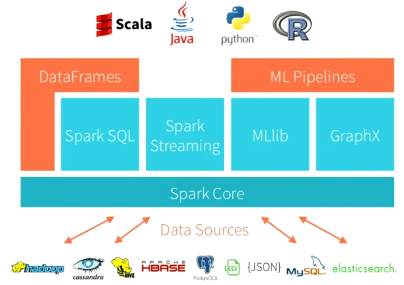

class: middle, center, title-slide

# Large-scale Distributed Systems

Lecture 7: Cloud computing

---

# Today

.center[]

How do we program this thing?
- MapReduce
- Spark
- Computational graph systems

---

# Dealing with lots of data

- Example: $130$+ trillion web pages $\times$ $50\text{KB} = 6.5$ exabytes.
    - ~$6500000$ hard drives ($1\text{TB}$) just to store the web.
- Assuming a data transfer rate of $200\text{MB}/s$, it would require $1000$+ years for a single computer to read the web!
    - And even more to make any useful usage of this data.
- Solution: **spread** the work over *many* machines.

---

# Traditional network programming

- Message-passing between nodes (MPI, RPC, etc).
- **Really hard** to do at scale (for 1000s of nodes):
    - How to *split* problem across nodes?
        - Important to consider network and data locality.
    - How to deal with *failures*?
        - a 10000-node clusters sees 10 faults/day.
    - Even without failure: *stragglers*.
        - Some nodes might be much slower than others.

---

# Traditional network programming

.center[]

.center[Almost nobody does message-passing anymore!$^*$]

.footnote[\*: except in niches, like scientific computing.]

---

# Data-Parallel models

- **Restrict** and **simplify** the programming interface so that the system can *do more automatically*.
- "Here is an operation, run it on all of the data".
    - I do not care *where* it runs (you schedule that).
    - In fact, feel free to run it *twice* on different nodes if needed.

---

# History

.center.width-100[]

---

class: middle, center

# MapReduce

---

# What is MapReduce?

- **MapReduce** is a *parallel programming* model for processing distributed data on a cluster.
- Simple *high-level* API limited two operations: **Map** and **Reduce**, as inspired by Lisp primitives:
    - `map`: apply function to each value in a set.
        - `(map 'length '(() (a) (a b) (a b c)))` $\rightarrow$ `(0 1 2 3)`
    - `reduce`: combines all the values using a binary function.
        - `(reduce #'+ '(1 2 3 4 5))` $\rightarrow$ `15`
- MapReduce is best suited for *embarrassingly parallel* tasks.
    - When processing can be broken into parts of equal size.
    - When processes can concurrently work on these parts.
- Programmers do not have to worry about handling
    - parallelization
    - data distribution
    - load balancing
    - fault tolerance

---

# Programming model

- **Map**: input key/value pairs $\rightarrow$ intermediate key/value pairs
    - User function gets called for each input key/value pairs.
    - Produces a set of intermediate key/value pairs.
- **Reduce**: intermediate key/value pairs $\rightarrow$  result files
    - Combine all intermediate values for a particular key through a user-defined function.
    - Produces a set of merged output values.

---

# What really happens

- **Map worker**:
    - Map:
        - Map calls are distributed across machines by automatically partitioning the input data into $M$ *shards*.
        - Parse the input shards into input key/value pairs.
        - Process the input pairs through a user-defined `map` function to produce a set of intermediate key/value pairs.
        - Write the result to an intermediate file.
    - Partition:
        - Assign the result to one of $R$ reduce workers based on a partitioning function.
            - Both $R$ and the partitioning function are user defined.
- **Reduce worker**:
    - Sort:
        - Fetch the relevant partition of the output from all mappers.
        - Sort by keys.
            - Different mappers may have output the same key.
    - Reduce:
        - Accept an intermediate key and a set of values for the key.
        - For each unique, combine these values through a user-defined `reduce` function to form a smaller set of values.

---

# The complete picture

.center.width-100[]

---

# Step 1: Split input files

.center.width-100[]

- Break up the input data into $M$ shards (typically $64 \text{MB}$).

---

# Step 2: Fork processes

.center.width-80[]

- Start up many copies of the program on a cluster of machines.
    - 1 master: scheduler and coordinator
    - Lots of workers
- Idle workers are assigned either:
    - *map tasks*
        - each works on a shard
        - there are $M$ map tasks
    - *reduce tasks*
        - each works on intermediate files
        - there are $R$ reduce tasks

---

# Step 3: Map task

.center.width-50[]

- Read content of the input shard assigned to it.
- Parse key/value pairs $(k,v)$ out of the input data.
- Pass each pair to a **user-defined** `map` function.
    - Produce (one or more) intermediate key/value pairs $(k',v')$.
    - These are buffered in memory.

---

# Step 4: Create intermediate files

.center.width-70[]

- Intermediate key/value pairs $(k',v')$ produced by the user's `map` function are periodically written to *local* disk.
    - These files are partitioned into $R$ regions by a partitioning function, one for each reduce worker.
    - e.g., `hash(key) mod R`
- Notify master when complete.
    - Pass locations of intermediate data to the master.
    - Master forwards these locations to the reduce workers.

[Q] What is the purpose of the partitioning function?

---

# Step 5: Sorting/Shuffling

.center.width-60[]

- Reduce worker get notified by master about the location of the intermediate files
associated to their partition.
- RPC to read the data from the local disks for the map workers.
- When the reduce worker reads intermediate data for its partition:
    - it sorts the data by intermediate keys $k'$.
    - all occurrences $v_i'$ of the same key are grouped together.

---

# Step 6: Reduce tasks

.center.width-60[]

- The sorting phase grouped data with a unique intermediate key.
- The **user-defined** `reduce` function is given the key and the set of intermediate values for that key.
    - $(k', (v_1', v_2', v_3', ...))$
- The output of the `reduce` function is appended to an output file.

---

# Step 7: Return to user

- When all Map and Reduce tasks have completed, the master wakes up the user program.
- The MapReduce call in the user program returns and the program can resume execution.
    - The output of the operation is available in $R$ output files.

---

# Example: Counting words

.center.width-100[]

---

# Other examples

- *Distributed grep*
    - Search for words in lots of documents.
    - Map: emit a line if it matches a given pattern. Produce $(file,line)$ pairs.
    - Reduce: copy the intermediate data to the output.
- *Count URL access frequency*
    - Find the frequency of each URL in web logs.
    - Map: process logs of web page access. Produce $(url,1)$ pairs.
    - Reduce: add all values for the same URL.
- *Reverse web-link graph*
    - Find where page links come from.
    - Map: output $(target,source)$ pairs for each link $target$ in a web page $source$.
    - Reduce: concatenate the list of all source URLs associated with a target.

---

# MapReduce is widely applicable

.center[]
.caption[Number of MapReduce programs in Google code source tree.]

---

# Fault tolerance

- Master *pings* each worker periodically.
    - If no response is received within a certain delay, the worker is marked as **failed**.
    - Map or Reduce tasks given to this worker are reset back to the initial state and rescheduled for other workers.
    - Task completion is committed through master to keep track of history.

[Q] What abstraction does this use?

[Q] What if the master node fails?

---

# Redundant execution

- Slow workers significantly lengthen completion time
    - Other jobs consuming resources on machine
    - Bad disks with soft errors transfer data very slowly
    - Weird things: processor caches disabled (!!)
- Solution: Near end of phase, spawn backup copies of tasks
    - Whichever one finishes first "wins"
- Effect: Dramatically shortens job completion time

---

# Locality

- Input and output files are stored on a distributed file system.
    - e.g., GFS or HDFS.
- Master tries to schedule Map workers near the data they are assigned to.
    - e.g., on the same machine or in the same rack.
- This results in thousands of machines reading input at local disk speed.
    - Without this, rack switches limit read rate.

---

.center.width-100[]
.caption[Google, 2004.]

---

# Hadoop Ecosystem (1)

.center.width-100[]

---

# Hadoop Ecosystem (2)

- *Hadoop HDFS*: A distributed file system for reliably storing huge amounts of unstructured, semi-structured and structured data in the form of files.
- **Hadoop MapReduce**: A distributed algorithm framework for the parallel processing of large datasets on *HDFS* filesystem. It runs on Hadoop cluster but also supports other database formats like *Cassandra* and *HBase*.
- *Cassandra*: A key-value pair NoSQL database, with column family data representation and asynchronous masterless replication.
- *HBase*: A key-value pair NoSQL database, with column family data representation, with master-slave replication. It uses HDFS as underlying storage.
- *Zookeeper*:  A distributed coordination service for distributed applications. It is based on **Paxos algorithm** variant called Zab.

---

# Hadoop Ecosystem (3)

- *Pig*: Pig is a scripting interface over MapReduce for developers who prefer scripting interface over native Java MapReduce programming.
- *Hive*:  Hive is a SQL interface over MapReduce for developers and analysts who prefer SQL interface over native Java MapReduce programming.
- *Mahout*: A library of machine learning algorithms, implemented on top of MapReduce, for finding meaningful patterns in HDFS datasets.
- *Yarn*: A system to schedule applications and services on an HDFS cluster and manage the cluster resources like memory and CPU.
- *Flume*: A tool to collect, aggregate, reliably move and ingest large amounts of data into HDFS.
- *Spark*: An in-memory data processing engine that can run a DAG of operations. It provides libraries for Machine Learning, SQL interface and near real-time Stream Processing
- ... and many others!

---

class: middle, center

# Spark

---

# MapReduce programmability

- Most applications require multiple MR steps.
    - Google indexing pipeline: 21 steps
    - Analytics queries (e.g., count clicks and top-K): 2-5 steps
    - Iterative algorithms (e.g., PageRank): 10s of steps
- Multi-step jobs create **spaghetti** code
    - 21 MR steps $\rightarrow$ 21 mapper and reducer classes
    - Lots of boilerplate code per step

.center.width-70[]
.caption[Chaining MapReduce jobs.]

---

# Problems with MapReduce

- Over time, MapReduce use cases showed two major limitations:
    - difficulty of programming directly in MapReduce.
        - e.g., a **linear dataflow** is forced.
    - performance bottlenecks.
        - e.g., due to **expensive** write to stable storage (HDFS) in-between chained jobs.
- That is, MapReduce does not compose so well for large applications.
- Hence the emergence of high level frameworks and specialized systems.
    - e.g., Pregel, Dremel, FI, Drill, GraphLab, Storm, Impala, etc.

---

# Spark

- Like Hadoop MapReduce, **Spark** is a framework for performing distributed computations.
- Unlike the various specialized systems, the goal of Spark is to *generalize* MapReduce.
- Two small additions are enough:
    - *fast data sharing*
    - general *direct acyclic graphs* (DAGs).
- More efficient engine.
- Simpler for end users.

---

# Spark ecosystem

.center.width-70[]

---

# Programmability

---

# Performance

---

# RDD

connection to the shared memory abstraction

---

# RDD graph

---

# Execution process

---

# DAG scheduler

---

# Job scheduler

---

class: middle, center

# Computational graph systems

---

# Summary

---

# References
