class: middle, center, title-slide

# Large-Scale Data Systems

Lecture 7: Distributed Hash Tables

<br><br>
Prof. Gilles Louppe<br>
[g.louppe@uliege.be](g.louppe@uliege.be)

???

R: in kademlia, why using the binary representation for structuring the topology? why not just integer and euclidean distance?
R: illustrations for kademlia https://www.kth.se/social/upload/516479a5f276545d6a965080/3-kademlia.pdf

---

# Today

How to design a large-scale distributed system similar to a hash table?

- Chord
- Kademlia

---

# Hash tables

A **hash table** is a data structure that implements an associative array abstract data type, i.e. a structure than can map keys to values.
- It uses a *hash function* to compute an index into an array of buckets or slots, from which the desired value can be found.
- Efficient and scalable: $\mathcal{O}(1)$ look-up and store operations (on a single machine).

.center.width-60[]

---

# Distributed hash tables

A **distributed hash table** (DHT) is a class of decentralized distributed systems that provide a lookup service similar to a hash table.
- Extends upon multiple machines in the case when the data is so large we cannot store it on a single machine.
- Robust to *faults*.

---

class: middle

## Interface

- $\text{put}(k, v)$
- $\text{get}(k)$

## Properties

- When $\text{put}(k, v)$ is completed, $k$ and $v$ are reliably stored on the DHT.
- If $k$ is stored on the DHT, a process will eventually find a node which stores $k$.

---

class: middle

# Chord

---

# Chord

Chord is a protocol and algorithm for a peer-to-peer distributed hash table.
- It organizes the participating nodes in an **overlay network**, where each node is responsible for a set of keys.
- Keys are defined as $m$-bit identifiers, where $m$ is a predefined system parameter.
- The overlay network is arranged in a **identifier circle** ranging from $0$ to $2^m - 1$.
    - A *node identifier* is chosen by hashing the node IP address.
    - A *key identifier* is chosen by hashing the key.
- Based on **consistent hashing**.
- Supports a single operation: $\text{lookup}(k)$.
    - Returns the host which holds the data associated with the key.

---

# Consistent hashing

## Traditional hashing

- Set of $n$ bins.
- Key $k$ is assigned to a particular bin.
- If $n$ changes, **all** items need to be rehashed.
    - E.g. when `bin_id = hash(key) % num_bins`.

--

count: false

## Consistent hashing

- Evenly distributes $x$ objects over $n$ bins.
- When $n$ changes:
  - Only $\mathcal{O}(\frac{x}{n})$ objects need to be rehashed.
  - Uses a deterministic hash function, independent of $n$. 
    - Chord makes use of SHA-1 as hash function

---

class:  middle

Consistent hashing in Chord assigns keys to nodes as follows:

- Key $k$ is assigned to the first node whose identifier is equal to or follows $k$ in the identifier space.
    - i.e., the first node on the identifier ring starting from $k$.
- This node is called the *successor node* of $k$, denoted $\text{successor}(k)$.
- Enable **minimal disruption**.

---

class: middle

To maintain the consistent (hashing) mapping, let us consider a node $n$ which
1. joins: some of the keys assigned to $\text{successor}(n)$ are now assigned to $n$.
    - Which? $\text{predecessor}(n) < k \leq n$
2. leaves: All of $n$'s assigned keys are assigned to $\text{successor}(n)$.

.center.width-80[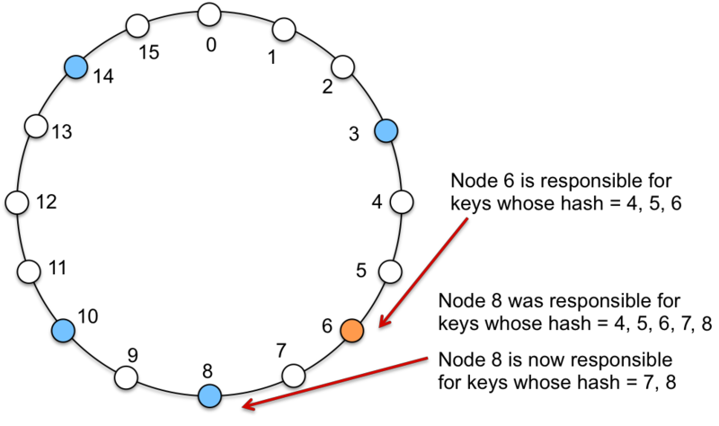]

---

# Routing

The core usage of the Chord protocol is to query a key from a client (generally a node as well), i.e. to find $\text{successor}(k)$.

## Basic query

- Any node $n$ stores its immediate successor $\text{successor}(n)$, and no other information.
- If the key cannot be found locally, then the query is passed to the node's successor.
- Scalable, but $\mathcal{O}(n)$ operations are required.
    - **Unacceptable** in  large systems!

.exercise[How to make lookups faster?]

???

Pause here

---

class: middle

## Finger table

In Chord, in addition to $\text{successor}$ and $\text{predecessor}$ pointers, each node maintains a finger table to accelerate lookups.
- As before, let $m$ be the number of bits in the identifier.
- Every node $n$ maintains a routing (finger) table with at most $m$ entries.
- Entry $1 \leq k \leq m$ in the finger table of node $n$:
  - First node $s$ that succeeds $n$ by at least $2^{k - 1}$ on the identifier circle.
  - Therefore, $s = \text{successor}((n + 2^{k-1})\text{~}\textrm{mod}\text{~}2^m)$

<br>
.center.width-70[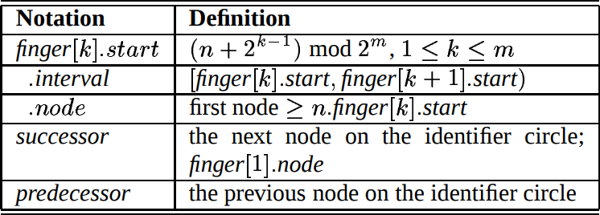]

---

class: middle

## Example

- $m = 4$ bits $\rightarrow$ max 4 entries in the table.
- $k$-th entry in finger table: $s = \text{successor}((n + 2^{k - 1})\text{~}\mathrm{mod}\text{~}2^m)$

.center.width-40[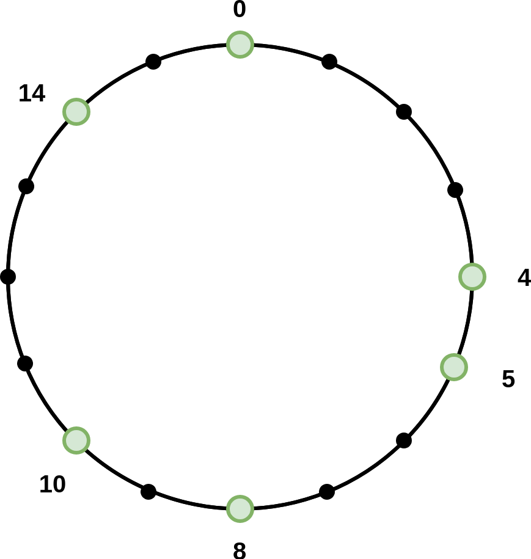]

---

class: middle

## Example: first entry

- $n=4$, $k = 1$
- $s = \text{successor}((n + 2^{k-1}) \text{~}\mathrm{mod}\text{~}2^m) = \text{successor}(5) = 5$

.center.width-80[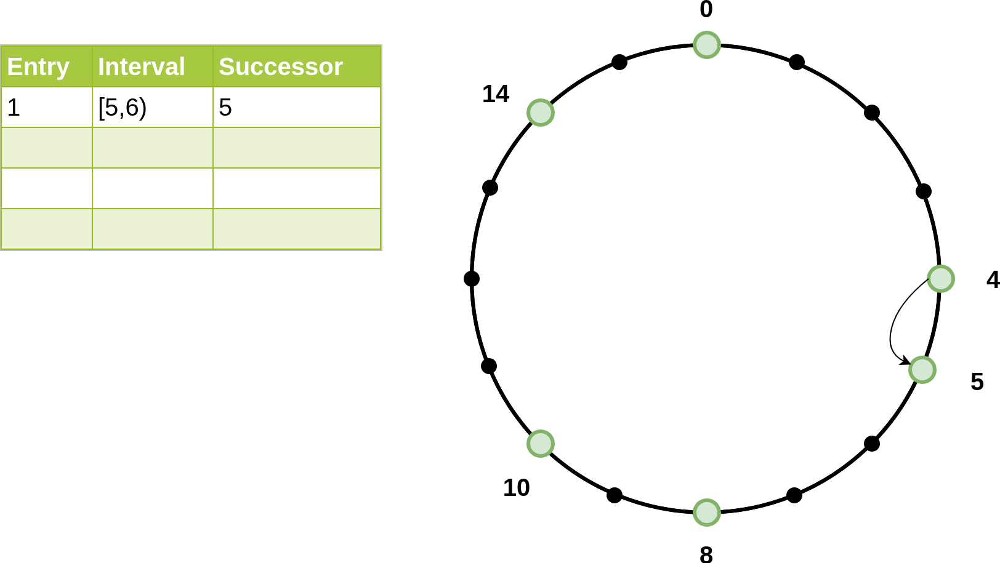]

???

- Interval: [`finger[k].start` -> `finger[k+1].start`)
- Successor column should be `finger[k].node`, i.e. `successor(finger[k].start)`

---

class: middle

## Example: second entry

- $n=4$, $k = 2$
- $s = \text{successor}((n + 2^{k-1}) \text{~}\mathrm{mod}\text{~}2^m) = \text{successor}(6) = 8$

.center.width-80[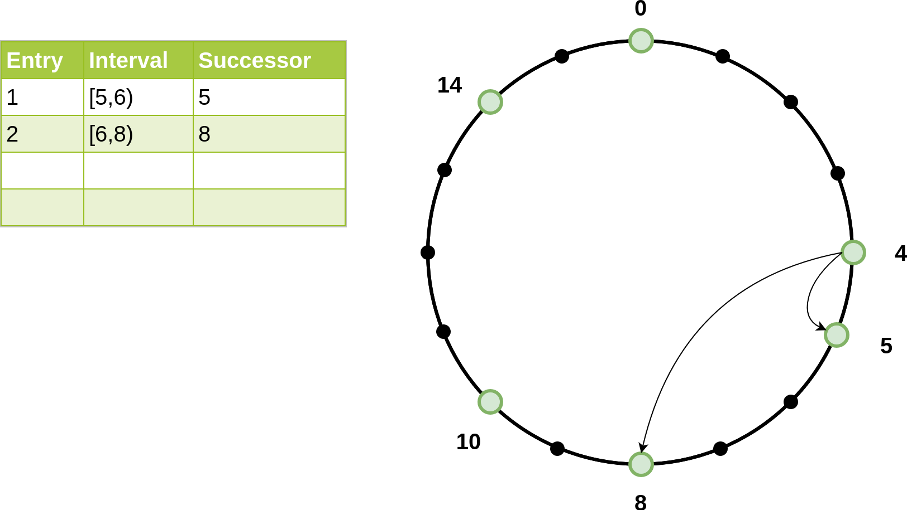]

---

class: middle

## Example: third entry

- $n=4$, $k = 3$
- $s = \text{successor}((n + 2^{k-1}) \text{~}\mathrm{mod}\text{~}2^m) = \text{successor}(8) = 8$

.center.width-80[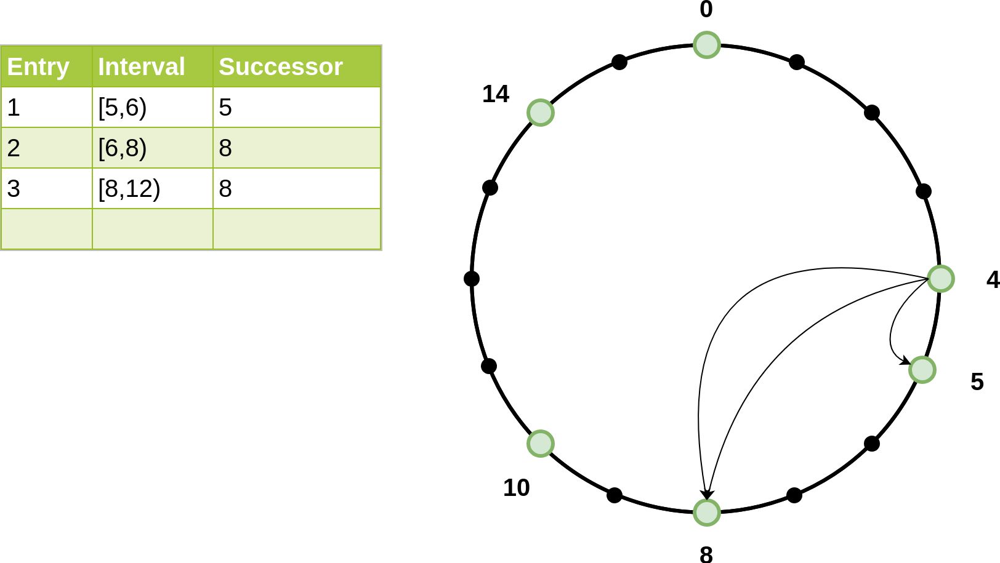]

---

class: middle

## Example: fourth entry

- $n=4$, $k = 4$
- $s = \text{successor}((n + 2^{k-1}) \text{~}\mathrm{mod}\text{~}2^m) = \text{successor}(12) = 14$

.center.width-80[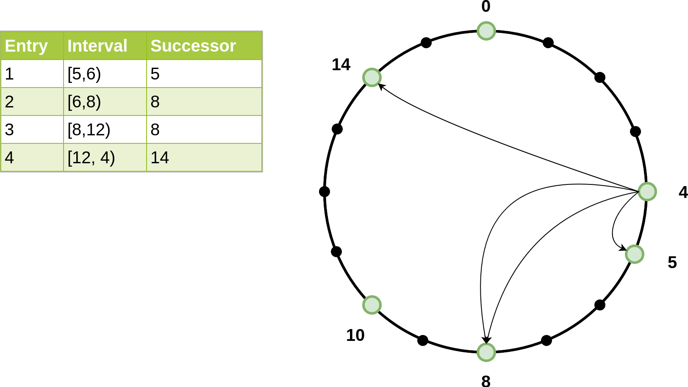]

---

class: middle

## Improved lookup

A lookup for $\text{successor}(k)$ now works as follows:
- if $k$ falls between $n$ and $\text{successor}(n)$, return $\text{successor}(n)$.
- otherwise, the lookup is forwarded at $n'$, where $n'$ is the node in the finger table that most immediately precedes $k$.
- Since each node has finger entries at power of two intervals around the identifier circle, each node can forward a query at least halfway along the remaining distance between the node and the target key.
- $\mathcal{O}(\log N)$ nodes need to be contacted.

---

class: middle

```
// ask node n to find the successor of id
n.find_successor(id):
  if (id ∈ (n, successor]):
    return successor
  else:
    // forward the query around the circle
    n0 = closest_preceding_node(id)
    return n0.find_successor(id)
```

```
// search the local table for the highest predecessor of id
n.closest_preceding_node(id):
  for k = m downto 1:
    if (finger[k] ∈ (n, id)):
      return finger[k]
  return n
```

???

`finger[k]` is the first node that succeeds $n+2^{k-1}$. I.e., this corresponds to `finger[k].node`.

---

class: middle

## Example: finding $\text{successor}(id=3)$ from $\text{node}\_4$

1. $\text{node}\_4$ checks if $id$ is in the interval (4, 5].
2. No, $\text{node}\_4$ checks its finger table (starting from the last entry, i.e., $k = m$).
   1. Is $\text{node}\_{14}$ in the interval (4, 3)? *Yes!*
3. $\text{node}\_{14}$ checks if $id$ is in the interval (14, 0].
4. No, $\text{node}\_{14}$ checks its finger table for closest preceding node.
   1. Return $\text{node}\_{0}$.
5. $\text{node}\_{0}$ checks if $id$ is in the interval (0, 4]. *Yes!*

$\rightarrow$ Node 0 is the preceding node of $k = 4$. Therefore $\text{successor}(id=3)=\text{node}\_0.\text{successor}=4$.

Of course, one could implement a mechanism that prevents $\text{node}\_{4}$ from looking up its own preceding node in the network.

---

# Join

We must ensure the network remains consistent when a node $n$ joins by connecting to a node $n^\prime$. This is performed in three steps:
1. Initialize the successor of $n$.
2. Update the fingers and predecessors of existing nodes to reflect the addition of $n$.
3. Transfer the keys and their corresponding values to $n$.

---

class: middle

## Initializing $n$'s successor

$n$ learns its successor by asking $n^\prime$ to look them up.

```
// join a Chord ring containing node n'.
n.join(n'):
  predecessor = nil
  successor = n'.find_successor(n)
```

---

class: middle

## Periodic consistency check

```
// called periodically. n asks the successor
// about its predecessor, verifies if n's immediate
// successor is consistent, and tells the successor about n
n.stabilize():
  x = successor.predecessor
  if (x ∈ (n, successor)):
    successor = x
  successor.notify(n)

// n' thinks it might be our predecessor.
n.notify(n'):
  if (predecessor is nil or n' ∈ (predecessor, n))
    predecessor = n'

// called periodically. refreshes finger table entries.
// next stores the index of the finger to fix
n.fix_fingers():
  next = next + 1
  if (next > m):
    next = 1
  finger[next] = find_successor(n+2^{next-1})
```

---

class: middle

## Transferring keys

- $n$ can become the successor only for keys that were previously the responsibility of the node immediately following $n$.
- $n$ only needs to contact $\text{successor}(n)$ to transfer responsibility of all relevant keys.

---

# Fault-tolerance

## Failures

- Since the successor (or predecessor) of a node may disappear from the network (because of failure or departure), each node records a whole segment of the circle adjacent to it, i.e., the $r$ nodes following it.
- This successor list results in a high probability that a node is able to correctly locate its successor (or predecessor), even if the network in question suffers from a high failure rate.


## Replication

- Use the same successor-list to replicate the data on the segment!

---

# Summary

- Fast lookup $\mathcal{O}(\log N)$, small routing table $\mathcal{O}(\log N)$.
- Handling failures and addressing replication (load balance) using same mechanism (successor list).
- Relatively small join/leave cost.
- Iterative lookup process.
- Timeouts to detect failures.
- No guarantees (with high probability ...).
- Routing tables must be correct.

---

class: middle

# Kademlia

---

# Kademlia

Kademlia is a peer-to-peer hash table with **provable** consistency and performance in a fault-prone environment.

- Configuration information spreads automatically as a side-effect of key look-ups.
- Nodes have enough knowledge and flexibility to route queries through low-latency paths.
- Asynchronous queries to avoid timeout delays from failed nodes.
- Minimizes the number of configuration messages (guarantee).
- 160-bit identifiers (e.g., using SHA-1 or some other hash function, implementation specific).
- Key-Value pairs are stored on nodes based on *closeness* in the identifier space.
- Identifier based *routing* algorithm by imposing a *hierarchy* (virtual overlay network).

---

# System description

Nodes are structured in an *overlay network* where they correspond
to the **leaves of an (unbalanced) binary  tree**, with each node's position determined by the shortest unique prefix of its identifier.

<br>
.center.width-85[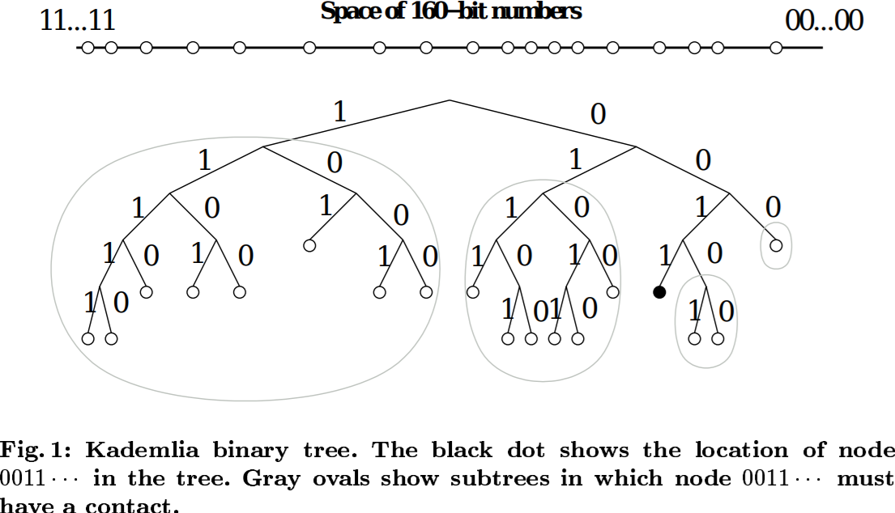]

---

class: middle

- Node identifiers are chosen at random in the identifier space.
- For a given node, Kademlia divides the binary tree into a series of successively lower sub-trees that do not contain the node.
    - The highest sub-tree consists of the half of the binary tree not containing the node.
    - The next sub-tree consists of the half of the remaining tree not containing the node, etc.
- Kamdelia ensures that every node knows at least one other node in each of its sub-trees. This guarantees that any node can locate any other node given its identifier.


---

class: middle

## Node distance

The distance between two identifiers is defined as $$d(x, y) = x \oplus y.$$
- XOR is a valid, albeit non-Euclidean metric.
- XOR captures the notion of distance between two identifiers: in a fully-populated binary tree of 160-bit IDs, it is the height of the smallest subtree containing them both.
- XOR is symmetric.
- XOR is unidirectional.

???

unidirectional: for any x and distance delta>0, there is exactly one y such that d(x,y)=delta.

---

class: middle

E.g., if the identifier space is 3 bits, then the distance between IDs $1$ and $4$ is

$$d(1, 4) = d(001\_2, 100\_2) = 001\_2 \oplus 100\_2 = 101\_2 = 5.$$

---

class: middle

## Node state

- For every prefix of size $0 \leq i < 160$, every node keeps a list, called a **k-bucket**,  of (IP address, Port, ID) for nodes of distance between $2^i$ and $2^{i+1}$ of itself.
- Every k-bucket is sorted by time last seen (least recently seen first).
- When a node receives a message, it updates the corresponding k-bucket for the sender's identifier. If the sender already exists, it is moved to the tail of the list.
  - If the k-bucket is full, the node pings the **least recently** seen node and checks if it is still available.
        - Only if the node is **not available** it will replace it.
        - If available, the node is pushed back at the end of the bucket.
  - Policy of replacement only when a nodes leaves the network $\rightarrow$ prevents Denial of Service (DoS) attacks (e.g., flushing routing tables).

---

class: middle

## k-bucket

<br>

.center.width-100[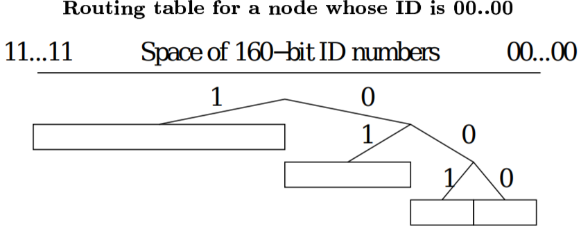]

???

Notice how this is similar to Chord's finger table.

---

# Interface

Kademlia provides four remote procedure calls (RPCs):

- `PING(id)` returns (IP, Port, ID)
  - Probes the node to check whether it is still online.
- `STORE(key, value)`
- `FIND_NODE(id)` returns (IP, Port, ID) for the $k$ nodes it knows about closest to ID.
- `FIND_VALUE(key)` returns (IP, Port, ID) for the $k$ nodes it knows about closest to the key, or the value if it maintains the key.

---

class: middle

## Node lookup

The most important procedure a Kademlia participant must perform is locating the $k$ closest nodes to some given identifier.

- Kademlia achieves this by performing a recursive  lookup procedure.
- The initiator issues asynchronous `FIND_NODE` requests to $\alpha$ (system parameter) nodes from its closest non-empty k-bucket.
  - Parallel search with the cost of increased network traffic.
  - Nodes return the $k$ closest nodes to the query ID.
  - Repeat and select the $\alpha$ nodes from the new set of nodes.
  - Terminate when set doesn't change.
  - **Possible optimization**: choose $\alpha$ nodes with lowest latency.

---

class: middle, center

.width-80[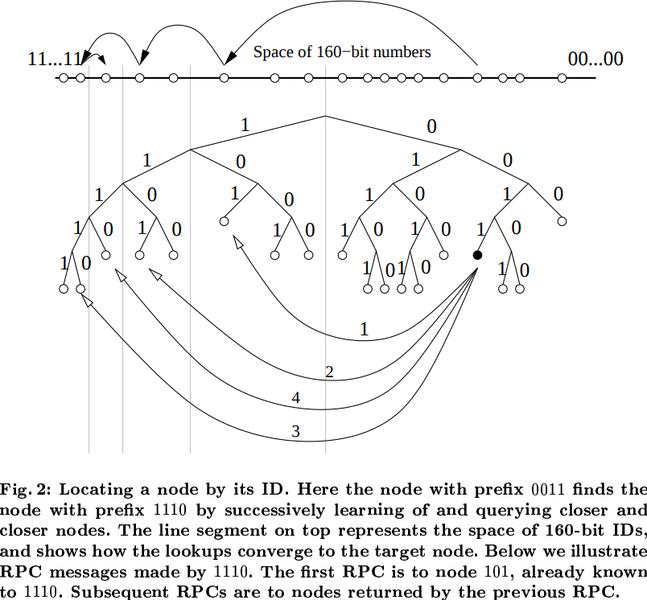]

---

class: middle

## Storing data

Using the lookup procedure, *storing* and making data *persistent* is trivial.

$\rightarrow$ Send a `STORE` RPC to the $k$ closest nodes identified by the lookup procedure.

- To ensure persistence in the presence of **node failures**, every node periodically republishes the key-value pair to the $k$ closest nodes.
- Updating scheme can be implemented. For example: delete data after 24 hours after publication to limit stale information.

---

class: middle

## Retrieving data

1. Find $k$ closest nodes of the specified identifier using `FIND_VALUE(key)`.
2. Halt procedure immediately whenever the set of closest nodes doesn't change or a value is returned.

--

count: false

For caching purposes, once a lookup succeeds, the requesting node stores the key-value pair at the closest node it observed to the key that did not return the value.
- Because of the *unidirectionality* of the topology (requests will usually follow the same path), future searches for the same key are likely to hit cached entries before querying the closest node.

Induces problem with popular keys: *over-caching* at many nodes.
- **Solution**: Set expiration time *inversely proportional* to the distance between the true identifier and the current node identifier.

---

class: middle

## Join

Straightforward approach compared to other implementations.

1. Node $n$ initializes it's k-bucket (empty).
2. A node $n$ connects to an already participating node $j$.
3. Node $n$ then performs a *node-lookup* for its own identifier.
   - Yielding the $k$ closest nodes.
   - By doing so $n$ inserts itself in other nodes $k$-buckets (see later).

Note: The new node should store keys which are the closest to its own identifier by obtaining the $k$-closest nodes.


---

class: middle

## Leave and failures

Leaving is very simple as well. Just disconnect.
- Failure handling is **implicit** in Kademlia due to *data persistence*.
- No special actions required by other nodes (failed node will just be removed from the k-bucket).

---

# Routing table

The routing table is an (unbalanced) binary tree whose leaves are $k$-buckets.
- Every $k$-bucket contains some nodes with a common prefix.
- The shared prefix is the $k$-buckets position in the binary tree.
- Thus, a $k$-buckets covers some range of the 160 bit identifier space.
- All $k$-buckets cover the *complete* identifier space with *no* overlap.

---

class: middle

## Dynamic construction of the routing table

- The routing tables are allocated dynamically as node receive requests.
- A bucket is split whenever the $k$-bucket is full and the range includes the node's own identifier.

.center.width-70[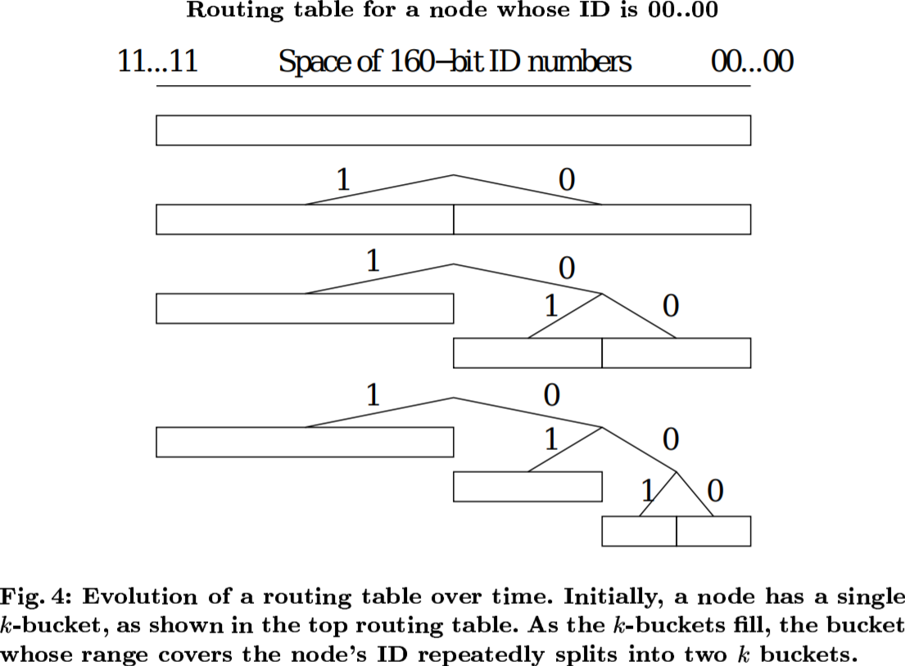]

---

class: middle

## Example

- $k = 2$
- $\alpha = 1$ (no asynchronous requests, also no asynchronous pings)
- Node identifier (000000) is not in the routing table

.center.width-60[]

---

class: middle, center
count: false

Node `000111` is involved with an RPC request, what happens?

.center.width-60[]

---

class: middle
count: false

.center.width-60[]

---

class: middle
count: false

.center.width-60[]

---

class: middle
count: false

.center.width-80[]

---

class: middle
count: false

.center.width-60[]

---

class: middle
count: false

.center.width-60[]

---

class: middle, center
count: false

A new node `011000` is involved with a RPC message.

.center.width-60[]

---

class: middle
count: false

.center.width-60[]

---

class: middle
count: false

.center.width-60[]

---

class: middle
count: false

.center.width-60[]

---

class: middle
count: false

.center.width-60[]

---

class: middle
count: false

.center.width-60[]

---

class: middle
count: false

.center.width-60[]

---

class: middle
count: false

.center.width-60[]

---

class: middle
count: false

.center.width-60[]

---

class: middle
count: false

.center.width-60[]

---

# Summary

- Efficient, guaranteed look-ups $\mathcal{O}(\text{log} N)$
- XOR-based metric topology (provable consistency and performance).
- Possibly latency minimizing (by always picking the lowest latency note when selecting $\alpha$ nodes).
- Lookup is iterative, but concurrent ($\alpha$).
- Kademlia protocol implicitly enables data persistence and recovery, no special failure mechanisms requires.
- Flexible routing table robust against DoS (route table flushing).

---

class: end-slide, center
count: false

The end.

---

# References

- Stoica, I., Morris, R., Karger, D., Kaashoek, M. F., & Balakrishnan, H. (2001). Chord: A scalable peer-to-peer lookup service for internet applications. ACM SIGCOMM Computer Communication Review, 31(4), 149-160.
- Maymounkov, P., & Mazieres, D. (2002, March). Kademlia: A peer-to-peer information system based on the xor metric. In International Workshop on Peer-to-Peer Systems (pp. 53-65). Springer, Berlin, Heidelberg.
