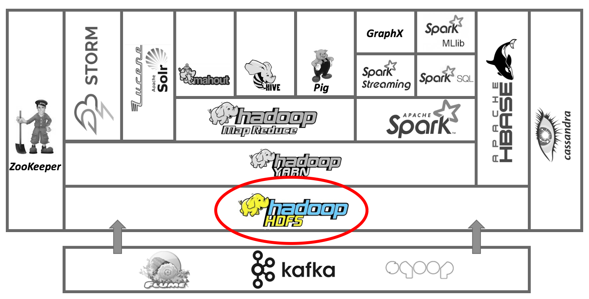
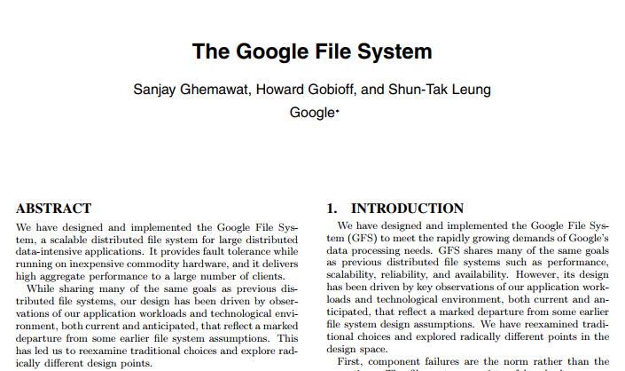
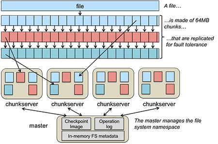
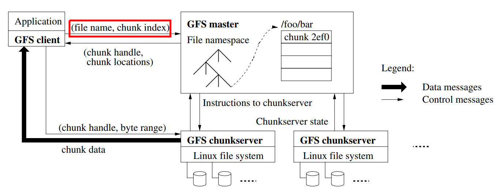
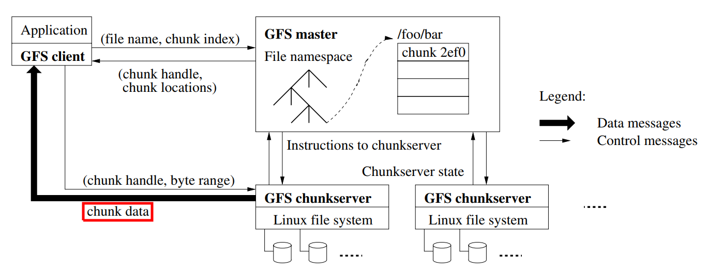
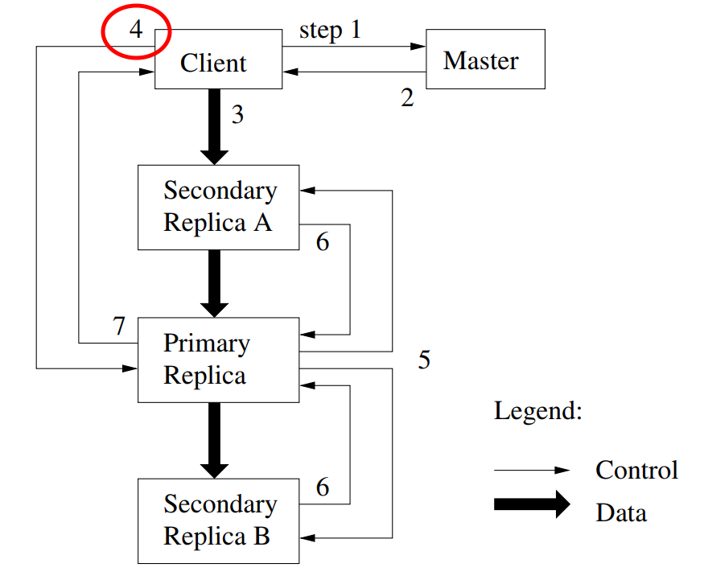
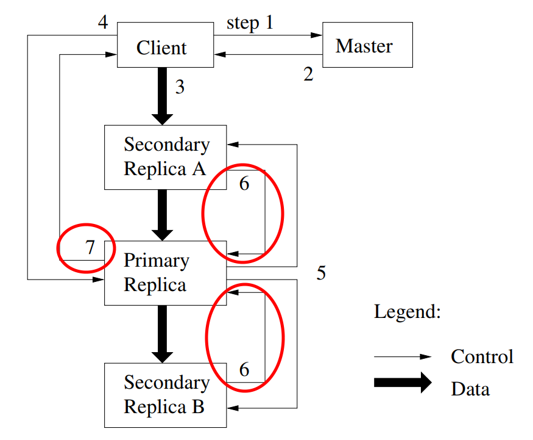
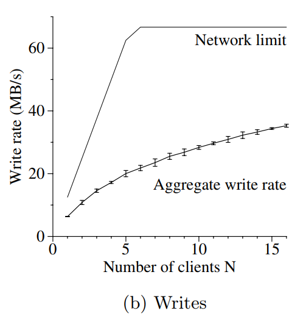
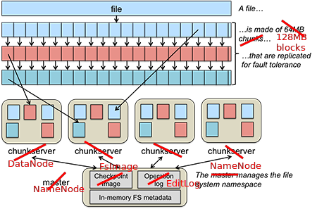

class: middle, center, title-slide

# Large-scale Distributed Systems

Lecture 8: Distributed file systems

---

# Today

- *Google File System* (GFS)
    - Design considerations behind GFS .
    - Data replication
    - Reading and writing.
    - Recovery from failure
- *Hadoop Distributed File System* (HDFS)

.center.width-80[]

---

class: middle, center

# Google File System

---

# File systems

- File systems determine **how** data is stored and retrieved.
- *Distributed file systems* manage the storage across a network of machines.
    - Single-system **illusion** for users.
    - Added complexity due to the network.
- GFS and HDFS are examples of distributed file systems.
    - They represent *one* way (not the way) to design a distributed file system.

        [Q] Which file systems do you know?

---

# History

- GFS was developed at Google around 2003, jointly with MapReduce.
- Provide **efficient** and **reliable** access to data.
- Use large clusters of *commodity hardware*.
- Proprietary.

.center.width-80[]

---

# Assumptions

- Hardware **failures are common** (commodity hardware).
- Files are *large* (multi-GB files are the norm) and their number is (relatively) limited (millions).
- Reads:
    - *large streaming reads* ($\geq$ 1MB in size)
    - *small random reads*
- Writes:
    - Large **sequential writes** that *append* to files.
    - Concurrent appends by multiple clients.
    - Once written, files are *seldom modified* ($\neq$ append) again.
        - Random modification in files is possible, but not efficient in GFS.
- High sustained bandwidth, but low latency.

---

# Which of those fit the assumptions?

- Global company dealing with the data of its 100M employees.
    - Salary, bonuses, age, performance, etc.
- A search engine's query log.
- A hospital's medical imaging data generated from an MRI scan.
- Data sent by the Hubble telescope.
- A search engine's index (used to serve search results to users).

---

# How would you design a DFS?

.grid[
.col-1-2[
- We want *single system illusion* for data storage.
- Although data is too large be stored in a single system.
- Hardware **will** fail.

.caption[Google first servers]
]
.col-1-2[

]
]

---

# Disclaimer

- GFS (and HDFS) are **not a good fit** for:
    - Low latency data access (in the ms range).
        - Solution: distributed databases, such as HBase.
    - Many small files.
    - Constantly changing data.
- Not all details of GFS are public knowledge.

---

# Design aims

- Maintain data and system *availability*.
- Handle **failures** gracefully and transparently.
- *Low synchronization* overhead between entities.
- Exploit *parallelism* of numerous entities.
- Ensure **high sustained throughput** over low latency for individual reads/writes.

---

# Architecture

.center.width-100[]

- A *single* **master** node.
- Many *chunkservers* (100s - 1000s) storing the data.
    - Physically spread in different racks.
- Many clients.

???

- Remember: one way, not the way.
- Data does not flow across the GFS master.

---

# Files

- A single **file** may contain several *objects*.
    - E.g., images, web pages, etc.
- Files are divided into fixed-size **chunks**.
    - Each chunk is identified by a globally unique 64 bit *chunk handle*.
- Chunkservers store chunks on local disks as plain Linux files.
    - Read or write data specified by a pair (chunk handle, byte range).
    - By default **three replicas** of a chunk stored across chunkservers.

.center.width-50[]

---

# Master

- The master node stores and maintains *all file system metadata*:
    - Three main types of metadata:
        - the file and chunk namespaces,
        - the mapping from files to chunks,
        - the locations of each chunk's replicas.
    - All metadata is kept in master's **memory** (fast random access).
        - Sets limits on the entire system's capacity.
- It controls and coordinates *system-wide activities*:
    - Chunk lease management
    - Garbage collection of orphaned chunks
    - Chunk migration between chunkservers
- **Heartbeat** messages between master and chunkservers.
    - To detect failures
    - To send instructions and collect state information
- An *operation log* persists master's state to permanent storage.
    - In case master crashes, its state can be recovered (more later).

---

# One node to rule them  all

- Having a **single master** node vastly simplifies the system design.
- Enable master to make sophisticated chunk placement and replication decisions, using *global knowledge*.
- Its involvement in reads and writes should be minimized so to avoid that it becomes a bottleneck.
    - Clients never read and write file data through master.
    - Instead, clients ask the master which chunkservers it should contact.

        [Q] As the cluster grows, can the master become a bottleneck?

???

Size of storage increased in the range of petabytes. The amount of metadata maintained by master increased and scanning through such large amounts became an issue. The single master started becoming a bottleneck when thousand client requests came simultaneously.

---

# Chunks

- Default size = 64MB.
    - This a **key design parameter** in GFS!
- Advantages of large (but not too large) chunk size:
    - **Reduced** need for client/master interaction.
    - 1 request per chunk suits the target workloads.
    - Client can cache *all the locations* for a multi-TB working set.
    - **Reduced size** of metadata on master (kept in memory).
- Disadvantage:
    - A chunkserver can become a **hotspot** for popular files.

      [Q] How to fix the hotspot problem?

---

# <strike>Caching</strike>

Decision decisions:
- Clients do **not** cache file data.
    - They do cache metadata.
- Chunckservers do **not** cache file data.
    - Responsibility of the underlying file system (e.g., Linux's buffer cache).
- Client caches offer *little benefit* because most applications
    - stream through huge files
        - disk seek time negligible compared to transfer time.
    - have working sets too large to be cached.
- Not having a caching system **simplifies the overall system** by eliminating cache coherence issues.

---

# Interface

- No file system interface at the operating-system level (e.g., under the VFS layer).
    - User-level API is provided instead.
    - Does not support all the features of POSIX file system access.
        - But looks similar (i.e., `open`, `close`, `read`, `write`, ...)
- Two special operations are supported:
    - *Snapshot*: efficient way of creating a copy of the current instance of a file or directory tree.
    - *Append*: append data to a file as an **atomic operation**, without having to lock the file.
        - Multiple processes can append to the same file concurrently without overwriting one another's data.

---

# Reads (1)

.center.width-100[]

1) The GFS client translates filename and byte offset specified by the application into a *chunk index* within the file. A request is sent to master.

---

# Reads (2)

.center.width-100[]

2) Master replies with chunk handle and locations of the replicas.

---

# Reads (3+4)

.center.width-100[]

3) The client caches this information using the file name and chunk index as the key.
- Further reads of the same chunk requires no more client-master interaction, until the cached information expires.

4) The client sends a request to one of the replicas, typically the closest.

---

# Reads (5)

.center.width-100[]

5) The contacted chunkserver replies with the data.

---

# Leases

- A **mutation** is an operation that changes the contents or metadata of a chunk.
    - `write`
    - `append`
- Each mutation is performed at all the chunk's replicas.
- **Leases** are used to maintain a consistent mutation order across replicas.
    - Master grants a chunk lease to one of the replicas, called the *primary*.
    - Leases are renewed using the periodic heartbeat messages between master and chunkservers.
- The primary picks a **serial order** for all mutations to the chunk.
    - All replicas follow this order when applying mutations.
- Leases and serial order at the primary define a *global ordering* of the operations on a chunk.

---

# Writes (1+2)

.center.width-40[]

1) The GFS client asks master for the primary and the secondary replicas for each chunk.

2) Master replies with the locations of the primary and secondary replicas. This information is cached.

---

# Writes (3)

.center.width-40[]

3) The client pushes the data to all replicas.
- Each chunkserver stores the data in an internal buffer.
- Each chunkserver sends back an acknowledgement to the client once the data is received.
- Data flow is decoupled control flow.

---

# Writes (4)

.center.width-40[]

4) Once all replicas have acknowledged, a **write request** is sent to the primary.
- This request identifies the data pushed earlier.
- The primary assigns consecutive serial numbers to all the mutations it receives, possibly from multiple clients.
    - This provides *ordering* and *consistency*.
- The primary applies the mutations, in the chosen order, to its local state.

---

# Writes (5)

.center.width-40[]

5) The primary forwards the write request to all secondary replicas.
- Mutations are applied locally in the serial order decided by the primary.

---

# Writes (6+7)

.center.width-40[]

6) The secondaries all reply to the primary upon completion of the operation.

7) The primary replies to the client.
- Errors may be reported to the client.
    - Upon errors, the client request is considered to have failed.
    - The modified region is left in an **inconsistent state**.
    - The client handles errors by retrying the failed mutation.

---

# Appends

- Google uses large files as queues between multiple *producers* and *consumers*.
- Same control flow as for writes, except that:
    - Client pushes data to replicas of *last chunk* of file.
    - Client send an append request to the primary.
    - The request fits in current last chunk:
        - Primary appends data to own replica.
        - Primary tells secondaries to do same at same byte offset in theirs.
        - Primary replies with success to client, specifying the offset the data was written.
    - When the data does not fit in last chunk:
        - Primary fills current chunk with padding.
        - Primary tells secondaries to do the same.
        - Primary replies to client to *retry on next chunk*.
- If a record append fails at any replica, the client has to retry the operation.
    - Replicas of same chunk may contain may not be bytewise identical!

---

# (Relaxed) Consistency model

- Changes to metadata are always *atomic*.
    - Guaranteed by having a single master server.
- Mutations are *ordered* as chosen by a primary node.
    - All replicas will be consistent if they all successfully  perform mutations in the same order.
    - Multiple writes from the same client may be interleaved or overwritten by concurrent operations from other clients.
        - i.e., a file region is defined only if client see mutations in entirety, it is undefined otherwise.
- Record append completes *at least once*, at offset of GFS's choosing.
    - There might be duplicate entries.
- Failures can cause inconsistency.

.center.width-60[]

---

# Replica placement

- Policy is to maximize:
    - data reliability and availability,
    - network bandwidth utilization.
- Chunks are created initially empty.
    - Preferably create chunks at *under-utilized* chunkservers, spread across different racks.
    - Limit number of recent creations on each chunk server.
- Re-replication.
    - Started once the available replicas fall below a user-defined threshold.
    - Master instructs chunkserver to copy chunk data directly from existing valid replica.
    - Number of active clone operations/bandwidth is limited.
- Re-balancing
    - Changes in replica distribution for better load balancing.
    - New chunk servers are gradually filled.

---

# Garbage collection

How can a file be **deleted** from the cluster?
- Deletion is *logged* by master.
- The file is *renamed* to a hidden file and the deletion timestamp is kept.
- Periodic scan of the master's file system namespace.
    - Hidden files older than 3 days are deleted from master's memory.
    - I.e., there is no further connection a file and its chunks.
- Periodic scan of the master's chunk namespace.
    - Orphaned chunks (not reachable from any file) are identified and their metadata is deleted.
- Hearbeat messages are used to synchronize deletion between master and chunkservers.

---

# Stale replica detection

Scenario: a chunkserver misses a mutation applied to a chunk (e.g., a chunk was appended).
- Master maintains a **chunk version number*** to distinguish up-to-date and stale replicas.
- Before an operation on a chunk, master ensures that the version number advances.
    - Each time master grants new lease, the version is incremented and informed to all replicas.
- Stale replicas are removed in the regular garbage collection cycle.

---

# Operation log

- The **operation log** is a persistent historical record of critical changes on metadata.
- Critical to the *recovery* of the system.
    - Master recovers its file system state by replaying the operation log.
    - Master periodically checkpoints its state to minimize startup time.
- Changes to metadata are only made visible to the clients **after** they have been written to the operation log.
- The operation log is *replicated* on multiple remote machines.
    - Before responding to a client operation, the log record must have been flushed locally and remotely.
- Serve as a **logical timeline** that defines the order of concurrent operations.

---

# Chunk locations

- Master does not keep a persistent record of chunk replica locations.
- Instead, it **polls** chunkservers about their chunks at startup.
- Master keeps up to date through *hearbeat* messages.
- A chunkserver has the **final word** over what chunks it stores.

           [Q] What does this design decision simplify?

---

# What if master fails?

- ... and does not recover?
- This represents a *single point of failure* of system.
- Solution:
    - Maintain shadow *read-only* replicas of master.
    - Use these replicas in case master fails.
    - Eventually elect a new leader if master never recovers.

---

# What if a chunkserver fails?

- Master notices missing hearbeats.
- Master decrements count of replicas for all chunks on dead chunkserver.
- Master re-replicates chunks missing replicas.
    - Highest priority for chunks missing greatest number of replicas.

---

# Data corruption

- Data corruption or loss can occur at any time.
- Chunkservers use **checksums** to detect corruption of stored data.
    - Alternative: compare replicas across chunk servers.
- A chunk is broken into 64KB blocks, each has a 32bit checksum.
    - These are kept in memory and stored persistently.
- Read requests: the chunkserver *verifies the checksum* of the data blocks that overlap with the read range.
    - Corrupted data are not sent to the clients.

       [Q] What if a read request fails because of corrupted data?

---

# Performance: reads

.center.width-70[]

---

# Performance: writes

.center.width-70[]

---

# Performance: appends

.center.width-70[]

---

# Summary

- Success: used actively by Google to support search service and other applications.
    - Availability and recoverability on cheap hardware.
    - High throughput by decoupling control and data.
    - Supports massive data sets and concurrent appends.
- Semantics not transparent to applications.
    - Must verify file contents to avoid inconsistent regions, repeated appends (at-least-once semantics).
- Performance not good for all applications.
- Assumes read-once, write-once workload (no client caching!)
- Replaced in 2010 by Colossus
    - Eliminate master node as single point of failure  
    - Targets latency problems due to more latency sensitive applications
    - Reduce block size to be between 1~8 MB
    - Few public details.
    
---

class: middle, center

# HDFS

---

# HDFS

XXX

---

# HDFS in one figure

.center.width-90[]

---

# GFS vs. HDFS

| GFS | HDFS |
| --- | ---- |
| Master | NameNode |
| Chunkserver | DataNode |
| Operation log | Journal, edit log |
| Chunk | Block |
| Random file writes are possible | Only append is possible |
| Multiple writers, multiple readers model | Single writer, multiple reader model |
| Default chunk size = 64MB | Default block size = 128MB |

---

# Summary

---

# References

- Ghemawat, Sanjay, Howard Gobioff, and Shun-Tak Leung. "The Google file system." ACM SIGOPS operating systems review. Vol. 37. No. 5. ACM, 2003.
- Shvachko, Konstantin, et al. "The hadoop distributed file system." Mass storage systems and technologies (MSST), 2010 IEEE 26th symposium on. IEEE, 2010.
- Claudia Hauff. "Big Data Processing, 2014/15. Lecture 5: GFS and HDFS".
