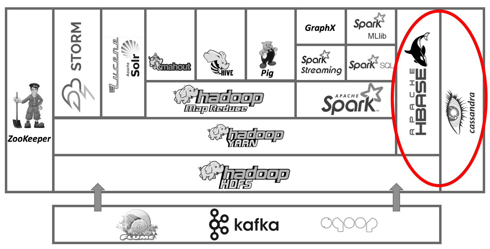
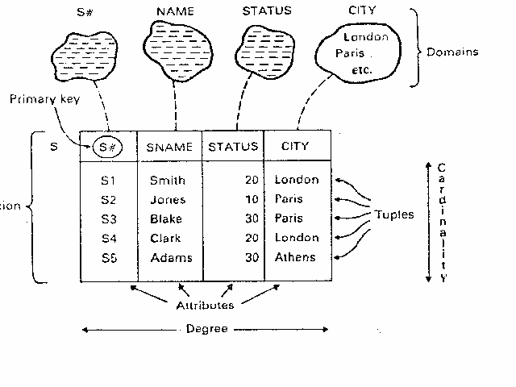
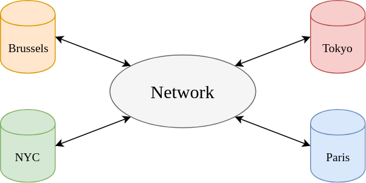
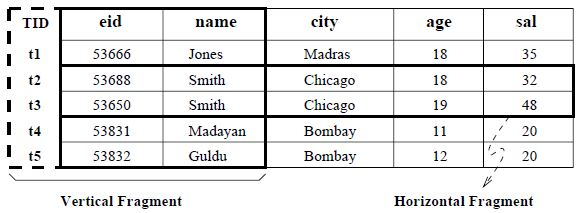
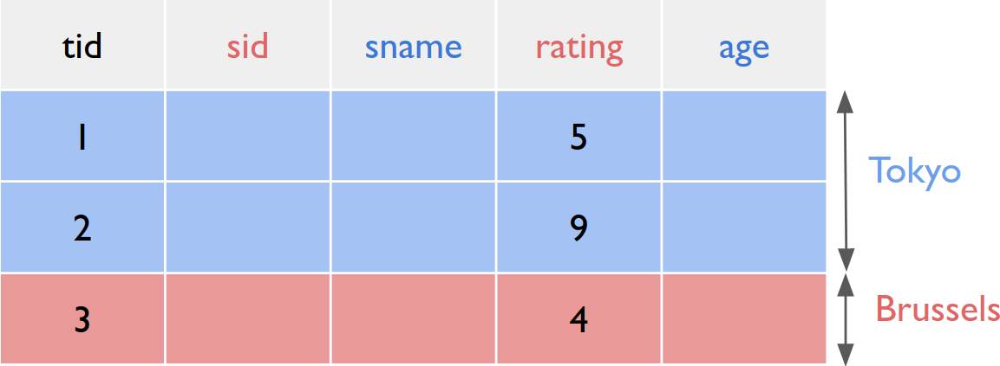
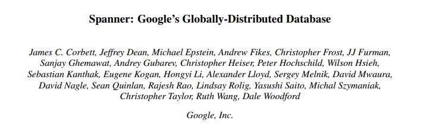
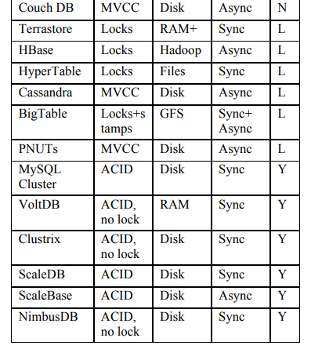

class: middle, center, title-slide

# Large-scale Distributed Systems

Lecture 9: Distributed databases and NoSQL

---

# Today

- *Relational databases*:
    - Quick recap
- *Distributed relational databases*.
    - Data placement
    - Distributed queries
    - Dsitributed transactions
- *NoSQL databases*.
    - CAP theorem

.center.width-60[]

---

class: middle, center

# Relational databases

(Quick recap from [INFO0009: Databases](https://www.programmes.uliege.be/cocoon/cours/INFO0009-1.html))

---

# Databases

From Oxford dictionary:
- *Database*: an organized body of related information.
- *Database system*, *Database management system* (DBMS): a software system that facilitates the creation and maintenance and use of an electronic database

What do you want from a DBMS?
- *Persistence*: Keep data around.
- *Queries*: answer questions about data.
- *Updates*: add, modify, delete data.

<span class="Q">[Q]</span> Which database systems do you know?

---

# Relational data model (1)

- A simple but *general-purpose* model.
- Data is stored in **relations** (i.e., a collection of tables).
    - a *tuple* is a row of a relation.
    - an *attribute* is a column of a relation.
    - a *domain* is a set of legal *atomic* values for an attribute.
        - this can be used to enforce semantic constraints.

.center.width-60[]

---

#  Relational data model (2)

- A **relation schema** is a list of attributes.
    - A schema is the blueprint that describes how the data is structured in the relation.
- A **relation** is a set of tuples for a given relation schema.
    - Each tuple in a relation is unique and satisfies the schema.
    - Uniqueness is often controlled through a (primary) *key* attribute.
- A *database schema* is a collection of relation schemas.
- **Relationships** between relations (tables) are defined by matching one or more attributes (usually, the keys) across relations.
    - 1-to-1 relationships
    - 1-to-many relationships
    - many-to-many relationships

---

# Querying data

- Data is retrieved, added or modified through an expressive *declarative query language*, **SQL**.
```SQL
SELECT EmployeeName, City FROM Employees;
```
    - Can be used to access data across one or more relations, with arbitrarily complex constraints.
    - Programmer specifies *what* answers a query should return, but **not how** the query is executed.
    - DBMS transparently picks the best execution strategy, based on availability of indexes, data/workload, properties, etc.
        - As based on an often sophisticated query processing engine.
- This provides *physical data independence*.
    - Applications should not worry about how data is physically structured and stored.
    - Applications instead work with a **logical** data model and a declarative query language.
- Single **most important reason** behind the success of DBMSs today.

---

# Concurrency

- DBMSs are *multi-user*, which raises **concurrency** issues.
- Example:
    - Both Homer and Marge concurrently execute, on the same bank account:
```python
def withdraw(account, amount):
            balance = account.balance
            if balance - amount >= 0:
                balance = balance - amount
                dispense_cash(amount)
                account.balance = balance
```
    - Homer at ATM1 withdraws $100.
    - Marge at ATM2 withdraws $200.
    - Initial balance = $400.
    - What is the final balance?

<span class="Q">[Q]</span> Haven't we already studied a similar problem?

???

- Make connections to linerarization.
- RW registers.

---

# Fault-tolerance and recovery

- Example: balance transfer.
    - decrement the balance of account $X$ by $100.
    - increment the balance of account $Y$ by $100.
- Scenario 1: Power goes out after the first instruction.
- Scenario 2: DBMS buffers and updates data in memory (for efficiency), but power goes out before they are written back to disk.
- How can we deal with these **failures**?

---

# ACID

**ACID** = key characteristics (most)
relational databases use to ensure modifications are saved in a
consistent, safe, and robust manner.
- *Atomic*: All parts of the transaction or none are committed.
- *Consistent*: A transaction either creates a new valid state of data, or, if any failure occurs, returns all data to its state before the transaction was started.
- *Isolation*: A transaction in process and not yet committed must remain isolated from any other transaction.
- *Durable*: Committed data is saved by the system such that, even in the event of a failure and system restart, the data is available in its correct state.

<span class="Q">[Q]</span> Don't some of these properties look familiar?

<span class="Q">[Q]</span> Assume the bank uses an ACID database. What does this mean for Homer and Marge?

---

# Performance

- DBMSs are designed to store **massive** amounts of data (TB, PB).
- High throughput is desired (thousands to millions transactions/hour).
- High availability ($\geq$ 99.999%).

<span class="Q">[Q]</span> How can we address these issues, at large-scale?

---

class: middle, center

# Distributed relational databases

---

# Distributed relational databases

- A **distributed** database (DDBMS) is a database whose relations reside on different sites.
- Interface requirements:
    - Relational data model
    - ACID properties
    - Single system illusion

.center.width-60[]

<span class="Q">[Q]</span> How is this different from/similar to a distributed file system?

---

# Data placement

- The *data placement* strategy, i.e. the distribution of the relations over the sites, and its implications form the main part in the design of a DDBMS.
- Aim to improve:
    - reliability
    - availability
    - efficiency (e.g., reduced communication costs or better load balancing)
    - security.
- Key considerations:
    - **Fragmentation**: relations may be divided into a number of sub-relations which are distributed.
    - **Allocation**: each fragment is stored at site with optimal placement.
    - **Replication**: copy of fragment may be maintained at several sites.

---

# Fragmentation

- *Break* a relation into smaller relations or **fragments**, which are then distributed at different sites.
- Main kinds of fragmentation:
    - *Horizontal*: partition a relation along its tuples.
        - e.g., identify fragments to selection queries.
    - *Vertical*: partition a relation along its attributes.
        - e.g., identify fragments to projection queries.
    - *Mixed*: partition horizontally and vertically.

.center.width-80[]

---

# Correctness rules of fragmentation

A fragmentation strategy should satisfy the following properties:
- *Completeness*: If a relation $R$ is decomposed into fragments $R_1, ..., R_n$, each data item that can be found in $R$ must appear in a least one fragment.
- *Reconstruction*: Must be possible to define a relation operation that will reconstruct $R$ from its fragments.
    - **Union** to combine horizontal fragments
    - **Join** to combine vertical fragments
- *Disjointness*: If data item $d$ appears in fragment $R\_i$, then it should not appear in any other fragment (at the exception for primary keys).
    - For horizontal fragmentation, data item is a tuple.
    - For vertical fragmentation, data item is an attribute.

---

# Allocation

- Ideally, fragments should be **allocated** such that queries that are frequently performed locally at sites are fast.
    - e.g., store tuples of Belgian employees at Brussels' site, but tuples of Japanese employees at Tokyo's.
- *Optimization problem*:
    - Givens:
        - fragments $f_1, ..., f_n$
        - sites $s_1, ..., s_m$
        - applications $q_1, ..., q_k$
    - Find the optimal assignment of fragments to sites such that the total cost of all applications is minimized and the performance is maximized.
        - Application costs: communication, storage, processing.
        - Performance: response time, throughput.
    - Constraints: per site constraints (storage and processing)
    - Problem is in general NP-complete, but good heuristics exist.
        - Reduce to a knapsack problem.
---

# Replication

- Storing a same fragment at distinct sites increases **availability** and **efficiency**.
- Replication modes:
    - *fully replicated*: each fragment at each site.
    - *partially replicated*: each fragment at one or more sites.
- Rule of thumb: if read-only queries / update queries $\geq 1$, then replication is advantageous, otherwise it may cause problems.
- The optimal partial replication policy can be determined jointly with the allocation problem.

<span class="Q">[Q]</span> Doesn't replication violate disjoitness?

---

# Distributed query processing

- For centralized regular DBMSs, all data is local and queries are mainly optimized to limit disk accesses.
- In DDBMSs, the data is distributed across several sites. This has the following consequences:
    - The query processing engine must *communicate* with all sites holding fragments involved in the query.
        - The cost of data transmission becomes a dominant factor when optimizing the query.
    - The engine must **orchestrate** the execution of sub-queries to compute the original query.
    - Independent sub-queries can be scheduled *concurrently*.

---

# Non-joins

.center.width-50[]

```SQL
SELECT AVG(S.age)
FROM Sailors AS S
WHERE S.rating > 3 AND
      S.rating < 7
```
- Horizontal fragmentation: Tuples with ratings $< 5$ at Brussels, $\geq 5$ at Tokyo.
    - Must compute sub-queries `SUM(S.age)` and `COUNT(s.age)` at both sites, before  *union* and aggregation.
    - If the `WHERE` clause contained just `S.rating > 6`, then the query could be processed at one site only.
- Vertical fragmentation:
    - Must reconstruct relation by *join* on `tid`, then evaluate the query.

---

# Joins

- Joins in DDBMSs can be very **expensive** if relations are stored at different sites.
- Consider three relations `account`, `depositor` and `branch`.
    - We want to compute their join `account`⋈`depositor`⋈`branch`.
        - `account` is stored at site 1.
        - `depositor` is stored at site 2.
        - `branch` is stored at site 3.
    - A query issued at site 1 must produce a result at site 1.
- Possible strategies:
    - Ship copies of all three relations to site 1 and process the query locally.
    - Ship a copy of `account` to site 2, compute `temp1`=`account`⋈`depositor`.
      Ship `temp1` from site 2 to site 3, compute `temp2`=`temp1`⋈`branch`.
      Ship `temp2` to site 1.

    <span class="Q">[Q]</span> Does the ordering matter? Can we do better?

---

# Semijoins

- We do not need to exchange the *whole* relations! Semijoins are sufficient:
    - At site 2, project `depositor` onto join columns with `branch` and ship to site 3.
    - At site 3, join the projection with `branch`.
      Project the resulting relation onto the join columns with `account` and ship to site 1.
    - At site 1, join the projection with `account`.
- Tradeoff the cost of computing and shipping projection for cost of shipping full relation.

---

# Distributed transactions

```python
def send(A, B, amount):
    begin_transaction()
    if A.balance - amount >= 0:
        A.balance = A.balance - amount
        B.balance = B.balance + aount
        commit_transaction()
    else:
        abort_transaction()
```

- All copies of the fragments involved in a transaction must be updated before the modifying transaction commits.
- How does one guarantee that all of the fragments commit the transactions or none do?

<span class="Q">[Q]</span> What algorithm have we seen that could solve this?

---

# Two-phase commit (1)

- Goal: general-purpose distributed agreement on some action, with failures.
- Running example: transfer money from $A$ to $B$.
    - Debit at $A$, credit at $B$, tell the client OK.
    - Require *both* banks to do it, or *neither*.
    - Require that **a bank never acts alone**.
- This is a form of **consensus**:
    - The value to agree upon is whether or not the transaction should be committed.
    - We require agreement, validity and termination.

???

http://the-paper-trail.org/blog/consensus-protocols-two-phase-commit/

---

# Two-phase commit (2)

- Site at which transaction originates is the **coordinator**.
- Other sites at which it executes are the *participants*.
- Two rounds of communication:
    - Phase 1 (request phase):
        - *Prepare* messages are sent from coordinator to all participants asking if ready to commit.
        - *Yes/No* replies from the participants to the coordinator.
            - If yes, the participant might have prepared locks on the local resources that need to be modified.
        - To commit, all subordinates must say yes.
    - Phase 2 (commit phase):
        - If yes from all participants, coordinator sends out *commit* messages, otherwise send *abort* instructions.
        - Participants do so, and send back an acknowledgement.
- **Efficient** protocol: $3n$ messages are exchanged in total. Seem difficult to do better.

---

# Two-phase commit (3)

What if nodes **fail**?

---

# Asynchronous transactions

- *Synchronous transactions*:
    - Before the update transaction can commit, it must obtain **locks** on all copies of the modified fragment.
    - This acquisition may take time.
    - But data distribution is transparent to user.
- *Asynchronous transactions*:
    - Copies of a modified fragment are only periodically updated. Different copies may get **out of sync** in the meantime.
    - More *efficient* than synchronized distribution transactions.
    - But users must be aware of data distribution.

---

# Case study: Cloud Spanner

.center[
<iframe width="640" height="480" src="https://www.youtube.com/embed/amcf6W2Xv6M?&loop=1&start=0" frameborder="0" volume="0" allowfullscreen></iframe>
]

---

# What is Cloud Spanner?

- Spanner: widely distributed database engine
    - General-purpose transactions (ACID)
    - SQL query language
    - Semi-relational data model
    - Scale to millions of machines
- Technical details:
    - Paxos replicated state machines
    - Adds very accurate clocks to data centres
        - XXX check slides
    - Make use of two-phase commits

.center.width-80[]

---

class: middle, center

# NoSQL databases

---

# NoSQL

- Many of the new generation databases are referred to as  **NoSQL** data stores.
    - e.g., MongoDB, CouchDB, Dynamo, Cassandra, Big Table, etc.
- NoSQL often not a useful term: definition by exclusion.
    - A NoSQL system will be appropriate because of the features it implements, not because of those it does not.
- NoSQL data stores are typically designed for *non-relational data*.
- Requirements are often **relaxed**, which often allows to gain in efficiency and scalability.

---

# Main features

- The ability to horizontally scale simple operations throughput over many servers.
- The ability to replicate and to distribute (partition) data over many servers.
- A simple call level interface or protocol.
    - In contrast to SQL.
- A weaker concurrency model than ACID transactions of most relational DBMS.
- Efficient use of distributed indexes and RAM for data storage.
- The ability to dynamically add new attributes to data records.

---

# Brewer's CAP theorem

- Credited to Eric Brewer: published in 1999, proven in 2002.
- It is **impossible** for a distributed data store to simultaneously provide more than two out of the following three guarantees:
    - *Consistency*: Every read receives the most recent write or an error.
    - *Availability*: Every request receives a (non-error) response (without the guarantee that it contains the most recent write).
    - *Partition tolerance*: The system continues to operate despite a partition of the network.
- Note that in the absence of a network partition, both consistency and availability can be satisfied.
- Relational DBMSs designed with traditional ACID guarantees often choose consistency over availability.

---

# BASE

- NoSQL systems typically do not provide ACID guarantees.
- Instead, the characteristics of a NoSQL systems are defined in terms BASE properties, which favors availability over consistency:
    - *Basically Available*: The system is guaranteed to be available for querying by all users.
    - *Soft state*: Stores do not have to be write-consistent, nor do replicas have to be mutually consistent all the time.
    - *Eventually consistent*: Stores exhibit consistency at some later point (e.g., lazily at read time).
- BASE properties are much loser than ACID properties.

---

# Differences in NoSQL systems

When studying a new NoSQL system, it is often worth considering how it from a relational DBMS in terms of:
- concurrency control
- data storage medium
- replication
- transactions mechanisms

---

# Concurrency control

- *Locks*:
    - Some systems provide one-user-at-a-time read or update locks.
- *Multiversion concurrency control*
    - Guarantee a read-only consistent view
    - May result in multiple conflicting versions of an entity if concurrent writes.
- *No control*:
    - Some systems do not provide atomicity.
    - Multiple users can edit in parallel a same entity.
    - No guarantee which version is read.
- *ACID*:
    - Pre-analyze transactions to avoid conflicts.
    - No deadlocks and no wait on locks.

---

# Data storage medium

- Designed for storage in *RAM*:
    - Fast but not persistent.
    - Often requires snapshots or replication saved on disk.
    - Poor performance when RAM overflows.
- Designed for *disk* storage:
    - Slow but persistent.
    - Often requires caching in RAM.

---

# Replication

Whether mirror copies are always in sync.
- *Synchronous*
    - Provides consistency, but usually slower.
- *Asynchronous*
    - Provides only eventual consistency, but usually faster.

---

# Transaction mechanisms

- *Supported*.
- *Not supported*.
- *In between*:
    - E.g., only for local transactions.

---

# Comparison

.grid[
.col-1-2[]
.col-1-2[]
]

.center[From 2011. Many of those have already died,<br> many other systems have appeared.]

---

# Data store categories

- Data stores are often grouped according to their data model.
- **Key-value stores**:
    - store key-value pairs.
    - e.g., Voldemort, Riak, Redis, Scalaris, Cabinet, Memcached, etc.
- **Document stores**:
    - store documents, which are indexed, with a simple query mechanism.
    - e.g., Amazon SimpleDB, CouchDB, MongoDB, Terrastore, etc.
- **Extensible record stores**:
    - store extensible records that can be partitioned vertically and horizontally across nodes.
    - e.g., HBase, HyperTable, Cassandra, etc.
- **Relational databases**:
    - store tuples, that are indexed and can be queried.
    - e.g., MySQL cluster, VoltDB, Clustrix, ScaleDB, etc.

---

# RDBMS benefits

- Relational DBMSs have **taken and retained majority market
share** over other competitors in the past 30 years.
- While no "one size fits all" in the SQL products themselves,
there is a common interface with SQL, transactions, and
relational schema that give advantages **in training,
continuity, and data interchange**.
- Successful relational DBMSs have been built to handle other
specific application loads in the past:
    - read-only or read-mostly data warehousing, OLTP on multi-core
multi-disk CPUs, in-memory databases, distributed databases, etc.

---

# NoSQL benefits

- NoSQL usually scale better than RDBMs.
- A NoSQL system is probably a better solution
    - when one only requires a lookup of objects based on a single key.
    - when the application requires a flexible schema.
- A relational DBMS usually make expensive operations easy to write.
    - On the other hand, a NoSQL system make them difficult for programmers.
- New systems are slowly gaining market shares, but still no clear winner.

---

# Case study: Bigtable

XXX

HBase

---

# Case study: Cassandra

XXX

---

# Summary

XXX

- CAP theorem helps classify distributed data stores behaviour choices.

---

# References

- Slides inspired from "[CompSci 316: Introduction to Database Systems](https://sites.duke.edu/compsci316_01_s2017/)", by Prof. Sudeepa Roy, Duke University.
- Apers, Peter M. G., Alan R. Hevner, and S. Bing Yao. "Optimization algorithms for distributed queries." IEEE transactions on software engineering 1 (1983): 57-68.
- Corbett, James C., et al. "Spanner: Google’s globally distributed database." ACM Transactions on Computer Systems (TOCS) 31.3 (2013): 8.
- Cattell, Rick. "Scalable SQL and NoSQL data stores." Acm Sigmod Record 39.4 (2011): 12-27.
