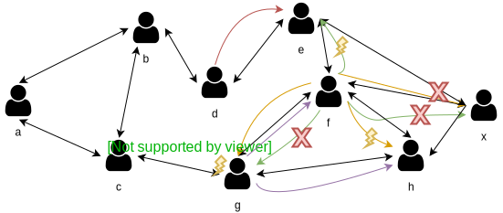

class: middle, center, title-slide

# Large-Scale Distributed Systems

Lecture X: Distributed Hash Tables

---

# History - Napster

.grid[
.col-2-3[
- Developed by Shawn Fanning, Sean Parker, and released on 1st June 1998.
- Napster pioneered the concept of P2P (peer-to-peer) file-sharing.
- However, it wasn't truly P2P as we know it by today's standards.

]
.col-1-3[

]
]

---

## Napster Architecture (1)

- Napster relied on a *centralized* directory server with *flat* filesystem.
  - Files with the same name are possible.
- Storage of the data was done at node-level (*decentralized*).
  - Node informed the directory server that it is still available using *keep-alive* messages.
  - Node informed the directory server which files it serves.

.width-100[

]

---

## Napster Architecture (2)

- Flat filesystem:

.width-100[

]

---

## Data querying and retrieval in Napster

- Joe queries the centralized directory server for a result set which satisfies the pattern $A$.

.width-100[

]

---

## Data querying and retrieval in Napster

- Directory server selects a result set of $n$ (~ 100) filenames which satisfy pattern $A$.
- The result-set is send to the requesting host, with the location of every entry in the result set.

.width-100[

]

---

## Data querying and retrieval in Napster

- To address of every item in the result set is pinged, and sorted with respect to transfer speed / distance.
- Joe selects the host do download the data from.
- Message is sent to Alice to initiate file transfer with Joe.
- No other instances besides the 2 nodes are involved with the transfer.

.width-100[

]

---

## Issues

- Centralized directory server
  - Flat filesystem
  - Bottleneck & security risk (e.g., DDoS) $\rightarrow$ complete network goes down.
  - Other external factors can shut down network (e.g., legal instances).
  - Query by name.
- Additional engineering required to handle load.
  - Hardware level (load balancers).
  - Software level (Partitioning of directory servers).
- No built-in replication of data.
  - Does not scale if everyone downloads from one particular peer because it is "close".
  - For example: if node $a$ is the only peer which holds a particular file $f$, and no other host copied $f$ during the time that $a$ was online, then file $f$ is "lost".
- Not technically interesting.

---

# History - Gnutella

- Napster's ultimate demise, legally, but more interestingly, technically:
  - Sudden spike in interest from industry and academia in P2P systems.
- Development of Gnutella, released in early 2000 (pure P2P).
- First, *fully decentralized* network.
- Decentralized group membership, and search protocol.
  - With main application in file sharing.
- Maintains a *unstructured virtual (overlay) network* among peers (see following slides).
- Gnutella nodes (*servents*), perform both *client* (C) and *server* (S) tasks.
  - (C) User-interfaces to facilitate querying.
  - (S) Accept queries from other servents.
  - (S) Check for matches against local dataset, and respond.
  - (S) Manage background traffic to ensure network integrity (e.g., routing).

---

## Bootstrapping (joining)

- A new servent connects to a list of known nodes.
  - Initial discovery of known peers in the network is *not* part of the protocol definition. Meaning, *no internally defined* ("tricks" are always possible) mechanisms to discover other servents.
  - Usually, initial list of peers was fetched from an external (centralized) service which kept track of a list of long-lived peers (e.g., gnutellahosts.com).
  - Or, list of possibly working peers was shipped with the software.

.width-100[

]

---

## Protocol

- Protocol messages are routed through the virtual overlay network (application layer).
  - A message could thus, for example, traverse the following path in the underlaying IP infrastructure: Belgium $\rightarrow$ Australia $\rightarrow$ Belgium, while the peers might be "neighbors" in the virtual overlay network.
- Gnutella supports the following protocol messages:

Type     | Description                                                                                                                                                  | Payload
---------|--------------------------------------------------------------------------------------------------------------------------------------------------------------|-----------------------------------------------------
Ping     | Mainly used to send keep-alive messages, and to discover new peers in the network.                                                                           | None
Pong     | The response to a Ping. Includes the address of a connected Gnutella peer and information regarding the amount of data it is making available to the network. | IP address, port, total size of shared files
Query    | The primary mechanism for searching the distributed network. A peer receiving a Query descriptor will respond with a QueryHit if a match is found against its local data set. | Minimum network bandwidth of responding peer and search criteria
QueryHit | The response to a Query. This descriptor provides the recipient with enough information to acquire the data matching the corresponding Query. | IP address, port, network bandwidth of responding peer, number of results and result set
Push     | A mechanism that allows a firewalled peer to contribute file-based data to the network. | Peer identifier, index of requested file, IP address and port to send file to

---

## Protocol: descriptors

- Servents communicate with each other by sending and receiving Gnutella protocol descriptors. Every descriptor is preceded by a Descriptor Header with the byte structure given below:
  - Descriptor ID (16 bytes)
  - Payload Descriptor (identifies message type, e.g., ping, pong, ...) (1 byte)
  - TTL (Time To Live) (1 byte)
  - Hops (1 byte)
  - Payload length (4 bytes)

---

## Descriptor ID

- 16-byte string which *uniquely* identifies the descriptor on the network.
- Its value must be preserved when forwarding messages between servents.
- Used to allow detection of cycles and help reduce unnecessary traffic on the network.

**Question:**

How would one generate such a uniquely identifiable identifier, while having only local knowledge of your peers?

---

## Descriptor ID

- 16-byte string which *uniquely* identifies the descriptor on the network.
- Its value must be preserved when forwarding messages between servents.
- Used to allow detection of cycles and help reduce unnecessary traffic on the network.

**Question:**

How would one generate such a uniquely identifiable identifier, while having only local knowledge of your peers?

**Answer:**

Use a cryptographically strong random generator. Because:

$P(\text{collision}) = \frac{1}{2^{128} - 1}$

Which is VERY small.

---

## Time To Live / Hops

TTL

- Number of times the descriptor will be forwarded by Gnutella servents before it is removed from the network.
- Servent MUST decrement the TTL before passing it on to another servent. When the TTL reaches 0, the descriptor MUST no longer be forwarded.

Hops

- Number of times the descriptor has been forwarded.

TTL & Hops invariants:

- $\text{TTL}_0 + \text{Hops}_i = \text{TTL}_0$
- $\text{TTL}_{i + 1} < \text{TTL}_i$
- $\text{Hops}_{i + 1} > \text{Hops}_i$

$\rightarrow \text{TTL}_i + \text{Hops}_i = \text{TTL}_0$

---

## Ping / Pong

Ping payload format:

- No payload format!

Pong payload format:

- Port (2 bytes)
- IP(v4) address (4 bytes)
- Number of shared files (4 bytes)
- Number of Kilobytes shared (4 bytes)
- Optional Pong Data (...)

---

## Example: Ping / Pong (1)

$x$ prepares a ping descriptor to discover to local virtual overlay network.

1. $x$ prepares a descriptor:
   - Descriptor ID = `generate_random_descriptor()` (`0x359d...`)
   - Payload Descriptor = `0x00` (ping)
   - TTL = `0x02` (3 hops)
   - Hops = `0x00`
   - Payload length = `0x00000000`

.width-100[

]

---

## Example: Ping / Pong (2)

- $x$ transmits `Ping` to direct neighbors ($e$, $f$, and $h$):
  - Descriptor ID: `0x359d...`
  - TTL: `0x02` (assume 2 is default in this setting)
  - Hops: `0x00`

.width-100[

]

---

## Example: Ping / Pong (3)

- $e$, $f$, and $h$ send `Pong` response with new descriptor ID to $x$ *through origin peer* (Why?).
- Every receiving node validates Descriptor ID ("Have I seen this ID recently? If yes, drop message."), decrements TTL, increments Hops, and retransmits `Ping` to *other, non-origin* peers.

.width-100[

]

---

## Example: Ping / Pong (4)

- At this point `Ping` descriptor from $x$ expires (TTL = 0). Servents $b$ and $c$ will drop the messages and send the final `Pong` descriptors to the *origin peers*.

.width-100[

]

---

## Example: Ping / Pong (5)

.width-100[

]

---

## Example: Ping / Pong (6)

.width-100[

]

---

## Example: Ping / Pong (7)

- Final `Pong` messages are dropped due to TTL time-outs and descriptor ID collisions.
- Visible peers $V(x) = \\{b, c, d, f, g, h\\}$.

.width-100[

]

---

## Query / QueryHit

- A `Query` for a specific pattern, and the accompanying response, `QueryHit` employs the same routing scheme as `Ping` and `Pong` (*flooding*).
- The query pattern will only be matched against the hosts in $V(\lambda)$, where $\lambda$ is the requestor.
  - This implies that data which does not reside in nodes in $V(\lambda)$, is *not* accessible by $\lambda$!

---

## Node Failure

- No action needs to be undertaken unless the failed node is a *direct peer*.
  - Cleanup of connection resources.
- Failure can be detected implicitely using `Ping` and `Pong` messages.
- Node does not reply to Query messages.
- After the disconnection of a node $n$, it does *not always* hold that $V(\lambda)_{t + 1} = V(\lambda)_t - \\{n\\}$.
- In this example: $V(x)_{t+1} = V(x)_t - \\{b, d\\} \rightarrow$ data of $b$ and $d$ is lost!

.width-100[

]

---

## Issues

- Communication in Gnutella happens through *flooding*.
  - Not scalable, increasing peers saturates connections and limits bandwidth.
  - Probability of finding data is dependent on structure of the network (e.g., number of direct peers) and TTL.
  - What happens when we increase TTL?
- No built-in replication.
  - Replication is dependent on user behaviour.
- Security issues, due to pattern matching in queries.
  - How do we know that `metallica_enter_sandman.mp3` is not `justin_bieber_baby.mp3` or a virus?
- Not all nodes in the network are accessible! $\rightarrow V(\lambda)$

---

# Issues with these approaches.

- Not reliable.
  - Data is lost if a particular node fails.
  - Node failure implicitely influence others nodes and network content (e.g., $V(\lambda)$).
- Not private and not secure.
  - How do ensure that the contents of file named $f$ really represents $f$?
- Not efficient and not scalable.
  - Querying network by flooding, $\mathcal{O}(n)$ worst-case, simply does not scale, hurts performance as well.
  - Querying network by using centralized service, bottlenecked, and single-point-of-failure directory server.
- Not self-organizing.
  - Centralized server was required in the case of Napster.
  - Web caches, or list of initial (bootstrapping) peers had to be shipped with the software.

$\rightarrow$ Data is arbitrarily stored over the network (*unstructured* P2P system).

---

class: middle
# Other approaches are required!

---

# Hash tables

- A hash table would be able to address some of these concerns.
  - *Efficient & scalable:* $\mathcal{O}(1)$ lookup and store operations (on a single machine).
  - *Secure:* key $\equiv$ SHA-256 hash (or other hash function) of file $\rightarrow$ ensures file contents.

**Core idea:** A *scalable indexing* approach for distributed systems by hashing a key to a specific machine in the network.
- The data transfer system is scalable (direct, host-to-host) since the underlaying IP (hiearchical) infrastructure supports it.
- But distributed systems need a scalable indexing system as well because of the virtual overlay network.

---

# Content Addressable Network

- Introduced by Sylvia Ratnasamy et al in 2001.
- Basically: take a hash map and apply it to the scale of the internet.
- Fully distributed.
- Scalable (nodes only contain small amount of informations about adjacent nodes).
- Fault-tolerant (can route around network disruptions).
- Does not impose a hiearchical naming structure to achieve scalability.
  - "*Hierachical*": ID's starting with 0 are on the left, ID's with 1 on the right (a la binary-search).

---

# CAN Architecture

- As the foundation of an internet-scale application.
- CAN operations:
  - Insertion
  - Lookup
  - Deletion
- Every CAN node stores:
  - A chunk (*zone*) of the entire hash table.
  - Holds information about a small number of adjacent nodes.
- Completely distributed, no intervention from centralized architecture.
- Scalable (nodes maintain a small amount of information about peers).
- Fault-tolerant, in the sense that messages can be routed around failures.
  - Data loss is still possible.
---

# CAN Architecture

- Virtual overlay network is a $d$-dimensional Cartesian space $C$.
  - E.g., 2-dimensional $[0,1] \times [0,1]$ Cartesian space.
- At any point in time, the *entire* coordinate space is *dynamically* partitioned among all nodes in the system, such that every nodes is responsible for a distinct zone.
- Using a $K, V$ pair, $K$ is hashed to a point $P \in C$ using a *uniform deterministic hash function $h$*.
  - Why uniform and deterministic?
- If the point $P$ is not owned by the requesting node or its immediate neighbors, the request must be routed through the CAN infrastructure until it reaches the desired zone.
  - **Efficient routing is critical to ensure scalability!**
  - Was this the case in the Gnutella network?

---

# CAN Routing

- Every node maintains a set of neighboring hosts, each entry:
  - IP address and port
  - Zone range

.width-100[

]

---

# CAN Routing

**Main concept**: follow a straight line through the Cartesian space from source to destination coordinates.

- Routing happens by selecting the neighboring zone which strictly minimizes the distance to the destination coordinate.
  - *Greedy message forwarding*.
  - Every CAN message includes a destination coordinate.
- A neighbor in a $d$-dimensional space is defined as: if two zones in a $d$-dimensional space overlap among $d - 1$ dimensions and abut along one.
- For a $d$-dimensional space partitioned into $n$ *equal* zones, the average routing path length is thus $(\frac{d}{4}n^{\frac{1}{d}})$.
  - Why?
  - Worst case?
  - Best case?

---

# CAN Routing Failure

- Failure in CAN routing can occur!
  - If a node loses all neighbors in a certain direction in the strictly shortest direction, and the routing table has not been rebuilt yet, then routing fails.
  - Message is send in a flooding manner to all remaining peers (*expanding ring search*).
  - Receive peers resume employing *greedy forwarding*.
  - **Problem**: Same message **COULD** be received multiple times by the destination node.

---

# CAN Construction

- Spltting the allocated zone of an existing node, and retaining a certain half of the splitted zone to the joining node along with all points which are located in the relevant half.
- This process can be divided into several steps:
  1. New node must assign itself a random coordinate.
  2. Then, the new node must have a node currently associated with the CAN (can be done differently).
  3. Using CAN routing, find the zone associated with the choosen coordinate.
  4. The current occupant node of the zone splits its zone in half and assigns one half to the new done. The split assumes a certain *ordering of dimensions* so a split can be undone at a later time.
  5. Key-Value pairs of the reassigned half-zone are transferred to the new node.
  6. Sets of neighbors in all adjacent zones are updated. Thus, insertion: $\mathcal{O}(d)$.

---

# CAN Maintenance

## Node departure and recovery

When nodes leave a CAN, we need to ensure that the zones they occupied are taken over by the remaining nodes.

*Clean exit*:
- Node explicitely hands over the zone (including the key-value) pairs to the (newly) responsible and remaining nodes.
- Zone will be handed over to the smallest adjacent zone (check correctness).

---

## Detecting failures

- Periodically, nodes send update messages to neighbors specifying:
  - A list of neighbors, and their zone coordinates
- A *time-out* of a neighbor response, triggers a failure.

---

## Recovering from a failure

Every neighboring node initiates a `TAKEOVER` procedure:

1. Evey neighbor zone starts a timer proportionally to the volume of the zone.
2. When the timer expires, the neighbor sends a `TAKEOVER` message to all other neighbors with new zone information (including failed zones).

Upon the receival of a `TAKEOVER` message, a node cancels its timer if and only if the volume of the receiving zone is smaller then its own.

In this manner, a neighbor is chosen *who is still alive* and has the *smallest zone* (why smallest zone?).

**Still prone to failure (simultaneous failure of multiple nodes, how?)!**

---

# CAN Summary

- Interesting idea of applying *hash-functions* to distributed systems!
- *Replication* by applying multiple (different) hash-functions (or one could hash a hash).
- Several failure cases still possible. Possible routing failure handled by flooding!
  - Inefficient consumption of bandwith in large networks.
  - Same message can arrive more than once (use Gnutella random-id safeguard).
- Rather inefficient messaging:
  - *Shortest* path length: 0
  - *Average* path length: $\mathcal{O}(\frac{d}{4}n^\frac{1}{d})$ (assuming equally divided zones)
  - *Longest* path length: $\mathcal{O}(n) \rightarrow$ Unacceptable for large systems
- Routing through overlay network makes all nodes reachable in a finite about of steps, practical considerations:
  - Neighboring nodes can be in Belgium and Australia ~370 ms (gov.au)
  - Imagine: message is routed through 10 machines with said latency: *3.7s respond time*!
  - Therefore, path length needs to be small! Even in worst-case!

---

# References

- http://rfc-gnutella.sourceforge.net/developer/stable/index.html (Gnutella Protocol RFC)
- http://people.cs.uchicago.edu/~matei/PAPERS/gnutella-rc.pdf
- http://conferences.sigcomm.org/sigcomm/2001/p13-ratnasamy.pdf (CAN)

---
