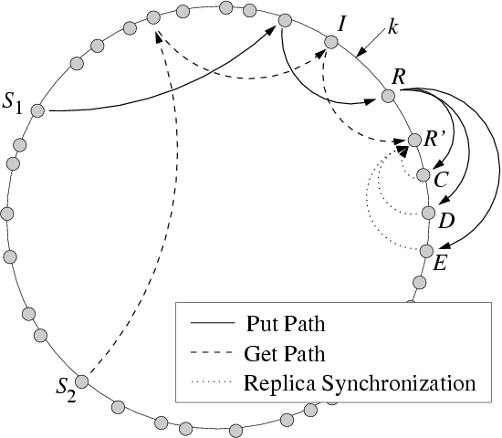

class: middle, center, title-slide

# Large-scale Distributed Systems

Fall 2017

---

# Organization

## Logistics
- Prof. Gilles Louppe ([g.louppe@ulg.ac.be](mailto:g.louppe@ulg.ac.be))
- Teaching assistant: Joeri Hermans ([joeri.hermans@doct.ulg.ac.be](mailto:joeri.hermans@doct.ulg.ac.be))

.pull-right[]
## Notes
- Christian Cachin, Rachid Guerraoui, Luis Rodrigues, "Introduction to Reliable and Secure Distributed Programming", Springer. (*recommended*)
- Slides available on [GitHub](https://github.com/glouppe/info8002-large-scale-database-systems).
- Slides are partially adapted from:
    - [CSE 486/585 Distributed systems](https://www.cse.buffalo.edu/~stevko/courses/cse486/spring16/schedule.html) (University at Buffalo)
    - [CS425 Distributed systems](https://courses.engr.illinois.edu/cs425/fa2017/lectures.html) (University of Illinois UC)
    - ID2203 Introduction to Distributed Systems (KTH).

---

# Lectures

- Theoretical lectures (10-12)
- Exercise sessions (5-6)
- Tutorials (2-3)

**Starting time:** 2pm?

---

# Evaluation

- Oral exam (50%)
- Programming project 1 (25%)
- Programming project 2 (25%)

---

# Philosophy

## Solid ground

- Understand the **foundational principles** of distributed systems, on top of
which distributed *databases* and *computing* systems are operating.

## Practical

- Exposition to *industrial software*.
- Fun and challenging course project.

## Critical thinking

- Assess the benefits and disadvantages of distributed systems.
- No hype!

---

class: middle, center

# Outline

---

class: middle, center

# I. Foundations

---

# 1. Distributed systems

- Introduction to distributed systems
- Outline
- Networking basics

---

# 2. Basic abstractions

Content from *chapters 1* and *2*.

- Distributed computation model
- Abstracting processes
    - Failures
- Abstracting communication
- Abstracting time
    - Timing assumptions
    - Failure detection
    - Leader election
- Distributed abstractions

---

# 3. Reliable delivery

Content from *chapter 3*.

- Reliable multicast
- Gossiping

---

# 4. Shared memory

Content from *chapter 4*.

- Shared memory

---

# 5. Consensus

Content from *chapter 5*.

- Consensus
- Impossibility result
- Paxos
- Replication (total order broadcast)

???

- Possibly split into two parts.
- Firefly consensus, impossibility

---

class: middle, center

# II. Distributed data storage

---

# 6. Distributed file systems

- Architecture
- RPC
- Scalability (partitioning)
- Case study: HDFS

---

# 7. NoSQL databases

- Structured vs. Unstructured databases
- Key-value stores
- DHT
- Graph databases
- Case study: Amazon Dynamo, Apache Cassandra

---

# 8. Block chain

- Concept
- Case study: Bitcoin

---

class: middle, center

# III. Computing paradigms for data science

---

# 9. Map Reduce

- Concept
- Case study: Hadoop

---

# 10. Computational graph systems

- Concept
- Static vs. dynamic graphs
- Optimization
- Case studies: Spark, Tensorflow, PyTorch

---

# 11. Data science on a budget

- A lot can be done using a laptop only
- Algorithmic solutions to large-scale data science problems

---

class: middle, center

# Projects

---

# Projects

.grid[
.col-2-3[
- Implementation of a simple distributed system (25%).
    - E.g., a distributed hash table, a group communication system, ...
- Exploratory analysis with a distributed computing framework (25%).
    - E.g., a case study using Spark.
]
.col-1-3[

]
]
